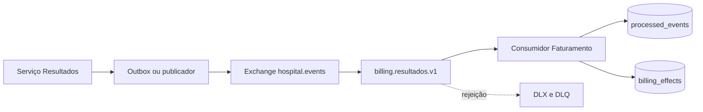

# Exemplo arquitetural: resultado disponível, cobrança uma vez

## Contexto e fronteiras

Resultados é dono da disponibilização do exame. Quando sua regra interna conclui que o resultado pode ser consultado, ela persiste o estado e emite o fato `ResultadoLaboratorialDisponibilizado.v1`. Faturamento é dono de decidir e registrar uma cobrança de resultado disponibilizado. Notificação, se vier a existir, é dona de preparar seu próprio aviso. Nenhum desses consumidores precisa entrar no banco de Resultados, e Resultados não precisa chamar Faturamento para concluir a disponibilização clínica.

O contrato mínimo evita circular conteúdo clínico. `exam_id` e `patient_id` são identificadores sintéticos no laboratório; `result_reference` aponta para o recurso que o owner controla. Em uma solução real, a classificação de dado, autorização de leitura e minimização do payload são decisões de domínio e segurança. Um evento não contorna controle de acesso por ter sido entregue internamente.

**Texto alternativo:** Topologia em que Resultados publica por outbox ou publicador na exchange hospital.events, que alimenta a fila de faturamento; o consumidor grava tentativas e efeitos e rejeições seguem para DLQ.

*Figura 10 — Contrato, fila de Faturamento, store idempotente e DLQ. Fonte: curso.*

**Leitura textual:** Resultados publica no canal `hospital.events`. A fila `billing.resultados.v1` entrega ao consumidor. O consumidor registra tentativa e efeito em armazenamento local; uma mensagem rejeitada por schema segue para a exchange de dead-letter e para a DLQ.

## Fluxo normal

O publicador cria um modelo Pydantic com os cinco campos do contrato. Ele abre conexão AMQP, declara a exchange `hospital.events` como topic durável e publica JSON persistente com a chave `laboratory.result.available.v1`. A declaração da exchange no publicador torna o exemplo executável em um ambiente vazio; em uma equipe maior, a topologia pode ser provisionada por infraestrutura declarativa e a aplicação apenas confirmar sua existência.

O consumidor declara a fila durável `billing.resultados.v1`, liga-a à exchange com a chave de roteamento e configura `hospital.events.dlx` como dead-letter exchange. Ao receber, primeiro valida o corpo com `ResultadoLaboratorialDisponibilizadoV1.model_validate_json`. Só uma mensagem semanticamente conhecida alcança a regra de negócio. A validação falha antes do ack; como o contexto de processamento usa `requeue=False`, o broker rejeita a entrega e aplica o binding de dead-letter.

Em caso válido, `ProcessedEventStore.record` começa uma transação SQLite imediata. Caso `event_id` não exista, insere em `processed_events` com uma tentativa e grava a linha de `billing_effects`. Caso exista, atualiza somente `attempts`. A confirmação AMQP ocorre depois que o método retorna. Por isso, duas publicações com a mesma identidade produzem duas tentativas registradas, uma única linha de efeito e duas confirmações. O teste automatizado mede exatamente essa observação.

## Onde ainda há falhas possíveis

O exemplo é deliberadamente pequeno. Entre publicar e chegar à fila há rede e disponibilidade de broker; entre gravar SQLite e confirmar AMQP existe uma janela em que o processo pode cair. A segunda janela produz reentrega, que o store cobre. A primeira janela, em um serviço de produção, pede uma estratégia na origem como outbox. Também não existe retry com atraso: erro de banco poderia reentregar imediatamente e exigir política de backoff, limite e alerta para não ocupar a fila indefinidamente.

A transação local não cria uma transação global entre Resultados, RabbitMQ e Faturamento. Portanto, o desenho não alega exactly-once. Ele controla um efeito local identificável. Se Faturamento chamar uma operadora externa, deverá passar a mesma chave de idempotência, registrar a requisição e reconciliar respostas ambíguas. Caso a operadora não aceite uma chave, pode ser necessário um ledger, consulta antes de repetir ou uma decisão de operação manual. A arquitetura torna a incerteza explícita.

## Ordem e evolução aplicadas ao caso

Este evento não afirma uma ordem global de exames. Se Faturamento precisar reagir somente ao estado mais recente do mesmo exame, o contrato pode ganhar uma versão de agregado ou sequência em evolução compatível. `occurred_at` é útil para auditoria temporal, mas não substitui uma sequência quando há empate, relógio desalinhado ou replay. Escolher `exam_id` como chave de particionamento em um log futuro preservaria a sequência por exame, não por paciente inteiro.

O sufixo `.v1` comunica que a versão pertence ao nome do evento. Uma alteração como adicionar `billing_reference` opcional pode passar por uma fase em que consumidores antigos ignoram o campo, se o schema permitir. Trocar o sentido de `result_reference` ou remover `exam_id` exige versão nova, consumidores compatíveis por período e decisão de retirada. Os exemplos do repositório não usam dados reais e a oficina não deve ser usada para inferir uma política de retenção hospitalar.

## Como ler a evidência

Ao final da oficina, três evidências contam histórias diferentes. A saída do publicador demonstra que uma mensagem foi enviada ao canal. A saída do consumidor mostra `processed=True attempts=1` na primeira entrega e `processed=False attempts=2` na repetição. A consulta SQLite mostra uma linha em `billing_effects` e duas tentativas em `processed_events`. Já a página de filas do management plugin ou a consulta AMQP mostra que o payload inválido chegou à DLQ. Nenhuma dessas evidências, isolada, prova todas as propriedades; juntas sustentam a decisão didática.

Se o consumidor informar `None`, a fila estava vazia no instante da busca. Isso não é confirmação de que uma publicação anterior foi perdida: confira primeiro URL AMQP, vhost, chave de roteamento, binding e se a mensagem já foi consumida. Se a mensagem for parar na DLQ, leia a razão de rejeição e o schema antes de republicar. Republicar cegamente uma mensagem inválida cria repetição de falha, não resiliência.
