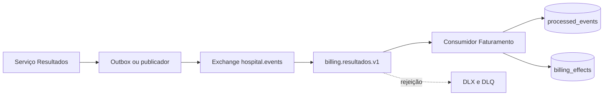

# Exemplo arquitetural: resultado disponível, cobrança uma vez

## Contexto e fronteiras

Este exemplo caminha por uma implementação completa dos conceitos das páginas anteriores, no mesmo caso hospitalar retomado na oficina a seguir. Três capacidades participam. Resultados publica quando um exame fica disponível para consulta. Faturamento decide e registra a cobrança administrativa correspondente. Notificação, se existir, prepara o aviso ao paciente. Cada uma mantém o próprio banco de dados, e nenhuma chama a outra diretamente: todas reagem a um fato publicado num broker RabbitMQ, o mesmo papel de broker descrito em [Broker e mediator](conceitos.md#broker-e-mediator).

Resultados é dono da disponibilização do exame. Quando sua regra interna conclui que o resultado pode ser consultado, ela persiste o estado e emite o fato `ResultadoLaboratorialDisponibilizado.v1`. Faturamento é dono de decidir e registrar uma cobrança de resultado disponibilizado. Notificação, se vier a existir, é dona de preparar seu próprio aviso. Nenhum desses consumidores precisa entrar no banco de Resultados, e Resultados não precisa chamar Faturamento para concluir a disponibilização clínica.

O contrato mínimo evita circular conteúdo clínico. `exam_id` e `patient_id` são identificadores sintéticos no laboratório; `result_reference` aponta para o recurso que o owner controla. Em uma solução real, a classificação de dado, autorização de leitura e minimização do payload são decisões de domínio e segurança. Um evento não contorna controle de acesso por ter sido entregue internamente.

O diagrama a seguir usa duas siglas que valem a pena definir antes de aparecerem juntas. Uma **dead-letter exchange** (DLX) é a exchange para a qual o RabbitMQ redireciona uma mensagem rejeitada, em vez de descartá-la. Uma **dead-letter queue** (DLQ) é a fila ligada a essa DLX, onde a mensagem rejeitada fica disponível para inspeção manual. A DLX decide para onde a rejeição vai; a DLQ é onde ela pousa e pode ser lida.


```mermaid
flowchart LR
    A[Serviço Resultados] --> O[Outbox ou publicador]
    O --> X[Exchange hospital.events]
    X --> Q[billing.resultados.v1]
    Q --> C[Consumidor Faturamento]
    C --> I[(processed_events)]
    C --> E[(billing_effects)]
    Q -. rejeição .-> D[DLX e DLQ]
```

**Texto alternativo:** Topologia em que Resultados publica por outbox ou publicador na exchange hospital.events, que alimenta a fila de faturamento; o consumidor grava tentativas e efeitos e rejeições seguem para DLQ.

*Figura 11 — Contrato, fila de Faturamento, store idempotente e DLQ. Fonte: curso.*

**Leitura textual:** Resultados publica no canal `hospital.events`. A fila `billing.resultados.v1` entrega ao consumidor. O consumidor registra tentativa e efeito em armazenamento local; uma mensagem rejeitada por schema segue para a exchange de dead-letter e para a DLQ.

## O contrato em código

O contrato é um modelo Pydantic com cinco campos, `extra="forbid"` e o nome do evento como título. Isso significa que um campo desconhecido no payload derruba a mensagem antes de qualquer regra de negócio rodar.

```python
# src/hospital/eventos/publicador.py
EVENT_NAME = "ResultadoLaboratorialDisponibilizado.v1"
EXCHANGE_NAME = "hospital.events"
ROUTING_KEY = "laboratory.result.available.v1"


class ResultadoLaboratorialDisponibilizadoV1(BaseModel):
    """Contrato mínimo e versionado do fato publicado pelo laboratório."""

    model_config = ConfigDict(extra="forbid", title=EVENT_NAME)

    event_id: str
    occurred_at: datetime
    exam_id: str
    patient_id: str
    result_reference: str
```

## Publicador: declarar, serializar, confirmar

O publicador abre uma conexão AMQP robusta (`aio_pika.connect_robust`, que reconecta sozinha em queda transitória), declara a exchange como `topic` e durável, e publica com `delivery_mode=PERSISTENT` para sobreviver a um restart do broker. O `message_id` recebe o `event_id`, o que permite correlacionar a mensagem AMQP à ocorrência de domínio ao inspecionar filas no management plugin.

```python
# src/hospital/eventos/publicador.py
async def publicar_json(payload: dict[str, object], url: str | None = None) -> None:
    connection = await aio_pika.connect_robust(url or amqp_url())
    try:
        channel = await connection.channel(publisher_confirms=True)
        exchange = await channel.declare_exchange(
            EXCHANGE_NAME, aio_pika.ExchangeType.TOPIC, durable=True
        )
        body = json.dumps(payload, default=str, sort_keys=True).encode("utf-8")
        await exchange.publish(
            aio_pika.Message(
                body,
                content_type="application/json",
                delivery_mode=aio_pika.DeliveryMode.PERSISTENT,
                type=EVENT_NAME,
                message_id=str(payload.get("event_id", "invalid-event")),
            ),
            routing_key=ROUTING_KEY,
        )
    finally:
        await connection.close()
```

`publisher_confirms=True` ativa a confirmação de publicação do RabbitMQ: o `await exchange.publish` só retorna depois que o broker confirmou a escrita, não apenas o envio pela rede. Sem isso, uma queda de conexão entre o envio e a confirmação passaria despercebida pelo publicador.

## Consumidor: declarar topologia, validar, deduplicar

O consumidor declara a mesma exchange, a fila durável de trabalho, a exchange de dead-letter e a fila de rejeitados, e liga a DLQ à DLX com a **mesma routing key** da fila principal. Declarar a exchange de novo com os mesmos parâmetros é seguro: RabbitMQ trata declarações repetidas e idênticas como uma operação sem efeito colateral. Já o vínculo de routing key é fácil de esquecer: se a DLQ for ligada com uma chave diferente, mensagens rejeitadas somem em vez de aparecer na fila de erro.

```python
# src/hospital/eventos/consumidor.py
QUEUE_NAME = "billing.resultados.v1"
DLX_NAME = "hospital.events.dlx"
DLQ_NAME = "billing.resultados.v1.dlq"

async def declarar_fila(self, channel: aio_pika.abc.AbstractChannel):
    exchange = await channel.declare_exchange(
        EXCHANGE_NAME, aio_pika.ExchangeType.TOPIC, durable=True
    )
    dlx = await channel.declare_exchange(DLX_NAME, aio_pika.ExchangeType.DIRECT, durable=True)
    queue = await channel.declare_queue(
        QUEUE_NAME,
        durable=True,
        arguments={"x-dead-letter-exchange": DLX_NAME},
    )
    dlq = await channel.declare_queue(DLQ_NAME, durable=True)
    await queue.bind(exchange, routing_key=ROUTING_KEY)
    await dlq.bind(dlx, routing_key=ROUTING_KEY)
    return queue
```

A validação de schema acontece antes de qualquer efeito, e a rejeição usa `requeue=False` para que o RabbitMQ aplique o binding de dead-letter em vez de reentregar a mensagem inválida em loop:

```python
# src/hospital/eventos/consumidor.py
async def consumir_uma(self, queue: aio_pika.abc.AbstractQueue) -> ProcessResult | None:
    message = await queue.get(fail=False)
    if message is None:
        return None
    try:
        event = ResultadoLaboratorialDisponibilizadoV1.model_validate_json(message.body)
    except ValidationError as error:
        await message.reject(requeue=False)
        print(f"Mensagem rejeitada para DLQ: schema inválido ({error.error_count()} erro)")
        return None
    async with message.process(requeue=False):
        result = self.processar_evento(event)
        print(
            f"{EVENT_NAME} event_id={event.event_id} "
            f"processed={result.processed} attempts={result.attempts}"
        )
        return result
```

A deduplicação acontece dentro de uma transação SQLite imediata (`BEGIN IMMEDIATE`): `event_id` é chave primária em `processed_events`, e `billing_effects` também tem `event_id` como chave primária. Isso é o que garante que uma segunda entrega eleve `attempts` sem criar uma segunda linha de efeito, mesmo que o processo tenha reiniciado entre as duas entregas. Um `if` em memória não ofereceria essa garantia entre reinícios.

```python
# src/hospital/eventos/consumidor.py
def record(self, event: ResultadoLaboratorialDisponibilizadoV1) -> ProcessResult:
    with self._connect() as connection:
        connection.execute("BEGIN IMMEDIATE")
        row = connection.execute(
            "SELECT attempts FROM processed_events WHERE event_id = ?", (event.event_id,)
        ).fetchone()
        if row:
            attempts = int(row[0]) + 1
            connection.execute(
                "UPDATE processed_events SET attempts = ? WHERE event_id = ?",
                (attempts, event.event_id),
            )
            return ProcessResult(processed=False, attempts=attempts)
        connection.execute(
            "INSERT INTO processed_events(event_id, attempts) VALUES (?, 1)",
            (event.event_id,),
        )
        connection.execute(
            """INSERT INTO billing_effects(event_id, exam_id, patient_id, result_reference)
               VALUES (?, ?, ?, ?)""",
            (event.event_id, event.exam_id, event.patient_id, event.result_reference),
        )
        return ProcessResult(processed=True, attempts=1)
```

## A infraestrutura que sustenta o exemplo

O exemplo inteiro roda sobre um único serviço Docker Compose: um RabbitMQ 4 com o plugin de management habilitado pela própria imagem, credenciais fixas de laboratório e healthcheck via `rabbitmq-diagnostics ping`. Não há cluster, TLS nem usuário de produção. É o mínimo para exercitar exchange, fila, DLX e DLQ localmente.

```yaml
# infra/compose.eventos.yml
services:
  rabbitmq:
    image: rabbitmq:4-management
    environment:
      RABBITMQ_DEFAULT_USER: guest
      RABBITMQ_DEFAULT_PASS: guest
    ports:
      - "${RABBITMQ_PORT:-15672}:5672"
      - "${RABBITMQ_MANAGEMENT_PORT:-15673}:15672"
    volumes:
      - rabbitmq_eventos_data:/var/lib/rabbitmq
    healthcheck:
      test: ["CMD", "rabbitmq-diagnostics", "-q", "ping"]
      interval: 2s
      timeout: 3s
      retries: 20

volumes:
  rabbitmq_eventos_data:
```

A porta hospedada em `${RABBITMQ_PORT:-15672}` mapeia para o protocolo AMQP dentro do contêiner (`5672`), enquanto `${RABBITMQ_MANAGEMENT_PORT:-15673}` mapeia para a interface HTTP de management (`15672` dentro do contêiner). É fácil confundir as duas na primeira leitura: os valores default do lado esquerdo (host) não são os mesmos números de porta do lado direito (contêiner), justamente para deixar as portas padrão do RabbitMQ livres para outros usos na máquina do aluno.

## Fluxo normal

O publicador cria um modelo Pydantic com os cinco campos do contrato, abre a conexão AMQP e publica JSON persistente com a chave `laboratory.result.available.v1`, como mostrado acima. A declaração da exchange no publicador torna o exemplo executável em um ambiente vazio; em uma equipe maior, a topologia pode ser provisionada por infraestrutura declarativa e a aplicação apenas confirmar sua existência.

Em caso válido, `ProcessedEventStore.record` começa a transação, insere ou atualiza conforme `event_id` já exista, e a confirmação AMQP ocorre depois que o método retorna — o `async with message.process(requeue=False)` só envia o ack ao sair do bloco sem exceção. Por isso, duas publicações com a mesma identidade produzem duas tentativas registradas, uma única linha de efeito e duas confirmações. O teste automatizado `tests/test_event_idempotency.py` mede exatamente essa observação.

## Onde ainda há falhas possíveis

O exemplo é deliberadamente pequeno. Entre publicar e chegar à fila há rede e disponibilidade de broker; entre gravar SQLite e confirmar AMQP existe uma janela em que o processo pode cair. A segunda janela produz reentrega, que o store cobre. A primeira janela, em um serviço de produção, pede uma estratégia na origem como outbox. Também não existe retry com atraso: erro de banco poderia reentregar imediatamente e exigir política de backoff, limite e alerta para não ocupar a fila indefinidamente.

A transação local não cria uma transação global entre Resultados, RabbitMQ e Faturamento. Portanto, o desenho não alega exactly-once. Ele controla um efeito local identificável. Se Faturamento chamar uma operadora externa, deverá passar a mesma chave de idempotência, registrar a requisição e reconciliar respostas ambíguas. Caso a operadora não aceite uma chave, pode ser necessário um ledger, consulta antes de repetir ou uma decisão de operação manual. A arquitetura torna a incerteza explícita.

## Ordem e evolução aplicadas ao caso

Este evento não afirma uma ordem global de exames. Se Faturamento precisar reagir somente ao estado mais recente do mesmo exame, o contrato pode ganhar uma versão de agregado ou sequência em evolução compatível. `occurred_at` é útil para auditoria temporal, mas não substitui uma sequência quando há empate, relógio desalinhado ou replay. Escolher `exam_id` como chave de particionamento em um log futuro preservaria a sequência por exame, não por paciente inteiro.

O sufixo `.v1` comunica que a versão pertence ao nome do evento. Uma alteração como adicionar `billing_reference` opcional pode passar por uma fase em que consumidores antigos ignoram o campo, se o schema permitir. Neste exemplo específico isso não acontece: `extra="forbid"` faz qualquer campo novo derrubar a validação até o modelo Pydantic ser atualizado. É uma escolha deliberada da oficina para tornar visível o custo de evoluir um contrato fechado; um serviço que preferir tolerância a campos novos usa `extra="allow"` ou `extra="ignore"`, ciente de que abre mão da mesma proteção. Trocar o sentido de `result_reference` ou remover `exam_id` exige versão nova, consumidores compatíveis por período e decisão de retirada. Os exemplos do repositório não usam dados reais e a oficina não deve ser usada para inferir uma política de retenção hospitalar.

## Como ler a evidência

Ao final da oficina, três evidências contam histórias diferentes. A saída do publicador demonstra que uma mensagem foi enviada ao canal. A saída do consumidor mostra `processed=True attempts=1` na primeira entrega e `processed=False attempts=2` na repetição. A consulta SQLite mostra uma linha em `billing_effects` e duas tentativas em `processed_events`. Já a página de filas do management plugin ou a consulta AMQP mostra que o payload inválido chegou à DLQ. Nenhuma dessas evidências, isolada, prova todas as propriedades; juntas sustentam a decisão didática.

Se o consumidor informar `None`, a fila estava vazia no instante da busca. Isso não é confirmação de que uma publicação anterior foi perdida: confira primeiro URL AMQP, vhost, chave de roteamento, binding e se a mensagem já foi consumida. Se a mensagem for parar na DLQ, leia a razão de rejeição e o schema antes de republicar. Republicar cegamente uma mensagem inválida cria repetição de falha, não resiliência.
