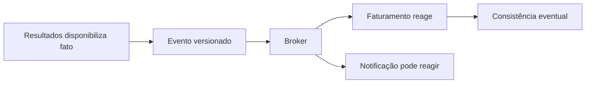

# Módulo 5 — Arquiteturas orientadas por eventos

**Encontro:** 5 de 6

Arquitetura orientada por eventos organiza colaboração por fatos. Ao disponibilizar resultado, o laboratório informa Faturamento, Notificação ou painel sem saber quem reagirá. A separação troca dependência temporal por contratos, repetição, atraso e decisões sobre dados.

O resultado é projetar integração assíncrona: distinguir evento, comando e mensagem; escolher fila, tópico ou log; e modelar consumidores que sobrevivem à repetição. No caso hospitalar, `ResultadoLaboratorialDisponibilizado.v1` permite cobrança sem cascata.

## Pergunta orientadora

Como permitir que capacidades independentes reajam a um fato sem prometer ordem global, ausência de repetição ou consistência imediata que a infraestrutura não oferece?

Evento afirma passado; comando pede ação; mensagem é envelope técnico. Confundi-los leva a publicar ordem como fato ou tratar repetição como impossível. Broker encaminha e isola; mediator coordena decisão. Resolvem acoplamentos diferentes.

## Percurso de aprendizagem

1. [Conceitos](conceitos.md): fatos, comandos, mensagens, broker, mediator, fila, tópico e log.
2. [Padrões e decisões](padroes-e-decisoes.md): entrega, idempotência, ordem, schema, evolução e DLQ.
3. [Exemplo arquitetural](exemplo-arquitetural.md): resultado, faturamento e duas tentativas.
4. [Estudo de caso](estudo-de-caso.md): decisão hospitalar e consequências.
5. [Oficina](oficina-de-ferramentas.md): RabbitMQ local, repetição e fila de descarte.
6. [Exercícios](exercicios.md): decisões pelos níveis de Bloom.
7. [Síntese e referências](sintese-e-referencias.md): heurísticas e fontes.

**Texto alternativo:** Fluxo em que Resultados publica um evento versionado para um broker; Faturamento e Notificação reagem de forma independente, e a cobrança converge depois do resultado.

*Figura 7 — Reações independentes a um fato publicado.*

**Leitura textual:** Resultados publica um fato versionado no broker. Faturamento e Notificação podem reagir de modo independente; por isso a informação de cobrança pode ficar correta depois da disponibilidade do resultado, e não no mesmo instante.

## Limite deliberado

O módulo não transporta resultado clínico completo nem transforma broker em prontuário. O contrato usa referências sintéticas e não promete “exactly-once” geral: confirmação, reentrega, banco e efeito externo cruzam limites. A oficina demonstra **pelo menos uma entrega, com efeito idempotente** para um `event_id`.

APIs síncronas continuam adequadas a consulta imediata. Eventos atendem reação independente, tolerância a atraso, picos ou mudança de estado. A decisão é contextual e verificável.
