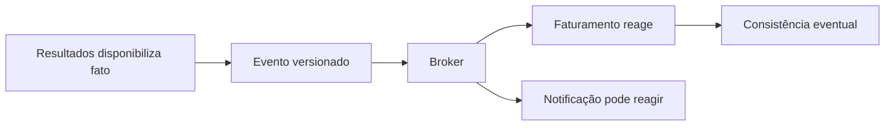

# Módulo 5 — Arquiteturas orientadas por eventos

**Encontro:** 5 de 6

Arquitetura orientada por eventos organiza parte da colaboração de um sistema ao redor de fatos que já aconteceram. Quando o laboratório disponibiliza um resultado, por exemplo, ele pode informar esse fato sem saber se Faturamento, Notificação ou um painel operacional irão reagir agora, mais tarde ou nem existir ainda. Essa separação é valiosa, mas não é automática: ela troca uma dependência temporal visível por contratos, entregas repetidas, acompanhamento de atrasos e decisões explícitas sobre dados e efeitos.

O resultado deste encontro é projetar uma integração assíncrona que seja explicável. Você distinguirá um evento de um comando e de uma mensagem genérica; escolherá fila, tópico ou log distribuído pelo comportamento que precisa; e modelará consumidores que sobrevivem a repetição. O caso integrador é a plataforma hospitalar: o fato `ResultadoLaboratorialDisponibilizado.v1` sai do domínio de resultados e permite que Faturamento registre a cobrança sem transformar a disponibilidade clínica em uma chamada síncrona em cascata.

## Pergunta orientadora

Como permitir que capacidades independentes reajam a um fato sem prometer ordem global, ausência de repetição ou consistência imediata que a infraestrutura não oferece?

Uma resposta arquitetural começa pela semântica. Um evento afirma algo no passado: “resultado foi disponibilizado”. Um comando pede que alguém faça algo: “gere a cobrança”. Uma mensagem é o envelope técnico que transporta qualquer uma dessas intenções. Confundir os três leva, por exemplo, a publicar uma ordem imperativa como se fosse fato compartilhável ou a tratar uma mensagem recebida duas vezes como falha impossível. A escolha do broker também depende da pergunta: um broker encaminha e isola produtores e consumidores; um mediator coordena uma conversa com decisão centralizada. Eles podem coexistir, mas resolvem acoplamentos diferentes.

## Percurso de aprendizagem

1. Em [Conceitos](conceitos.md), definimos fatos, comandos, mensagens, broker, mediator e os modelos de fila, tópico e log.
2. Em [Padrões e decisões](padroes-e-decisoes.md), examinamos entrega pelo menos uma vez, idempotência, ordem, esquema, evolução e dead-letter queue.
3. Em [Exemplo arquitetural](exemplo-arquitetural.md), seguimos o resultado até Faturamento e a evidência de duas tentativas.
4. Em [Estudo de caso](estudo-de-caso.md), comparamos decisões para resultado e faturamento em uma plataforma hospitalar.
5. Na [Oficina de ferramentas](oficina-de-ferramentas.md), executamos RabbitMQ local, publicamos repetição e observamos a fila de descarte.
6. Em [Exercícios](exercicios.md), usamos os seis níveis da Taxonomia de Bloom para justificar escolhas e limites.
7. Em [Síntese e referências](sintese-e-referencias.md), consolidamos heurísticas, equivalências em Java e .NET e fontes públicas.

**Leitura textual da figura:** Resultados publica um fato versionado no broker. Faturamento e Notificação podem reagir de modo independente; por isso a informação de cobrança pode ficar correta depois da disponibilidade do resultado, e não no mesmo instante.

## Limite deliberado

O módulo não propõe transportar resultado clínico completo em eventos nem transformar o broker em banco de dados de prontuário. O contrato usa referências e identificadores sintéticos; o consumidor busca ou mantém apenas o dado que realmente lhe cabe. Também não promete “exactly-once” como propriedade geral. Confirmações, reentregas, escrita em banco e efeitos externos atravessam limites distintos. A oficina demonstra um objetivo mais honesto: **pelo menos uma entrega, com efeito de negócio idempotente** para um `event_id`.

Isso não elimina a necessidade de APIs. Uma consulta que precisa responder imediatamente continua podendo ser síncrona. Eventos são especialmente úteis quando há reação independente, tolerância a atraso, absorção de picos ou necessidade de registrar uma mudança de estado. A decisão correta é contextual, documentada e verificável.
