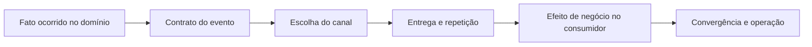

# Módulo 5 — Arquiteturas orientadas por eventos

**Encontro:** 5 de 6

Nos módulos anteriores, um serviço que precisava de algo chamava outro e esperava a resposta. Esse desenho funciona bem quando a resposta é necessária para continuar, e cobra caro quando não é: quem chama fica preso à disponibilidade e ao desempenho de quem responde, mesmo para avisar sobre um fato que já aconteceu.

Este módulo trata da alternativa. Um serviço publica que algo ocorreu e encerra o próprio trabalho; quem tiver interesse reage depois, no ritmo que conseguir sustentar. A troca não é gratuita, e boa parte do módulo é sobre o que ela cobra: contratos entre partes que não se conhecem, mensagens que podem chegar duas vezes, dados que ficam temporariamente desencontrados e falhas que ninguém percebe se não houver quem as observe.

O caso condutor continua sendo a plataforma hospitalar. Quando um resultado de exame fica disponível, Faturamento precisa cobrar e Notificação precisa avisar o paciente, sem que o laboratório dependa de nenhum dos dois para concluir seu próprio trabalho.

## Pergunta orientadora

Como permitir que capacidades independentes reajam a um fato sem prometer ordem global, ausência de repetição ou consistência imediata que a infraestrutura não oferece?

Ao final, você será capaz de distinguir evento, comando e mensagem pela intenção que cada um carrega; escolher entre broker e mediator conforme a necessidade de coordenar o fluxo; comparar fila, tópico e log distribuído pelo que cada um faz com a mensagem depois de entregue; e projetar um consumidor que sobrevive a receber a mesma mensagem mais de uma vez. Também executará um broker local e observará, em código, a diferença entre uma entrega repetida e um efeito de negócio duplicado.

## Percurso de aprendizagem

1. Em [Conceitos](conceitos.md), partimos do estilo e do vocabulário: evento, comando, mensagem, broker, mediator, fila, tópico e log distribuído.
2. Em [Padrões e decisões](padroes-e-decisoes.md), tratamos entrega, idempotência, ordenação, contrato e o que fazer com a mensagem que falha.
3. Em [Exemplo arquitetural](exemplo-arquitetural.md), acompanhamos um resultado de exame gerar uma única cobrança, com o código que sustenta isso.
4. Em [Estudo de caso](estudo-de-caso.md), avaliamos a migração de uma cadeia síncrona para mensageria e dois incidentes que vieram depois.
5. Em [Casos reais](casos-reais.md), acompanhamos o LinkedIn substituir uma cadeia de chamadas síncronas pelo log distribuído que viria a ser o Apache Kafka.
6. Na [Oficina de ferramentas](oficina-de-ferramentas.md), publicamos o mesmo evento duas vezes e verificamos o efeito no banco.
7. Em [Exercícios](exercicios.md), avançamos pelos seis níveis da Taxonomia de Bloom.
8. Em [Síntese e referências](sintese-e-referencias.md), consolidamos heurísticas e fontes públicas.

```mermaid
flowchart LR
    A[Fato ocorrido no domínio] --> B[Contrato do evento]
    B --> C[Escolha do canal]
    C --> D[Entrega e repetição]
    D --> E[Efeito de negócio no consumidor]
    E --> F[Convergência e operação]
```

**Texto alternativo:** percurso que parte de um fato ocorrido no domínio, passa pelo contrato do evento e pela escolha do canal, e chega à entrega, ao efeito no consumidor e à operação.

*Figura 5 — Percurso de decisão para integração orientada por eventos. Fonte: curso.*

**Leitura textual:** o percurso começa pelo fato que ocorreu, define o contrato que o representa e o canal que o transporta, e só então trata do que acontece quando a mensagem chega mais de uma vez, do efeito que ela produz no consumidor e do tempo até tudo convergir.

## O que não será presumido

Eventos não substituem APIs síncronas. Uma consulta que precisa de resposta imediata continua sendo uma chamada, e trocá-la por mensageria só adiciona latência e complexidade. O módulo trata do caso em que a origem não precisa da resposta para concluir seu trabalho.

Mensageria também não é sinônimo de Kafka. Fila, tópico e log resolvem problemas diferentes, e o custo de operar cada um varia bastante. A escolha entre eles aparece aqui como decisão com critérios explícitos. Tratá-la como uma escada de maturidade, em que Kafka ocuparia o degrau mais alto, ignora o trabalho operacional que cada opção carrega.

Nenhuma tecnologia entrega uma promessa de processamento único que atravesse banco de dados, rede e sistemas externos ao mesmo tempo. O que existe são garantias com escopo declarado, e o módulo trabalha com a mais honesta delas: a mensagem pode chegar mais de uma vez, e cabe ao consumidor garantir que o efeito no negócio aconteça uma só vez.

O laboratório usa dados sintéticos e um broker local. Em produção, classificação de dados, autorização de leitura, retenção e observabilidade exigiriam decisões que este módulo não toma.
