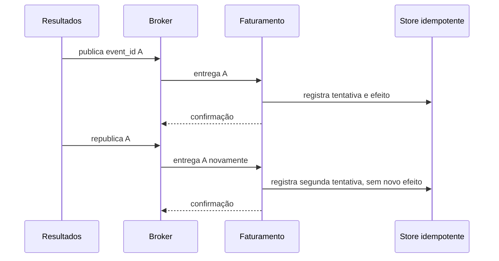

# Padrões e decisões: entrega útil, não mágica

## Entrega pelo menos uma vez e idempotência

A entrega **pelo menos uma vez** admite repetição. Um consumidor recebe a mensagem, grava o efeito e cai antes de confirmar; o broker não pode saber que a gravação ocorreu e volta a entregar. A rede pode interromper uma confirmação já aplicada. O produtor pode publicar novamente por ter perdido a confirmação. Repetição é consequência prudente de não perder trabalho diante de falhas ambíguas, não uma anomalia que se resolve com uma condição frágil na memória do processo.

**Idempotência** significa que aplicar a mesma ocorrência mais de uma vez tem o mesmo efeito de negócio observável que aplicá-la uma única vez. Não significa que nada acontece na segunda tentativa: é útil registrar que houve outra tentativa, medir o motivo e confirmar a mensagem. No laboratório, `processed_events` guarda `event_id` e contagem de tentativas, enquanto `billing_effects` tem uma chave única por `event_id`. A primeira mensagem cria o efeito; a segunda eleva tentativas para duas e não cria novo lançamento administrativo.

A fronteira deve ser transacional onde for possível. Registrar deduplicação e efeito na mesma transação SQLite evita o intervalo em que um é gravado sem o outro. Em outro sistema, a mesma ideia pode usar uma tabela de inbox no banco do consumidor, uma restrição única ou uma operação naturalmente idempotente. Um cache de processo é insuficiente: reinício, réplica diferente e expiração permitem duplicidade. Para efeitos fora do banco, como e-mail ou lançamento externo, a chave de idempotência também precisa chegar ao provedor e a reconciliação passa a fazer parte do desenho.

## Ordem: qual ordem, para qual chave?

“Precisamos de ordenação” é uma frase incompleta. É necessário declarar a sequência relevante: resultados do mesmo exame? mudanças do mesmo paciente? todos os fatos do hospital? Ordem global reduz paralelismo, torna falhas mais caras e em muitos brokers simplesmente não é garantida. Uma fila com vários consumidores pode entregar mensagens em sequência, mas seus efeitos terminam em ordem diferente. Retentativas e redelivery também alteram o momento observado.

Em Kafka, a ordem é normalmente por partição; escolher `exam_id` como chave pode manter eventos daquele exame na mesma partição, mas não ordena eventos de exames diferentes. Em RabbitMQ, uma fila e um consumidor podem facilitar uma sequência local, mas não tornam uma topologia inteira globalmente ordenada. Quando o domínio exige progressão, o evento pode carregar versão ou sequência por agregado; o consumidor rejeita estado anterior, guarda pendência ou aplica regra determinística. A decisão deve explicar a perda aceitável quando eventos chegam trocados.

## Esquema, compatibilidade e evolução

O contrato é uma interface pública entre capacidades, mesmo quando todas estão no mesmo repositório. Um esquema explícito especifica campos, tipos, semântica, campos obrigatórios e versão. A validação Pydantic da oficina recusa payload sem `result_reference` antes do ack. O nome `ResultadoLaboratorialDisponibilizado.v1` torna a versão visível e a configuração `extra="forbid"` impede que o consumidor aceite em silêncio campos desconhecidos no exercício. Em produção, a tolerância a campos adicionais é uma escolha consciente de compatibilidade, não um padrão universal.

Evoluir não é apenas alterar JSON. Adicionar um campo opcional pode ser compatível para consumidores que o ignoram; tornar campo obrigatório ou mudar seu significado pode quebrar leitura. Trocar unidade, fuso, identificador ou classificação de dado pode quebrar negócio sem quebrar parse. Uma estratégia usual é publicar leitura compatível durante transição, documentar data e owner, e retirar apenas quando consumidores confirmarem a migração. Uma nova versão no nome é mais clara quando a semântica se rompe; produzir duas versões temporariamente pode reduzir risco, ao custo de observabilidade e prazo explícito.

Schema Registry, JSON Schema, Avro, Protobuf e validação de modelos são mecanismos possíveis, não substitutos da conversa de contrato. A questão é descobrir incompatibilidade antes de uma mensagem parada em produção. Testes de contrato, exemplos sintéticos e uma política de depreciação verificável fazem essa descoberta mais barata.

## Dead-letter queue como evidência, não depósito

Uma **dead-letter queue** (DLQ) recebe mensagens que não puderam seguir a política normal: rejeição sem requeue, expiração ou limite de tentativas, conforme configuração. Na oficina, `billing.resultados.v1` declara `hospital.events.dlx` como dead-letter exchange e `billing.resultados.v1.dlq` recebe mensagens rejeitadas. A mensagem inválida não deve ser confirmada como se tivesse sido faturada; ela fica disponível para inspeção com o erro, a versão e a decisão de recuperação.

DLQ não corrige schema automaticamente nem é trilha de auditoria clínica. Sem owner, alerta e procedimento de decisão, ela vira armazenamento silencioso de falhas. A equipe define quais erros são transitórios e merecem retry, quais são permanentes e vão à DLQ, como proteger dados ali presentes e como evitar reprocessar em loop. Corrigir o produtor, criar evento de compensação ou descartar uma mensagem sintética são decisões diferentes; a fila preserva evidência para fazê-las, não escolhe por nós.

**Leitura textual da figura:** Resultados publica a ocorrência A. Faturamento registra o efeito e confirma. A mesma ocorrência chega outra vez; o store aumenta a contagem de tentativas, reconhece a identidade já processada e impede novo efeito antes da segunda confirmação.

## Outbox, inbox e fronteiras de escrita

Publicar diretamente após uma transação de domínio cria o problema de dupla escrita: o resultado pode ser salvo sem evento se o processo falhar antes de publicar; ou o evento pode sair quando a transação local falha. O padrão **outbox** grava a mudança e uma intenção de publicação na mesma transação local. Um publicador separado envia a outbox ao broker e marca o avanço. Ainda há repetição possível, portanto o destinatário usa uma **inbox** ou deduplicação pelo `event_id`.

O laboratório mostra a metade consumidora da ideia: a tabela de mensagens processadas é uma inbox didática. Não implementa outbox porque o foco é observar a repetição, mas a decisão de produção deve considerar os dois lados. Se a origem tem banco transacional, outbox costuma ser mais confiável do que tentar coordenar banco e broker com uma transação distribuída. Se a origem é um fluxo de log, a estratégia pode ser diferente. A obrigação é documentar a janela de falha e a recuperação, não invocar “exactly-once” para escondê-la.

## RabbitMQ ou Kafka: matriz de perguntas

Escolha RabbitMQ quando roteamento de mensagens e unidades de trabalho com confirmações forem o centro do problema, e quando a topologia de filas for compreensível para a operação. Escolha Kafka quando retenção, replay, leitura por múltiplos grupos e particionamento de fluxo forem requisitos centrais. Avalie também as competências da equipe, monitoramento, recuperação, política de dados e custo operacional. Uma ponte entre os dois pode ser justificável, mas aumenta contratos, observabilidade e modos de falha.

Não use uma comparação de taxa isolada como decisão. O custo de uma mensagem, persistência, confirmação, tamanho de lote, replicação e consumidores muda o resultado. Não descreva qualquer configuração como exatamente uma vez: Kafka oferece mecanismos de idempotência e transações em escopos definidos, mas efeitos em sistemas externos ainda exigem desenho ponta a ponta; RabbitMQ oferece confirmações e processamento confiável conforme a topologia, mas a idempotência do consumidor continua necessária. A linguagem precisa evita expectativas perigosas.

## Checklist de decisão

Antes de criar um canal, registre fato ou comando, producer owner, consumidores conhecidos e desconhecidos, modelo de retenção, chave de partição ou ordenação, política de confirmação, identidade de deduplicação, schema e compatibilidade, DLQ e sinais de atraso. Declare ainda qual projeção pode ficar atrasada e como o usuário verá esse estado. Um desenho pequeno com essas respostas é mais útil que uma lista longa de tecnologias.
