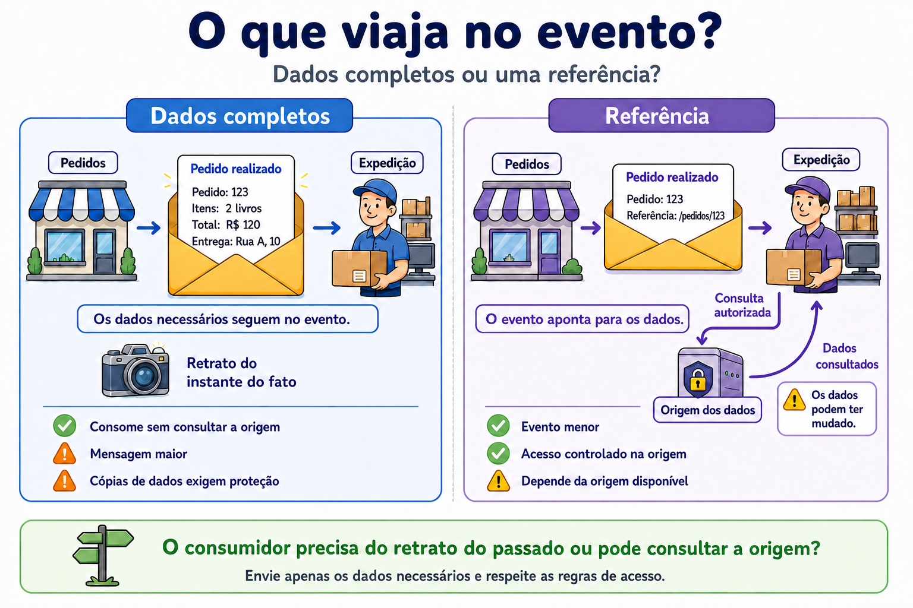
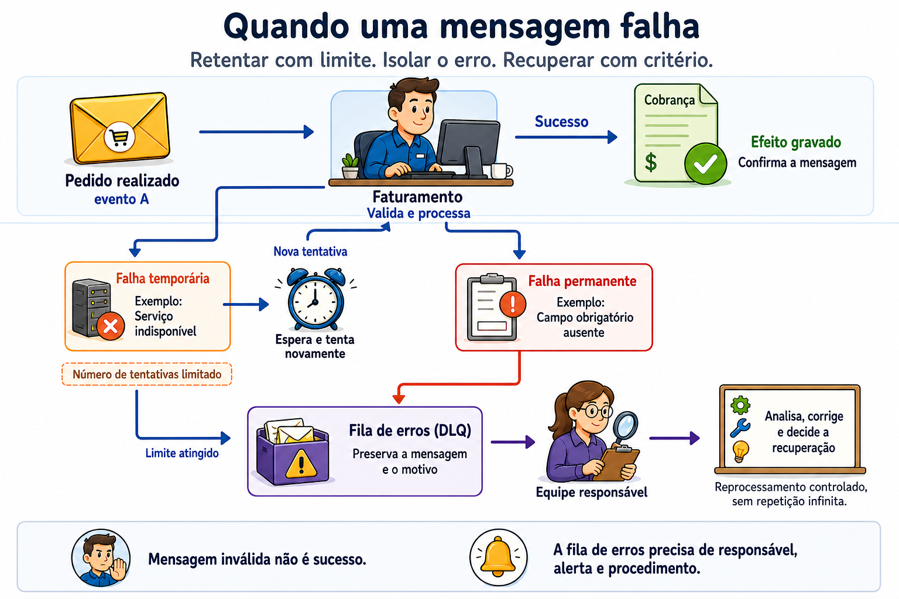
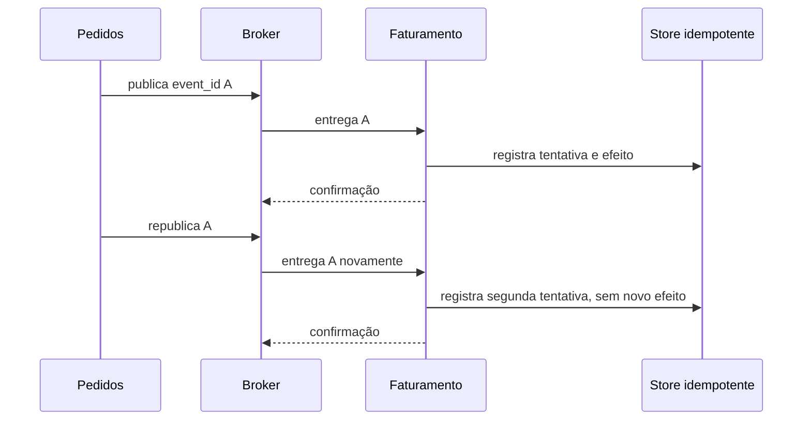

# Padrões e decisões: entrega útil, não mágica

## Entrega pelo menos uma vez e idempotência

A entrega **pelo menos uma vez** admite repetição. Um consumidor recebe a mensagem, grava o efeito e cai antes de confirmar; o broker não pode saber que a gravação ocorreu e volta a entregar. A rede pode interromper uma confirmação já aplicada. O produtor pode publicar novamente por ter perdido a confirmação. Repetição é consequência prudente de não perder trabalho diante de falhas ambíguas, não uma anomalia que se resolve com uma condição frágil na memória do processo.

**Idempotência** significa que aplicar a mesma ocorrência mais de uma vez tem o mesmo efeito de negócio observável que aplicá-la uma única vez. Não significa que nada acontece na segunda tentativa: é útil registrar que houve outra tentativa, medir o motivo e confirmar a mensagem. No serviço de Pedidos, `processed_events` guarda `event_id` e contagem de tentativas, enquanto `billing_effects` tem uma chave única por `event_id`. A primeira mensagem cria o efeito; a segunda eleva tentativas para duas e não cria novo lançamento administrativo.

Vale situar a entrega pelo menos uma vez entre as três garantias que uma mensageria pode oferecer, porque as outras duas são frequentemente prometidas sem ressalva.

*Figura 11 — Os três modelos de entrega e o papel da idempotência. Fonte: curso.*

**Leitura textual da figura:** no modelo **no máximo uma vez**, o remetente envia e não acompanha o resultado: a mensagem chega uma vez ou não chega, porque não há reenvio. Pode haver perda. No modelo **pelo menos uma vez**, o remetente reenvia enquanto não receber confirmação; se a confirmação se perder no caminho, ele tenta de novo, e o destinatário pode receber a mesma mensagem duas vezes. Não há perda, mas há duplicatas. No modelo **exatamente uma vez**, um controle de entrega com registro persistente absorve as tentativas internas e entrega uma única vez ao destinatário, sem perda nem duplicação — dentro de um escopo delimitado, que a figura marca explicitamente. Na faixa inferior, a idempotência protege o efeito de negócio por outro caminho: mesmo que o evento A chegue duas vezes, um consumidor idempotente registra o evento e o efeito na mesma transação e produz um único lançamento no banco. O aviso final vale para a decisão inteira: entrega, processamento e efeito externo têm escopos diferentes, e uma garantia num deles não se estende automaticamente aos outros.

A fronteira deve ser transacional onde for possível. Registrar deduplicação e efeito na mesma transação SQLite evita o intervalo em que um é gravado sem o outro. Em outro sistema, a mesma ideia pode usar uma tabela de inbox no banco do consumidor, uma restrição única ou uma operação naturalmente idempotente. Um cache de processo é insuficiente: reinício, réplica diferente e expiração permitem duplicidade. Para efeitos fora do banco, como e-mail ou lançamento externo, a chave de idempotência também precisa chegar ao provedor e a reconciliação passa a fazer parte do desenho.

Idempotência resolve o problema de uma mensagem chegar duas vezes. Um problema vizinho, e independente dele, é o de várias mensagens chegarem na ordem errada.

## Payload completo ou referência?

Antes de decidir ordem, contrato ou tecnologia, há uma escolha mais básica: quanto do dado viaja dentro do evento. Duas estratégias competem.

O **payload completo** carrega no evento todos os dados de que o consumidor precisa. Ele elimina uma ida de volta à origem, o que ajuda quando o consumidor não tem acesso ao banco do produtor, quando a origem pode estar indisponível no momento do consumo, ou quando o histórico precisa refletir o estado exato daquele instante. O preço é um evento maior, mais acoplado à estrutura interna de quem publica, e uma cópia de dado circulando por canais que talvez não devessem transportá-lo.

A estratégia de **referência** envia apenas identificadores, e o consumidor busca o que precisa na origem. O evento fica pequeno e estável, o produtor mantém controle sobre quem lê o quê, e dado sensível não circula pelo canal. O preço é que o consumidor passa a depender da disponibilidade da origem no momento em que processa, e o dado buscado pode já ter mudado desde o instante do fato.

*Figura 12 — Dados completos ou referência: o que viaja dentro do evento. Fonte: curso.*

**Leitura textual da figura:** à esquerda, na estratégia de dados completos, o serviço de Pedidos publica um evento que carrega itens, valor total e endereço de entrega; a Expedição consome tudo o que precisa sem consultar a origem, e o evento funciona como um retrato do instante do fato. O preço é uma mensagem maior e cópias de dados que exigem proteção. À direita, na estratégia de referência, o mesmo evento carrega apenas o identificador do pedido e um caminho de consulta; a Expedição faz uma consulta autorizada à origem dos dados para obter o resto. O evento fica menor e o controle de acesso permanece na origem, mas o consumidor passa a depender de ela estar disponível, e os dados consultados podem já ter mudado desde o instante do fato. A pergunta que decide entre as duas: o consumidor precisa do retrato do passado ou pode consultar a origem?

O contrato deste módulo usa a estratégia de referência: `result_reference` aponta para o recurso que o owner controla, em vez de carregar o laudo. Num domínio clínico, essa escolha é menos sobre tamanho de mensagem e mais sobre controle de acesso — um evento entregue internamente não deveria virar um atalho em torno da autorização de leitura. Num domínio sem essa restrição, o payload completo pode ser a decisão certa pelo motivo oposto: reduzir acoplamento temporal com a origem.

## Ordem: qual ordem, para qual chave?

“Precisamos de ordenação” é uma frase incompleta. É necessário declarar a sequência relevante: eventos do mesmo pedido? mudanças do mesmo cliente? todos os fatos da loja? Ordem global reduz paralelismo, torna falhas mais caras e em muitos brokers simplesmente não é garantida. Uma fila com vários consumidores pode entregar mensagens em sequência, mas seus efeitos terminam em ordem diferente. Retentativas e redelivery também alteram o momento observado.

Em Kafka, a ordem é normalmente por partição; escolher `pedido_id` como chave pode manter eventos daquele pedido na mesma partição, mas não ordena eventos de pedidos diferentes. Em RabbitMQ, uma fila e um consumidor podem facilitar uma sequência local, mas não tornam uma topologia inteira globalmente ordenada. Quando o domínio exige progressão, o evento pode carregar versão ou sequência por agregado; o consumidor rejeita estado anterior, guarda pendência ou aplica regra determinística. A decisão deve explicar a perda aceitável quando eventos chegam trocados.

## Esquema, compatibilidade e evolução

O contrato é uma interface pública entre capacidades, mesmo quando todas estão no mesmo repositório. Um esquema explícito especifica campos, tipos, semântica, campos obrigatórios e versão. A validação Pydantic da oficina recusa um payload sem um campo obrigatório antes do ack. Um nome de evento versionado, como `PedidoRealizado.v1`, torna a versão visível na assinatura do próprio fato, e uma configuração de esquema estrito (`extra="forbid"`) impede que o consumidor aceite em silêncio campos desconhecidos no exercício. Não existe padrão universal aqui: em produção, a tolerância a campos adicionais é uma escolha consciente de compatibilidade que cada equipe assume.

Evoluir não é apenas alterar JSON. Adicionar um campo opcional pode ser compatível para consumidores que o ignoram; tornar campo obrigatório ou mudar seu significado pode quebrar leitura. Trocar unidade, fuso, identificador ou classificação de dado pode quebrar negócio sem quebrar parse. Uma estratégia usual é publicar leitura compatível durante transição, documentar data e owner, e retirar apenas quando consumidores confirmarem a migração. Uma nova versão no nome é mais clara quando a semântica se rompe; produzir duas versões temporariamente pode reduzir risco, ao custo de observabilidade e prazo explícito.

Schema Registry, JSON Schema, Avro, Protobuf e validação de modelos são mecanismos possíveis; nenhum deles substitui a conversa de contrato. A questão é descobrir incompatibilidade antes de uma mensagem parada em produção. Testes de contrato, exemplos sintéticos e uma política de depreciação verificável fazem essa descoberta mais barata.

Mesmo um contrato bem versionado eventualmente chega quebrado: de um bug no produtor, de uma migração incompleta, de um consumidor que ainda espera a versão antiga. É para guardar essa mensagem, sem confirmá-la como sucesso, que existe a dead-letter queue.

## Dead-letter queue como evidência, não depósito

Uma **dead-letter queue** (DLQ) recebe mensagens que não puderam seguir a política normal: rejeição sem requeue, expiração ou limite de tentativas, conforme configuração. Na oficina, a fila de trabalho de Faturamento declara uma exchange de dead-letter, e uma fila companion dedicada recebe mensagens rejeitadas. A mensagem inválida não deve ser confirmada como se tivesse sido faturada; ela fica disponível para inspeção com o erro, a versão e a decisão de recuperação.

DLQ não corrige schema automaticamente nem é trilha de auditoria geral. Sem owner, alerta e procedimento de decisão, ela vira armazenamento silencioso de falhas. A equipe define quais erros são transitórios e merecem retry, quais são permanentes e vão à DLQ, como proteger dados ali presentes e como evitar reprocessar em loop. Corrigir o produtor, criar evento de compensação ou descartar uma mensagem sintética são decisões diferentes; a fila só preserva a evidência para tomá-las, e quem decide é a equipe.

A separação entre erro transitório e permanente é o que decide o caminho da mensagem, e a figura a seguir mostra os três desfechos possíveis de uma entrega.

*Figura 13 — Retentativa com limite, isolamento do erro e recuperação com critério. Fonte: curso.*

**Leitura textual da figura:** o evento de pedido chega a Faturamento, que valida e processa. Em caso de sucesso, o efeito é gravado e a mensagem é confirmada. Uma falha temporária, como um serviço indisponível, leva a uma espera seguida de nova tentativa, com número de tentativas limitado; atingido esse limite, a mensagem segue para a fila de erros. Uma falha permanente, como um campo obrigatório ausente, vai direto para a fila de erros sem retentativa, porque repetir não mudaria o resultado. A fila de erros preserva a mensagem e o motivo da falha, e uma equipe responsável analisa, corrige e decide a recuperação, num reprocessamento controlado. Duas condições sustentam o desenho: uma mensagem inválida nunca é confirmada como sucesso, e a fila de erros precisa de responsável, alerta e procedimento.

```mermaid
sequenceDiagram
    participant R as Pedidos
    participant B as Broker
    participant F as Faturamento
    participant S as Store idempotente
    R->>B: publica event_id A
    B->>F: entrega A
    F->>S: registra tentativa e efeito
    F-->>B: confirmação
    R->>B: republica A
    B->>F: entrega A novamente
    F->>S: registra segunda tentativa, sem novo efeito
    F-->>B: confirmação
```

**Texto alternativo:** Sequência de duas entregas do mesmo evento A: a primeira cria efeito e a segunda apenas registra nova tentativa no store idempotente antes da confirmação.

*Figura 14 — Reentrega com efeito de negócio idempotente. Fonte: curso.*

**Leitura textual:** Pedidos publica a ocorrência A. Faturamento registra o efeito e confirma. A mesma ocorrência chega outra vez; o store aumenta a contagem de tentativas, reconhece a identidade já processada e impede novo efeito antes da segunda confirmação.

## Outbox, inbox e fronteiras de escrita

Publicar diretamente após uma transação de domínio cria o problema de dupla escrita: o resultado pode ser salvo sem evento se o processo falhar antes de publicar; ou o evento pode sair quando a transação local falha. O padrão **outbox** grava a mudança e uma intenção de publicação na mesma transação local. Um publicador separado envia a outbox ao broker e marca o avanço. Ainda há repetição possível, portanto o destinatário usa uma **inbox** ou deduplicação pelo `event_id`.

*Figura 15 — Caixa de saída e caixa de entrada protegendo as duas pontas. Fonte: curso.*

**Leitura textual da figura:** na primeira etapa, o serviço de Pedidos grava o pedido registrado e a caixa de saída (*outbox*) com o evento A dentro da mesma transação local, de modo que ou os dois são gravados, ou nenhum. Na segunda etapa, um publicador separado lê a caixa de saída, publica na central de eventos e marca o envio depois da confirmação; entre a central e o consumidor pode haver reentrega do mesmo evento. Na terceira etapa, Faturamento grava a caixa de entrada (*inbox*), registrando que o evento A foi processado, e o efeito de negócio, uma cobrança, também na mesma transação, confirmando o consumo só depois de gravar. O consumidor identifica duplicatas pela identidade do evento, não pelo horário nem pela posição na fila. O resultado: duas entregas do evento A produzem uma única cobrança.

O laboratório mostra a metade consumidora da ideia: a tabela de mensagens processadas é uma inbox didática. Não implementa outbox porque o foco é observar a repetição, mas a decisão de produção deve considerar os dois lados. Se a origem tem banco transacional, outbox costuma ser mais confiável do que tentar coordenar banco e broker com uma transação distribuída. Se a origem é um fluxo de log, a estratégia pode ser diferente. A obrigação é documentar a janela de falha e a recuperação em vez de invocar “exactly-once” para escondê-la.

Idempotência, ordem, contrato, DLQ, outbox: nenhuma dessas garantias é exclusiva de uma tecnologia específica, mas o esforço para implementá-las muda bastante de uma para outra.

## Escolher entre RabbitMQ, Kafka, ActiveMQ e serviços gerenciados

RabbitMQ é uma alternativa quando roteamento de mensagens e unidades de trabalho com confirmações forem o centro do problema e a topologia de filas for compreensível para a operação. Kafka é uma alternativa quando retenção, replay, leitura por múltiplos grupos e particionamento de fluxo forem requisitos centrais. ActiveMQ é uma alternativa quando filas ou tópicos com confirmações precisam integrar sistemas que já dependem de JMS ou de protocolos interoperáveis. Nenhuma dessas capacidades substitui idempotência, ownership, nem uma política para falhas.

Avalie limites e custo operacional em relação ao contexto: RabbitMQ pede operação de exchanges, filas, confirmações e DLQ; Kafka pede retenção, partições, grupos, replicação e governança do dado retido; ActiveMQ pede decidir variante, persistência, disponibilidade, compatibilidade de protocolos e monitoramento. Uma ponte entre tecnologias pode ser justificável, mas aumenta contratos, observabilidade e modos de falha. Não use comparação de taxa isolada como decisão: mensagem, persistência, confirmação, tamanho de lote, replicação e consumidores mudam o resultado. Kafka oferece mecanismos de idempotência e transações em escopos definidos, mas efeitos externos ainda exigem desenho ponta a ponta; RabbitMQ e ActiveMQ oferecem confirmações e processamento confiável conforme a topologia, mas a idempotência do consumidor continua necessária.

| Dimensão | RabbitMQ | Kafka | ActiveMQ |
| --- | --- | --- | --- |
| Unidade de paralelismo | Fila, com múltiplos consumidores competindo | Partição, uma por consumidor no grupo | Fila ou tópico, conforme o conector |
| Modelo de leitura | Destrutivo: ack remove a mensagem | Não destrutivo: offset por consumidor, replay possível | Destrutivo, com opções de tópico durável |
| Retenção típica | Até a confirmação, ou TTL configurado | Por tempo ou tamanho, independente do consumo | Até a confirmação, com store persistente |
| Protocolo nativo | AMQP 0-9-1, com plugins para MQTT e STOMP | Protocolo próprio binário sobre TCP | JMS, com OpenWire, AMQP e MQTT via conectores |
| Onde pesa o custo operacional | Exchanges, bindings e política de DLQ | Partições, réplicas e retenção em disco | Escolha de variante (Classic/Artemis) e persistência |

Quando a pergunta muda de “qual mensageria autogerida operar” para “o que terceirizar”, entram os serviços gerenciados citados no módulo de conceitos: AWS SQS resolve fila simples sem servidor próprio, EventBridge resolve roteamento por regra entre serviços AWS, Google Pub/Sub e Azure Service Bus cobrem papéis equivalentes em suas nuvens, e Apache Pulsar aparece quando multi-tenancy e replicação geográfica nativas pesam mais que o ecossistema já maduro do Kafka. Nenhuma dessas opções elimina a decisão sobre idempotência ou ordenação; elas apenas deslocam o time-to-market e o controle fino de configuração para o provedor, ao custo de portabilidade e de uma superfície de API que a equipe não controla.

## Checklist de decisão

Antes de criar um canal, registre fato ou comando, producer owner, consumidores conhecidos e desconhecidos, modelo de retenção, chave de partição ou ordenação, política de confirmação, identidade de deduplicação, schema e compatibilidade, DLQ e sinais de atraso. Declare ainda qual projeção pode ficar atrasada e como o usuário verá esse estado. Um desenho pequeno com essas respostas é mais útil que uma lista longa de tecnologias.
