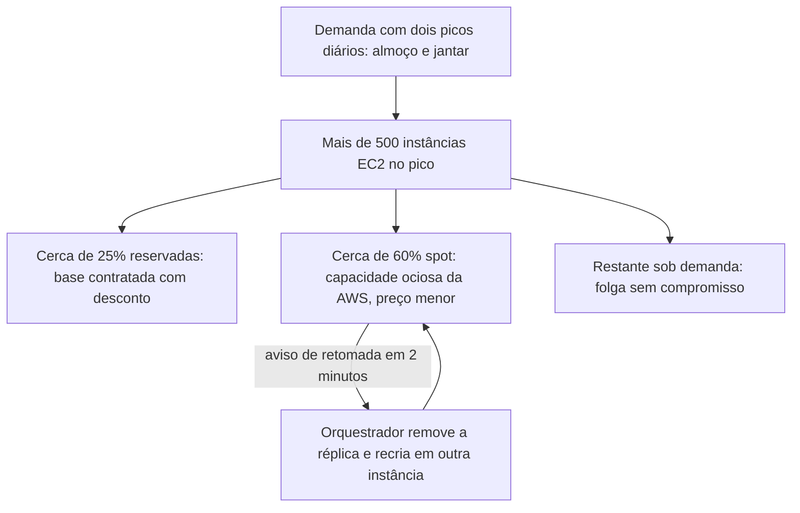
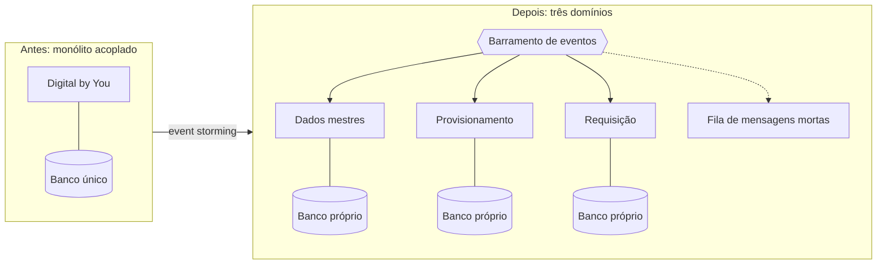

# iFood: 500 instâncias no pico, 60% delas descartáveis

No sábado, 7 de março de 2026, o iFood registrou mais de 7,7 milhões de pedidos em um único dia. No fim de semana inteiro foram 22,2 milhões de pedidos, cerca de 5,1 mil transações por minuto, com mais de 200 mil entregadores ativos ao mesmo tempo, segundo o [comunicado da própria empresa](https://institucional.ifood.com.br/noticias/ifood-bateu-recorde-de-vendas/).

Quinze anos antes, a tecnologia da empresa era telefone e fax.

Este caso percorre o que aconteceu entre as duas frases, e percorre pelo lado técnico.

## De onde vem cada número deste caso

A espinha dorsal é um vídeo de onze minutos, **[Estudo de caso AWS: iFood](https://www.youtube.com/watch?v=IRZJBpRmB4I)**, publicado no canal da Amazon Web Services em 31 de julho de 2018, em que engenheiros da própria empresa descrevem a migração e citam os números de infraestrutura da época. Ele é referido adiante como *o vídeo de 2018*, e vale assisti-lo antes de seguir.

Três materiais posteriores completam o quadro. O **[estudo de caso do iFood no site da AWS](https://aws.amazon.com/pt/solutions/case-studies/innovators/ifood/)** traz os resultados da adoção de Kubernetes. O artigo **[iFood modernizes its financial middleware to event-driven architecture](https://aws.amazon.com/blogs/industries/ifood-modernizes-its-financial-middleware-to-event-driven-architecture/)**, publicado pela AWS em 17 de outubro de 2023, detalha a decomposição do sistema financeiro interno. E o **[relato de caso da Confluent](https://www.confluent.io/customers/ifood/)** descreve a arquitetura de dados e a decisão sobre streaming.

Todos os quatro foram publicados pela empresa, por seu provedor de nuvem ou por um fornecedor dela. Isso não os invalida e obriga a ler cada número pelo que ele mede.

## Antes da nuvem, a infraestrutura morava no call center

O iFood nasceu em 15 de maio de 2011, digitalizando uma operação que existia desde 1997 como Disk Cook, um guia impresso de cardápios com central telefônica, conforme o [verbete da Wikipédia sobre a empresa](https://pt.wikipedia.org/wiki/IFood). No começo, segundo os engenheiros no [vídeo de 2018](https://www.youtube.com/watch?v=IRZJBpRmB4I), toda a infraestrutura ficava dentro do call center.

Com o crescimento, isso deixou de se sustentar, e a primeira mudança foi para um data center convencional. Não resolveu. A frase que descreve o problema no vídeo de 2018 é a mais reconhecível da história inteira: *"a velocidade que o negócio estava imprimindo para a tecnologia era muito grande. [Cada] dia a gente precisava de mais link, mais servidores. A gente perdia muito tempo operando a infraestrutura."*

Repare no que está sendo dito. O gargalo não era desempenho do sistema. Era o tempo de engenharia consumido por provisionamento. Um pedido de mais link é um chamado, um contrato, um prazo. A soma desses prazos define a velocidade máxima com que o negócio consegue crescer, e nenhuma otimização de código muda isso.

## A migração foi por partes, e a ordem revela a estratégia

A virada para a nuvem não foi um evento. Foi uma sequência, e ela está descrita no [vídeo de 2018](https://www.youtube.com/watch?v=IRZJBpRmB4I) em quatro etapas.

Primeiro vieram os serviços de envio de e-mail. Depois, os serviços de gestão de filas e mensagens. Só então a plataforma foi quebrada em microsserviços, que passaram a migrar um a um. No fim, quando manter o data center virou insustentável, o restante foi movido de uma vez.

A ordem não é acidental. E-mail e filas são capacidades sem estado de negócio próprio, com contrato estreito e falha tolerável. São o lugar certo para aprender a operar na nuvem com risco baixo. Quebrar o monolito veio depois, porque só faz sentido migrar peça por peça quando existem peças. Esse é o padrão que a literatura chama de estrangulamento, visto no [Módulo 3](../modulo-3-servicos/padroes-e-decisoes.md#chassi-e-estrangulador-evoluir-sem-reescrever-no-escuro), aplicado aqui à infraestrutura em vez de ao código.

## A escolha do provedor teve critério declarado

O [vídeo de 2018](https://www.youtube.com/watch?v=IRZJBpRmB4I) registra por que AWS, e vale reproduzir porque é raro encontrar o critério escrito: *"naquela época a AWS era mais madura e tinha todos os requisitos que a gente queria. O nosso negócio ser escalável, estável, seguro, e que tivesse um suporte para a gente ter uma boa curva de aprendizado dentro do time."*

Quatro atributos e uma restrição de equipe. É a estrutura de um registro de decisão arquitetural, mesmo sem o documento. O último item, a curva de aprendizado do time, costuma ficar de fora das comparações técnicas e é o que decide muita migração na prática.

## O desenho de 2018: três formas de comprar a mesma máquina

O negócio de entrega de comida tem sazonalidade diária e agressiva. São dois picos por dia, almoço e jantar, e entre eles a demanda despenca. Esse formato é o caso de uso canônico de elasticidade.

No horário de pico de 2018, o iFood mantinha **mais de 500 instâncias EC2** em execução. O que interessa ao arquiteto está em como elas eram compradas. Pelo relato dos engenheiros no [vídeo de 2018](https://www.youtube.com/watch?v=IRZJBpRmB4I), cerca de **60% em instâncias spot** e cerca de **25% em instâncias reservadas**, com o restante sob demanda.

As três formas de compra existem porque compram coisas diferentes.

A **instância reservada** é capacidade contratada por um ou três anos, com desconto expressivo em troca de compromisso. Ela cobre a base que se sabe que vai ser usada de qualquer jeito, o vale entre os picos.

A **instância sob demanda** é a capacidade avulsa, mais cara por hora e sem compromisso. Ela cobre a folga e o imprevisto.

A **instância spot** é capacidade ociosa do provedor, vendida com desconto grande e com uma condição dura: a AWS pode retomá-la a qualquer momento. A [documentação do EC2 sobre avisos de interrupção](https://docs.aws.amazon.com/pt_br/AWSEC2/latest/UserGuide/spot-instance-termination-notices.html) define o prazo: *"um aviso emitido dois minutos antes de a Amazon EC2 parar ou encerrar a sua instância spot"*, entregue como evento do EventBridge e como item nos metadados da instância. Rodar 60% do pico sobre capacidade que pode sumir em dois minutos é a decisão mais interessante do caso.

**Texto alternativo:** a demanda com dois picos diários leva a mais de 500 instâncias EC2 no pico, repartidas em cerca de 25% reservadas, cerca de 60% spot e o restante sob demanda, com as instâncias spot podendo ser retomadas em dois minutos e as réplicas recriadas em outra instância pelo orquestrador.

*Figura 1 — O mix de compra de capacidade do iFood no pico de 2018. Fonte: curso, a partir do estudo de caso em vídeo publicado pela AWS em 31 de julho de 2018.*

**Leitura textual da figura:** o desenho parte da demanda, que tem dois picos por dia, no almoço e no jantar, e chega à capacidade de pico de mais de 500 instâncias EC2. Dessa capacidade saem três ramos, um para cada forma de compra: cerca de um quarto em instâncias reservadas, que formam a base contratada com desconto, cerca de três quintos em instâncias spot, que usam capacidade ociosa do provedor a preço menor, e o restante sob demanda, como folga sem compromisso. Do ramo spot sai uma seta indicando a retomada da instância pelo provedor com dois minutos de aviso, que leva ao orquestrador. Ele remove a réplica afetada e a recria em outra instância, e uma seta de volta ao ramo spot fecha o ciclo, mostrando que a interrupção é rotina e não incidente.

Spot só funciona sob três condições, e as três são conteúdo deste módulo. A aplicação precisa ser **sem estado**, porque a instância que some leva junto o que estava na memória dela. Precisa existir um **orquestrador** que perceba a perda e recrie a réplica em outro lugar sem intervenção humana. E a **capacidade precisa ser folgada**, com réplicas suficientes para que a saída de uma parcela não derrube o serviço enquanto a reposição acontece.

Dito de outro jeito: os fatores 6 e 9 dos [doze fatores](padroes-e-decisoes.md#os-doze-fatores), processos sem estado e descartabilidade, deixam de ser boa prática e viram pré-requisito comercial. Sem eles, aquele desconto é inacessível.

## Os dados: mais de 80 instâncias de banco

Do lado da persistência, o [vídeo de 2018](https://www.youtube.com/watch?v=IRZJBpRmB4I) registra **mais de 80 instâncias rodando bancos de dados em RDS**, o serviço de banco relacional gerenciado da AWS. O S3, serviço de armazenamento de objetos, aparece junto com o EC2 como um dos dois serviços mais usados pela empresa.

Oitenta bancos não é um banco grande. É muitos bancos pequenos, que é a assinatura de uma arquitetura em que cada serviço tem a própria persistência. Escolher RDS em vez de operar Postgres em máquina própria é a mesma decisão de sempre, aplicada à camada de dados: paga-se mais por hora para deixar de aplicar correção de segurança, configurar réplica e testar restauração à mão.

O [vídeo de 2018](https://www.youtube.com/watch?v=IRZJBpRmB4I) também afirma que o ambiente é **100% automatizado**. Essa frase, dita em 2018, é a infraestrutura como código descrita em [Conceitos](conceitos.md). Sem ela, nada do que veio antes se sustenta, porque recriar réplica a cada retomada de spot exige que a criação de máquina seja um arquivo, e não um procedimento executado por alguém.

## O custo por pedido

O trecho mais valioso do [vídeo de 2018](https://www.youtube.com/watch?v=IRZJBpRmB4I), para um arquiteto, é este: *"com essa elasticidade da nuvem eu consigo atribuir um custo por pedido, porque eu não estou pagando por infraestrutura ociosa. Então toda a infraestrutura que está provisionada está relacionada a uma transação que está acontecendo dentro da plataforma."*

Isso é economia unitária habilitada por decisão de arquitetura. Enquanto a capacidade é comprada em bloco e fica ociosa entre os picos, o custo de infraestrutura é um valor mensal que não se divide por nada. Quando a capacidade acompanha a demanda, o mesmo custo passa a ter denominador, e o negócio ganha uma grandeza que antes não existia: quanto custa atender mais um pedido.

Essa é a resposta para a pergunta de custo que fecha muitos projetos de nuvem sem resposta.

## O que veio depois de 2018

O desenho sobre EC2 e RDS foi o começo. Três movimentos posteriores estão documentados.

A execução migrou para Kubernetes gerenciado. O [estudo de caso do iFood no site da AWS](https://aws.amazon.com/pt/solutions/case-studies/innovators/ifood/) registra **redução de 40% nos custos** com o uso de Kubernetes e uma plataforma que atende **até 60 milhões de requisições por minuto**. A unidade de escala deixou de ser a instância e passou a ser o contêiner, o que aumenta a densidade de uso de cada máquina.

A integração migrou para streaming. Pelo [relato de caso da Confluent](https://www.confluent.io/customers/ifood/), a empresa passou a operar cerca de **2.000 microsserviços** ligados por pipelines de eventos, substituindo os pipelines em lote entre bancos que faziam a falha de um serviço alcançar os seguintes. O volume de eventos saiu de 100 milhões por dia, limite do desenho anterior, para algo entre 8 e 10 bilhões diários. A empresa adotou Kafka gerenciado e, ainda assim, trocou por uma plataforma de streaming totalmente gerenciada, hoje sustentando cerca de 700 aplicações, porque dimensionar cluster e aplicar atualização manual estava consumindo o tempo dos engenheiros. É o mesmo argumento de 2011, reaparecendo uma camada acima.

E a plataforma passou a servir aprendizado de máquina, com Amazon SageMaker e Amazon Bedrock sustentando recomendação e personalização, segundo o mesmo [estudo de caso da AWS](https://aws.amazon.com/pt/solutions/case-studies/innovators/ifood/). O [vídeo de 2018](https://www.youtube.com/watch?v=IRZJBpRmB4I) já anunciava esse caminho como próximo passo.

## O monolito financeiro que só caiu em 2023

Nem tudo acompanhou. A plataforma interna Digital by You, usada nos processos financeiros que atendem cerca de 100 mil pessoas ligadas ao iFood, continuava monolítica. O [artigo publicado pela AWS em 17 de outubro de 2023](https://aws.amazon.com/blogs/industries/ifood-modernizes-its-financial-middleware-to-event-driven-architecture/), assinado por Ricardo Marques e Abbas Zahid, descreve componentes fortemente acoplados, taxa de falha mais alta, tempo médio de recuperação mais longo e entrega de funcionalidade em cerca de um mês.

A decomposição seguiu três passos. Workshops de *event storming* identificaram três domínios de negócio. Cada domínio virou um microsserviço com banco de dados próprio. Um barramento de eventos passou a ligar os três, com filas de mensagens mortas e política de reprocessamento para que nenhum evento se perdesse durante uma indisponibilidade.

**Texto alternativo:** à esquerda, um monólito chamado Digital by You ligado a um banco de dados único. À direita, três microsserviços de domínio, cada um com banco próprio, alimentados por um barramento de eventos que também encaminha o que falha para uma fila de mensagens mortas.

*Figura 2 — A decomposição do middleware financeiro do iFood em três domínios. Fonte: curso, a partir do relato técnico publicado pela AWS em 17 de outubro de 2023.*

**Leitura textual da figura:** o desenho contrasta dois momentos. Antes, uma aplicação única concentra os processos financeiros sobre um banco de dados compartilhado, e a falha de um componente alcança os demais por esse acoplamento. Depois, o mesmo escopo aparece repartido em três serviços de domínio, dados mestres, provisionamento e requisição, cada um com seu próprio banco. Um barramento de eventos os alimenta, e o que não pode ser processado segue para uma fila de mensagens mortas em vez de desaparecer. A seta entre os dois blocos indica que a separação de domínios veio de workshops de *event storming*.

Os resultados publicados são disponibilidade 30% maior, tempo médio de recuperação 90% menor e tempo de entrega de funcionalidade reduzido pela metade, de um mês para ciclos de duas semanas.

Doze anos separam a primeira migração desta. O sistema financeiro interno foi o último a sair porque ninguém sentia a dor dele no sábado à noite, que é exatamente como dívida arquitetural sobrevive.

## O conselho que fecha o vídeo de 2018

O encerramento do [vídeo de 2018](https://www.youtube.com/watch?v=IRZJBpRmB4I) é uma frase de método, e ela vale mais do que os números: *"não imagine a migração dos seus sistemas ou do seu parque de tecnologia como ele é hoje. Imagine como ele deveria ser na nuvem e no futuro, e vá atrás das mudanças necessárias para chegar nesse cenário."*

Traduzindo para o vocabulário deste módulo, é a diferença entre rehost e refactor. Mover o que existe é barato e entrega pouco. O ganho de 40% em custo e a compra de 60% da capacidade em spot não estavam disponíveis para quem apenas moveu máquinas.

## Questões para discussão

Releia o caso com a lente do arquiteto. As questões abaixo pedem recuperar os fatos, explicar os mecanismos e comparar as escolhas descritas no próprio caso.

**1.** Liste as quatro etapas da migração descritas no vídeo de 2018, na ordem em que ocorreram, e explique por que e-mail e filas vieram antes da quebra do monólito.

**2.** Explique as três condições técnicas que precisam existir para que 60% da capacidade de pico rode em instâncias spot, e relacione cada uma a um mecanismo estudado neste módulo.

**3.** Compare as três formas de compra de instância citadas no caso quanto a preço, compromisso e risco de interrupção, e diga qual parcela da curva de demanda cada uma cobre.

**4.** O caso afirma que a elasticidade permitiu atribuir um custo por pedido. Explique por que essa grandeza não existia no desenho anterior, com infraestrutura em data center próprio.

**5.** Entre 2018 e hoje, a unidade de escala mudou de instância EC2 para contêiner orquestrado. Descreva o que essa mudança altera na densidade de uso de cada máquina e relacione isso à redução de 40% no custo.

## Fontes

- AWS, [Estudo de caso AWS: iFood](https://www.youtube.com/watch?v=IRZJBpRmB4I) — vídeo publicado em 31 de julho de 2018, com engenheiros do iFood. Fonte das mais de 500 instâncias EC2 no pico, do mix de 60% spot e 25% reservadas, das mais de 80 instâncias RDS, da automação integral do ambiente, das etapas da migração, do critério de escolha do provedor e das citações diretas. A transcrição usada é a automática do YouTube, e os trechos citados foram corrigidos onde ela erra nomes próprios. Palavra entre colchetes indica troca editorial feita para atender ao validador de conteúdo do repositório, que reprova o termo original por colidir com um marcador de rascunho.
- AWS, [iFood case study](https://aws.amazon.com/pt/solutions/case-studies/innovators/ifood/) — redução de 40% de custo com Kubernetes, até 60 milhões de requisições por minuto, Amazon SageMaker e Amazon Bedrock.
- AWS, [iFood modernizes its financial middleware to event-driven architecture](https://aws.amazon.com/blogs/industries/ifood-modernizes-its-financial-middleware-to-event-driven-architecture/) — 17 de outubro de 2023, por Ricardo Marques e Abbas Zahid. Fonte dos três domínios, do barramento de eventos e dos resultados publicados.
- Confluent, [iFood scales a cloud-based data flow architecture](https://www.confluent.io/customers/ifood/) — os 2.000 microsserviços, as 700 aplicações, o acoplamento anterior em lote e a decisão de trocar Kafka autogerido por gerenciado.
- iFood, [recorde de 22,2 milhões de pedidos](https://institucional.ifood.com.br/noticias/ifood-bateu-recorde-de-vendas/) — números do fim de semana de 6 a 8 de março de 2026.
- Wikipédia, [iFood](https://pt.wikipedia.org/wiki/IFood) — origem em 1997 como Disk Cook e fundação em 15 de maio de 2011.

Os números vêm de material publicado pela própria empresa e por seus fornecedores de nuvem. Eles são verificáveis e têm interesse comercial embutido. O que essas fontes não trazem é o valor absoluto do custo por pedido, a margem de capacidade restante em cada pico e o tamanho do time de plantão que sustenta esses números.
