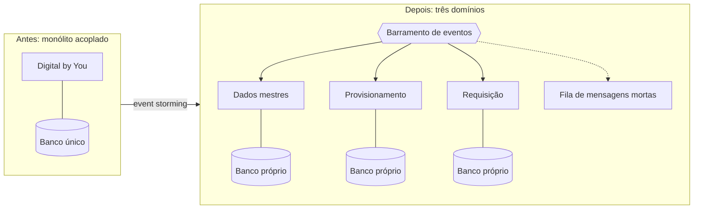

# iFood: 22 milhões de pedidos em um fim de semana

No sábado, 7 de março de 2026, o iFood registrou mais de 7,7 milhões de pedidos em um único dia. No fim de semana inteiro, de sexta a domingo, foram **22,2 milhões de pedidos**, cerca de 5,1 mil transações por minuto, com mais de 200 mil entregadores ativos ao mesmo tempo na plataforma.

O recorde diário anterior era de 6,6 milhões de pedidos, em 6 de setembro de 2025. O sábado de março o superou em 18%.

Números assim costumam ser lidos como notícia de negócio. Vale lê-los como notícia de arquitetura, porque cada um deles é uma decisão técnica que precisou ser tomada anos antes, por alguém que não sabia o tamanho que a curva ia ter.

## A empresa começou em papel

A origem do iFood é de 1997, e não era digital. Chamava-se Disk Cook, um guia impresso de cardápios com uma central telefônica para onde o cliente ligava e fazia o pedido. Quase quatorze anos depois, em 15 de maio de 2011, a ideia migrou para o meio digital e foi rebatizada.

Entre 2011 e 2016 a empresa cresceu por aquisição e aporte. A arquitetura acompanhou o crescimento do jeito que arquitetura costuma acompanhar crescimento rápido: acumulando. Os sistemas se falavam por pipelines em lote entre bancos, serviços e aplicações, fortemente acoplados. O relato público da própria empresa descreve a consequência: o erro de um serviço afetava os sistemas seguintes, e a investigação de causa consumia tempo enquanto a operação ficava degradada.

Em 2016, com a expansão acelerada, a empresa concluiu que precisava de escalabilidade de nuvem para lidar com a variação de demanda. Essa é a primeira decisão da história, e ela é do tipo que o Módulo 6 chama de escolha de modelo operacional.

## A pandemia dobrou a conta em meses

O crescimento vinha rápido e previsível. Em 2020 deixou de ser previsível.

Com o início da pandemia, os pedidos saltaram cerca de 200% em relação a 2019. A plataforma passou a servir mais de 60 milhões de pedidos por mês, em mais de 1.200 cidades brasileiras. A demanda não cresceu em rampa, cresceu em degrau, e degrau é o pior formato possível para quem dimensionou capacidade pela média.

Aqui aparece a propriedade que o módulo chama de elasticidade, e ela aparece no lugar onde dói. Não existe negociar prazo com um sábado à noite. O pico é o produto.

## A resposta foi decompor e orquestrar

A empresa hoje opera cerca de **2.000 microsserviços** ligados por pipelines de streaming, o que permitiu desacoplar a arquitetura anterior. A execução desses serviços foi para Kubernetes gerenciado na nuvem, e o resultado publicado pela AWS é direto: **redução de 40% nos custos** com o uso de Kubernetes, atendendo **até 60 milhões de requisições por minuto**.

Um único microsserviço, o que guarda os metadados de cliente, chega a 2 milhões de requisições por minuto no pico. Em 2020, um engenheiro da casa publicou o relato de um serviço projetado para sustentar 30 mil requisições por segundo, e a lição que ele registra é a mais desconfortável da lista: os times projetavam esperando que o uso dobrasse ou triplicasse em poucos meses.

Repare no que a redução de 40% significa. Ela não veio de comprar mais barato. Veio de parar de pagar por capacidade ociosa, que é o que acontece quando a unidade de escala deixa de ser a máquina e passa a ser o serviço.

## O dado cresceu cem vezes

A arquitetura de dados teve sua própria crise. O desenho anterior dava conta de 100 milhões de eventos por dia. O volume subiu para algo entre 8 e 10 bilhões de eventos diários, e o desenho anterior parou de dar conta.

A empresa adotou Kafka gerenciado na nuvem e, mesmo assim, encontrou o problema seguinte. Os engenheiros passaram a gastar tempo demais dimensionando cluster, planejando capacidade, configurando autenticação e aplicando atualizações manuais. O trabalho de operar a plataforma estava consumindo o trabalho de construir sobre ela.

A decisão foi trocar por uma plataforma de streaming totalmente gerenciada, hoje sustentando cerca de 700 aplicações. É exatamente o dilema de lock-in que o módulo discute, resolvido de forma explícita: a empresa aceitou depender mais de um fornecedor em troca de devolver horas de engenharia ao produto.

## O monolito que ficou por último

Nem tudo virou microsserviço ao mesmo tempo, e o caso mais bem documentado é o da área financeira.

A plataforma interna Digital by You, usada nos processos financeiros que atendem cerca de 100 mil pessoas ligadas ao iFood, continuava monolítica. Os componentes eram fortemente acoplados, e o relato publicado em 17 de outubro de 2023 descreve o efeito em duas grandezas que arquiteto reconhece de longe: taxa de falha mais alta e tempo médio de recuperação mais longo. A entrega de uma funcionalidade nova levava cerca de um mês.

A decomposição seguiu três passos. Workshops de *event storming* identificaram três domínios de negócio. Cada domínio virou um microsserviço independente, com banco de dados próprio. Um barramento de eventos passou a ser o canal de comunicação entre eles, com filas de mensagens mortas e políticas de reprocessamento para que nenhum evento se perdesse durante uma indisponibilidade.

**Texto alternativo:** à esquerda, um monólito chamado Digital by You ligado a um banco de dados único. À direita, três microsserviços de domínio, cada um com banco próprio, alimentados por um barramento de eventos que também encaminha o que falha para uma fila de mensagens mortas.

*Figura 1 — A decomposição do middleware financeiro do iFood em três domínios. Fonte: curso, a partir do relato técnico publicado pela AWS em 17 de outubro de 2023.*

**Leitura textual da figura:** o desenho contrasta dois momentos. Antes, uma aplicação única concentra os processos financeiros sobre um banco de dados compartilhado, e a falha de um componente alcança os demais por esse acoplamento. Depois, o mesmo escopo aparece repartido em três serviços de domínio, dados mestres, provisionamento e requisição, cada um com seu próprio banco. Um barramento de eventos os alimenta, e o que não pode ser processado segue para uma fila de mensagens mortas em vez de desaparecer. A seta entre os dois blocos indica que a separação de domínios veio de workshops de *event storming*, e não de um recorte técnico arbitrário.

Os resultados publicados são estes: disponibilidade da plataforma 30% maior, tempo médio de recuperação 90% menor, e tempo de entrega de funcionalidade reduzido pela metade, de um mês para ciclos de duas semanas.

## O que o fim de semana de março prova, e o que não prova

Voltando ao recorde. As 22,2 milhões de pedidos de março de 2026 representaram crescimento de mais de 16% sobre o recorde anterior, de 19,1 milhões, em setembro de 2025.

O que esses números provam é que a plataforma absorve um degrau de demanda sem que o cliente perceba. O que eles não provam é nada sobre custo por pedido, sobre margem de capacidade restante, nem sobre quanto trabalho de plantão sustentou aquele sábado. Essas três grandezas não aparecem em nota à imprensa, e são justamente as que decidem se a arquitetura está saudável.

## As três decisões que sustentam o recorde

A primeira é a escolha de modelo operacional, tomada por volta de 2016. Capacidade obtida como serviço, em vez de comprada e instalada, é o que torna possível responder a um degrau de demanda em meses em vez de trimestres.

A segunda é a unidade de escala. Enquanto a unidade foi a máquina, crescer significava máquina maior e ociosidade paga o mês inteiro. Quando a unidade virou o serviço, replicado por um orquestrador, a redução de 40% no custo virou consequência aritmética.

A terceira é a mais cara de aprender e aparece duas vezes na história. Operar a plataforma compete com construir o produto. Foi ela que levou o time de dados a trocar o Kafka autogerido por um gerenciado, e foi ela que manteve o middleware financeiro monolítico até 2023, porque mexer nele custava tempo que ninguém tinha.

## Questões para discussão

Releia o caso com a lente do arquiteto. As questões abaixo pedem recuperar os fatos, explicar os mecanismos e comparar as escolhas descritas no próprio caso.

**1.** Liste os três momentos em que a arquitetura do iFood mudou de forma relevante, com o ano de cada um, e diga qual pressão externa provocou cada mudança.

**2.** Explique por que a redução de 40% no custo é apresentada como consequência da adoção de Kubernetes, ligando a afirmação à mudança na unidade de escala.

**3.** O time de dados adotou Kafka gerenciado e ainda assim trocou de solução depois. Explique qual problema permaneceu após a primeira decisão e por que a segunda o resolveu.

**4.** Compare os três resultados publicados para o middleware financeiro, disponibilidade, tempo de recuperação e tempo de entrega, e diga qual deles depende mais da separação dos bancos de dados por domínio.

**5.** O recorde de março de 2026 é evidência de qual atributo de qualidade, e qual evidência adicional seria necessária para afirmar que a plataforma também é eficiente em custo?

## Fontes

- AWS, [iFood case study](https://aws.amazon.com/pt/solutions/case-studies/innovators/ifood/) — redução de 40% de custo com Kubernetes, até 60 milhões de requisições por minuto e os serviços gerenciados citados.
- AWS, [iFood modernizes its financial middleware to event-driven architecture](https://aws.amazon.com/blogs/industries/ifood-modernizes-its-financial-middleware-to-event-driven-architecture/) — 17 de outubro de 2023, por Ricardo Marques e Abbas Zahid. Fonte dos três domínios, do barramento de eventos e dos resultados de disponibilidade, recuperação e tempo de entrega.
- Confluent, [iFood scales a cloud-based data flow architecture](https://www.confluent.io/customers/ifood/) — os 2.000 microsserviços, as 700 aplicações, o acoplamento anterior em lote e a decisão de trocar Kafka autogerido por gerenciado.
- iFood, [recorde de 22,2 milhões de pedidos](https://institucional.ifood.com.br/noticias/ifood-bateu-recorde-de-vendas/) — números do fim de semana de 6 a 8 de março de 2026 e comparação com os recordes de setembro de 2025.
- Wikipédia, [iFood](https://pt.wikipedia.org/wiki/IFood) — origem em 1997 como Disk Cook e fundação em 15 de maio de 2011.
- Felipe Volpone, [Developing a microservice to handle over 30k requests per second at iFood](https://medium.com/swlh/developing-a-microservice-to-handle-over-30k-requests-per-second-at-ifood-3e2d7b822b0e) — julho de 2020, relato de engenharia sobre projetar esperando que o uso dobre ou triplique em poucos meses.

Os números de negócio vêm de material publicado pela própria empresa e por seus fornecedores de nuvem. Eles são verificáveis e têm interesse comercial embutido. Números que não aparecem nessas fontes, como custo por pedido e capacidade ociosa, continuam desconhecidos.
