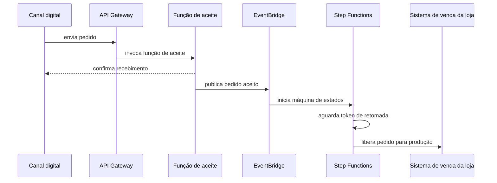

# Casos reais: iFood e Taco Bell

O [estudo de caso deste módulo](estudo-de-caso.md) decide elasticidade na janela de agendamento hospitalar, onde você mede os próprios sinais. Esta página traz duas empresas que tomaram decisões de nuvem em direções diferentes. Leia antes o [protocolo de leitura de caso público](../referencia/como-ler-um-caso-publico.md).

O iFood mostra orquestração de contêineres gerenciada em escala, com material publicado pelo fornecedor de nuvem. A Taco Bell mostra serverless numa organização pequena, com relato assinado por quem conduziu a migração.

## iFood: elasticidade gerenciada

O iFood interessa por ser uma operação brasileira, sujeita à mesma infraestrutura de rede, ao mesmo mercado de trabalho e à mesma regulação dos sistemas que você provavelmente vai arquitetar. O material público sobre ele é predominantemente do fornecedor de nuvem, o que torna o caso um bom exercício de leitura crítica.

### A escala declarada

O estudo de caso publicado pela AWS descreve o iFood atendendo *"millions of orders a month for more than 300,000 restaurants"*, com mais de 80% de participação no mercado brasileiro, e afirma que a empresa processa *"up to 60 million requests per minute"* usando o Amazon EKS. O mesmo material atribui ao Kubernetes uma redução de custos de 40%.

Um segundo estudo de caso da AWS, focado em inteligência artificial, descreve mais de 80 milhões de pedidos por mês e mais de 330 mil estabelecimentos parceiros, e afirma que o iFood representou 0,5% do Produto Interno Bruto brasileiro em 2022.

As duas páginas do mesmo fornecedor divergem na contagem de restaurantes e na ordem de grandeza dos pedidos, e nenhuma informa data de apuração. Registre isso como característica do gênero. Estudo de caso de fornecedor é material comercial revisto por quem vendeu a solução. Os números servem para dimensionar a ordem de grandeza do problema, e falham como citação precisa.

### A decisão e a cadeia que a sustenta

A escolha documentada é orquestração de contêineres gerenciada, com o Amazon EKS sustentando o tráfego. A afirmação de 40% de redução merece leitura cuidadosa, porque contêiner não reduz custo por si.

O que reduz custo é uma cadeia de pré-condições. Densidade maior por máquina, porque vários serviços compartilham o mesmo nó em vez de ocuparem instâncias dedicadas subutilizadas. Escala automática acompanhando a curva de demanda, o que exige aplicações *stateless*, conforme [stateless, stateful e os doze fatores](padroes-e-decisoes.md#stateless-stateful-e-os-doze-fatores). E capacidade computacional interrompível para cargas que toleram ser reiniciadas.

Uma aplicação que guarda sessão em memória impede o terceiro efeito e degrada o segundo. Um serviço sem limites de recurso declarados quebra o primeiro. O caso não demonstra que Kubernetes é barato; demonstra que uma equipe que adaptou as aplicações colheu 40% segundo o próprio fornecedor.

### Inferência dentro da requisição

O material mais recente descreve o uso do Amazon SageMaker para prazos de entrega, segurança e experiência do usuário, e do Amazon Bedrock para recursos de IA generativa, incluindo um assistente chamado Garçon. O estudo de caso afirma que um usuário atravessa mais de cem modelos entre abrir o aplicativo e concluir a compra, e cita Thiago Cardoso, diretor de dados e IA: *"Only with AI can I create a personalized experience for each user, from recommendation to fraud prevention."*

Cem modelos por transação diz mais sobre a arquitetura do sistema do que sobre a qualidade dos modelos. A afirmação implica que a inferência está no caminho síncrono da requisição, que existe um orçamento de latência repartido entre esses modelos e que a indisponibilidade de um deles precisa ter comportamento definido. Um modelo de detecção de fraude que não responde não pode simplesmente bloquear o pedido nem simplesmente liberá-lo. Alguém decidiu qual dos dois erros é aceitável, e isso é decisão de arquitetura.

## Taco Bell: serverless numa equipe pequena

A Taco Bell tem material melhor documentado, e vale dizer por quê. O apêndice B do livro *Serverless Development on AWS*, de Sheen Brisals e Luke Hedger, foi escrito com contribuições de Vadim Parizher, vice-presidente de tecnologia, e Robbie Kohler, diretor sênior de engenharia de software, ambos da Taco Bell. É relato assinado por quem conduziu a decisão.

### A restrição

Em novembro de 2023 a rede tinha mais de 7.200 restaurantes atendendo mais de 40 milhões de clientes por semana nos Estados Unidos. Os pedidos entram por caminhos muito diferentes: atendente no sistema de venda da loja, quiosque de autoatendimento, site próprio, aplicativo e plataformas de entrega de terceiros.

O sistema legado de comércio eletrônico era um monólito Java com banco único. O relato de Kohler é específico quanto aos sintomas. Eventos de tráfego alto, como promoções de fidelidade, causavam lentidão e indisponibilidade, e preparar a escala era tarefa manual e sujeita a erro. Servidores rodavam o tempo inteiro, inclusive em períodos de baixa. O código passava de um milhão de linhas, com camadas de abstração que poucos especialistas entendiam de fato. Latência do banco ou queda de um servidor de tarefas podia derrubar o sistema inteiro. Colocar uma pessoa nova para produzir levava semanas, às vezes meses.

A restrição decisiva, porém, é organizacional, e o apêndice a declara sem rodeio: a empresa não dispunha de uma equipe grande e experiente de engenharia de software, e não pretendia crescê-la rapidamente. Nas palavras de Kohler, era preciso fazer muito com pouco.

### A decisão

A migração do comércio eletrônico começou em meados de 2022, na direção de uma arquitetura MACH, sigla para microsserviços, API-first, nativa de nuvem e *headless*. A empresa controladora, a Yum! Brands, construiu um motor de comércio *headless* responsável por autenticação, processamento de pagamento, carrinho e cálculo de tributos.

A transição usou o padrão estrangulador com fatias verticais, e a ordem das fatias é instrutiva: primeiro o microsserviço de lojas, depois o de cardápio, depois o de carrinho e pedido, e por último o de usuário. Cada fatia entrega uma capacidade completa e reduz o risco da seguinte.

O middleware de pedidos, construído antes, é o exemplo mais claro de desenho orientado a eventos. Ele é descrito como 100% serverless e sem VPC, com Step Functions para orquestração e EventBridge para coreografia de eventos, DynamoDB para dados do pedido e para persistir tokens de tarefa, e funções Lambda em TypeScript escritas num padrão hexagonal simplificado.

**Texto alternativo:** diagrama de sequência em que o canal digital envia o pedido ao API Gateway, que invoca a função de aceite. A função confirma o recebimento e publica o evento de pedido aceito no EventBridge, que inicia uma máquina de estados no Step Functions. A máquina aguarda um token de retomada e então libera o pedido para produção no sistema de venda da loja.

*Figura 1 — Aceite, espera e liberação do pedido na Taco Bell. Fonte: curso, a partir do apêndice B de Serverless Development on AWS.*

**Leitura textual da figura:** o cliente recebe resposta assim que o pedido é aceito, antes de o pedido chegar à loja. Entre o aceite e a liberação existe um evento e uma máquina de estados que fica suspensa aguardando um sinal externo. O apêndice descreve esse sinal: quando o entregador se aproxima da loja, um evento é enviado ao EventBridge para que o pedido seja liberado e a comida seja preparada. A espera é parte do desenho, e não uma falha.

Esse detalhe é o mais interessante do caso para este módulo. A máquina de estados usa o padrão de token de retomada para permanecer parada por tempo indeterminado sem consumir computação. Uma solução com servidor manteria um processo ou uma tarefa agendada vigiando a condição.

### As evidências

O apêndice apresenta números da migração do comércio eletrônico. Uma equipe de cinco engenheiros migrou o backend inteiro em menos de um ano, sem impacto na operação existente. As linhas de código caíram cerca de 95%, de aproximadamente um milhão para menos de 50 mil. O custo de AWS caiu mais de 90% em relação à arquitetura com servidores. As liberações passaram de aproximadamente uma por mês para várias por semana. E uma pessoa nova passa a produzir num serviço serverless em menos de uma hora, contra semanas ou meses no sistema anterior.

O middleware de cardápio traz um dado igualmente relevante: a primeira entrega foi feita por dois engenheiros dentro do prazo, e o sistema chegou a mais de doze canais de integração processando dezenas de milhares de cardápios por dia.

Note que a redução de custo aqui tem base de comparação declarada: um monólito Java com servidores rodando o tempo inteiro e banco dimensionado para tráfego imprevisível. É por isso que esse percentual é mais utilizável do que o do caso anterior.

### O que a própria equipe registra como caminho, e não como salto

O apêndice desmonta a leitura heroica. Kohler afirma que a empresa não migrou tudo de uma vez. O primeiro middleware de cardápio usou banco relacional MySQL gerenciado, ferramentas tradicionais de integração de dados e bastante SQL, porque a equipe ainda não estava confortável com NoSQL. As primeiras funções foram escritas em .NET, zipadas e enviadas pelo console, sem estrutura de infraestrutura como código. As últimas instâncias EC2 desse sistema só foram desligadas em 2022.

A equipe também trocou de linguagem por razão de ecossistema: percebeu que havia pouca gente usando .NET com serverless e que o apoio da comunidade era fraco, e passou a escrever em JavaScript e Python. O código .NET original continua rodando.

## O que os dois casos não provam

O iFood tolera consistência eventual em quase toda a experiência. Um restaurante que aparece como aberto e recusa o pedido segundos depois é defeito irritante e recuperável. O hospital não tem essa folga na autorização de exame.

Serverless funcionou na Taco Bell porque o trabalho é curto, sem estado e disparado por evento externo. Processamento em lote de longa duração, cargas com alto uso de memória e sistemas com latência de inicialização intolerável não cabem nesse formato, e o caso não afirma o contrário.

As duas empresas aceitaram dependência forte de um provedor específico. Uma máquina de estados escrita em Step Functions não é portável, e um fluxo em EventBridge tem semântica própria de roteamento e repetição. A conta de saída dessas arquiteturas é reescrita, e não migração. Este módulo trata isso em [custo e lock-in](padroes-e-decisoes.md#custo-e-lock-in), e a decisão precisa ser registrada com o custo de saída estimado, conforme o [template de ADR](../referencia/template-adr.md).

## Leitura guiada

**1. Causa da economia.** A redução de 40% do iFood é atribuída ao Kubernetes. Reescreva a afirmação de modo tecnicamente preciso, nomeando as pré-condições sem as quais o resultado não ocorre.

**2. Classificação por fronteira.** Monte uma tabela com Amazon EKS, AWS Lambda e AWS Step Functions indicando qual responsabilidade fica com o provedor e qual fica com a equipe. Só depois atribua o rótulo IaaS, PaaS, SaaS ou serverless, e explique onde o rótulo é ambíguo. O [vocabulário de revisão](conceitos.md#vocabulario-de-revisao) apoia essa distinção.

**3. Inferência no caminho crítico.** Assumindo cem modelos entre a abertura do aplicativo e a compra, e orçamento total de 400 milissegundos, discuta que estratégias tornam isso viável. Considere execução paralela, resultados pré-calculados e degradação controlada.

**4. Espera sem computação.** Explique o que a máquina de estados da Taco Bell faz enquanto aguarda o entregador se aproximar da loja, e compare com o custo de manter um processo ou tarefa agendada vigiando a mesma condição.

**5. Bases de comparação.** Os dois casos declaram redução de custo. Explique por que o percentual da Taco Bell é mais utilizável do que o do iFood e formule as perguntas que faltam para tornar o segundo comparável.

## Fontes

- AWS, [iFood: an Artificial Intelligence (AI) journey with AWS](https://aws.amazon.com/solutions/case-studies/ifood-bedrock/) — pedidos por mês, estabelecimentos parceiros, uso de SageMaker e Bedrock e a afirmação sobre a quantidade de modelos por transação.
- AWS, [iFood — Innovators](https://aws.amazon.com/solutions/case-studies/innovators/ifood/) — participação de mercado, requisições por minuto com Amazon EKS e a redução de custos atribuída ao Kubernetes.
- Sheen Brisals e Luke Hedger, [Serverless Development on AWS, Apêndice B — Taco Bell's Serverless Journey](https://www.oreilly.com/library/view/serverless-development-on/9781098141929/app02.html) — O'Reilly, 2024, com contribuições de Vadim Parizher e Robbie Kohler. Fonte de todos os dados da Taco Bell.
- AWS, [Taco Bell e Trek10 — Partner Success](https://aws.amazon.com/partners/success/taco-bell-trek10) — página oficial da AWS que corrobora as reduções declaradas.
- Amazon EKS, [documentação oficial](https://docs.aws.amazon.com/eks/latest/userguide/what-is-eks.html) — divisão de responsabilidade entre plano de controle gerenciado e nós de trabalho.
- AWS Step Functions, [callback com token de tarefa](https://docs.aws.amazon.com/step-functions/latest/dg/callback-task-sample-sqs.html) e Amazon EventBridge, [documentação oficial](https://docs.aws.amazon.com/eventbridge/latest/userguide/eb-what-is.html) — semântica dos mecanismos usados no middleware de pedidos.
