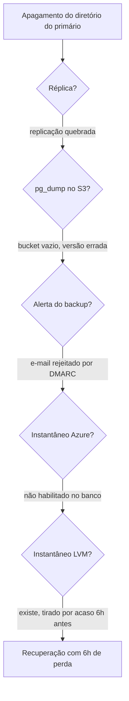

# GitLab: a noite em que cinco backups não existiam

Às 23h27 de 31 de janeiro de 2017, um engenheiro do GitLab cansado, no fim de um turno que já durava horas, digitou um comando para limpar o diretório de dados de um servidor PostgreSQL. Ele acreditava estar na réplica. Estava no primário.

Cancelou um ou dois segundos depois de perceber. Dos 310 GB do banco de produção do GitLab.com, restaram **4,5 GB**.

O que aconteceu nas horas seguintes é o motivo pelo qual este caso é ensinado. O GitLab tinha cinco mecanismos de recuperação. Nenhum funcionava. E, em vez de esconder, a empresa transmitiu a recuperação ao vivo no YouTube e publicou um *post-mortem* completo, o relatório aberto de análise do incidente, com nome dos comandos, horários e as próprias falhas de processo.

## O que estava acontecendo antes

O incidente não começou com o comando errado. Começou com uma sequência de coisas menores, cada uma inofensiva sozinha.

O GitLab.com rodava com **um primário e uma réplica** em espera quente, usada apenas para *failover*, a assunção automática do papel de primário. Um único banco aguentava toda a carga, e o *post-mortem* reconhece que isso não era ideal.

Às 17h20 daquele dia, um engenheiro tirou um instantâneo LVM do banco de produção para carregar no ambiente de teste — ele queria uma cópia mais recente que a automática das 01h00, para testar o pgpool-II.

Às 19h00, a carga do banco disparou. A suspeita registrada é spam. Parte do peso vinha de um processo em segundo plano tentando remover um funcionário do GitLab e os dados associados, porque a conta dele tinha sido marcada por abuso e agendada para remoção por engano.

Às 23h00, sob essa carga, a replicação da réplica ficou para trás. Os segmentos de log que ela precisava já tinham sido removidos do primário, e como o GitLab.com não usava arquivamento de WAL, a réplica teria de ser ressincronizada manualmente. Isso significa apagar o diretório de dados da réplica e rodar `pg_basebackup` para copiar tudo de novo a partir do primário.

## A hora e meia de frustração

O `pg_basebackup` travava sem produzir saída, mesmo com a opção `--verbose` ligada. Depois de algumas tentativas, informou que não conseguia conectar porque o primário não tinha conexões de replicação disponíveis.

A equipe aumentou `max_wal_senders` de 3 para 32. O PostgreSQL então se recusou a reiniciar, reclamando de semáforos demais — efeito de `max_connections` estar em 8000, um valor absurdo que estava aplicado havia quase um ano e vinha funcionando. Baixaram para 2000 e o banco subiu.

O `pg_basebackup` continuou sem iniciar a replicação. Um engenheiro rodou `strace` e viu o processo parado numa chamada `poll`, sem mais informação.

Aqui está o detalhe cruel. O *post-mortem* revela depois que **aquele era o comportamento normal**: o `pg_basebackup` espera silenciosamente até o primário começar a enviar dados de replicação. Nenhum *runbook* da empresa, o roteiro operacional que a equipe segue em plantão, registrava isso, e a documentação oficial da ferramenta também não deixava claro.

Um engenheiro, achando que tentativas anteriores tinham deixado arquivos no diretório, decidiu limpá-lo. No servidor errado.

## Cinco mecanismos, zero recuperações

A parte que transforma um erro humano em desastre é a seguinte. O GitLab tinha, no papel, cinco formas de recuperar.

**Réplica PostgreSQL.** Existia apenas para *failover*. A essa altura a replicação estava quebrada e os dados já tinham sido apagados dos dois lados.

**Backup diário com `pg_dump` para o S3.** O *bucket*, o repositório de objetos onde as cópias eram guardadas, estava vazio. A causa é um clássico de configuração: o procedimento rodava `pg_dump` 9.2 contra um banco PostgreSQL 9.6. Diferença de versão maior faz o `pg_dump` abortar com erro. Isso acontecia porque o backup era executado em um servidor de aplicação comum, onde não existe diretório de dados do PostgreSQL, e o empacotamento do GitLab, sem conseguir detectar a versão, assumia 9.2 como padrão.

**E o alerta desse erro?** As tarefas agendadas notificavam falha por e-mail. O GitLab.com usa DMARC, e o DMARC não estava configurado para os e-mails dessas tarefas. As mensagens eram rejeitadas pelo destinatário. O *post-mortem* resume: *"This means we were never aware of the backups failing, until it was too late."*

**Instantâneos de disco do Azure.** Estavam habilitados nos servidores de arquivos, e **não** nos servidores de banco, porque a equipe presumia que os outros mecanismos bastavam.

**Instantâneos LVM.** Serviam para copiar produção para o ambiente de teste, e essa era a única finalidade prevista. Havia dois disponíveis: um automático de quase 24 horas antes, e aquele que o engenheiro tinha tirado manualmente às 17h20, **seis horas antes** do apagamento.

O único caminho de volta era o instantâneo tirado por acaso, para outro propósito, por um engenheiro que queria testar outra coisa.

**Texto alternativo:** fluxo que parte do apagamento do diretório do primário e percorre cinco mecanismos de recuperação. A réplica falha por replicação quebrada, o backup em S3 por bucket vazio e versão incompatível, o alerta do backup por e-mail rejeitado, o instantâneo do Azure por não estar habilitado no banco, e apenas o instantâneo LVM tirado por acaso seis horas antes permite recuperar, com perda de seis horas de dados.

*Figura 1 — Os cinco caminhos de recuperação do GitLab e onde cada um parou. Fonte: curso, a partir do *post-mortem* oficial de 10 de fevereiro de 2017.*

**Leitura textual da figura:** cada losango é um mecanismo que existia na documentação da empresa e falhou por um motivo diferente. Três das cinco falhas são silenciosas: ninguém sabia que o backup não rodava, que o alerta não chegava, nem que o instantâneo não cobria o banco. O único caminho que funcionou não tinha sido projetado para essa finalidade.

## A recuperação levou dezoito horas para copiar arquivos

Restaurar o instantâneo LVM parece simples e não foi.

O ambiente de teste do GitLab rodava em Azure clássico, sem armazenamento premium, escolha feita para economizar. Os discos eram de rede e limitados a cerca de 60 Mbps. Copiar o diretório de dados do ambiente de teste para o de produção **levou aproximadamente 18 horas**. Não havia gargalo de rede nem de processador; o gargalo eram os discos, e não existia caminho para mover aquilo para armazenamento mais rápido.

Em 1º de fevereiro, às 17h00 UTC, o banco foi restaurado ao estado de 31 de janeiro às 17h20. Um detalhe do processo merece registro: como o procedimento de cópia para o ambiente de teste **remove os *webhooks*** (as chamadas automáticas que o sistema dispara para endereços externos) para não disparar chamadas por acidente, a equipe teve de montar um segundo banco a partir do mesmo instantâneo, sem essa remoção, só para recuperá-los. E incrementou todas as sequências do banco em 100.000, para que nenhum identificador já usado fosse reaproveitado.

## O que se perdeu

Modificações feitas entre 17h20 e 00h00 UTC de 31 de janeiro. A estimativa da empresa: cerca de **5.000 projetos, 5.000 comentários e 700 contas novas**. Repositórios de código e wikis ficaram indisponíveis durante a interrupção, e não foram afetados pela perda de dados.

O *post-mortem* abre com uma frase que vale pelo documento inteiro: *"Losing production data is unacceptable."* E o executivo-chefe pede desculpas em nome próprio e da empresa, no texto.

## As três decisões arquiteturais anteriores ao incidente

É tentador ler o caso como erro humano, e essa leitura não ensina nada. Um engenheiro cansado às 23h vai digitar o comando errado, mais cedo ou mais tarde. A arquitetura é o que decide se isso vira incidente ou catástrofe.

Três decisões arquiteturais aparecem no relato, todas anteriores ao incidente.

Um único primário concentrando toda a carga, com a réplica servindo apenas para *failover*, sem nenhum mecanismo pensado para recuperação de desastre.

Backup tratado como tarefa agendada em vez de capacidade verificada. Ninguém tinha restaurado um backup recentemente, e por isso ninguém sabia que não havia backup.

Escolha de armazenamento barato no ambiente de teste, que só cobrou o preço no dia em que esse ambiente virou a origem da recuperação. Um ambiente secundário tinha se tornado, sem que ninguém decidisse isso, parte do caminho crítico de continuidade.

## Questões para discussão

Releia o caso com a lente do arquiteto. As questões abaixo pedem recuperar os fatos, explicar os mecanismos e comparar as escolhas descritas no próprio caso.

**1.** Liste os cinco mecanismos de recuperação que o GitLab tinha documentados e diga por que cada um falhou naquela noite.

**2.** Explique a cadeia que fez o backup com `pg_dump` falhar em silêncio, ligando a versão do binário, o servidor em que a tarefa rodava e o e-mail de notificação.

**3.** O único caminho de recuperação que funcionou não tinha sido projetado para essa finalidade. Explique o que esse fato revela sobre a diferença entre ter backup e ter capacidade de recuperação.

**4.** A cópia dos dados levou aproximadamente 18 horas. Explique como uma decisão de custo tomada para o ambiente de teste passou a determinar o tempo de recuperação da produção.

**5.** Compare a réplica em espera quente e o instantâneo LVM quanto à finalidade para a qual cada um foi projetado e quanto ao que cada um teria protegido.

## Fontes

- GitLab, [Postmortem of database outage of January 31](https://about.gitlab.com/blog/postmortem-of-database-outage-of-january-31/) — 10 de fevereiro de 2017. Fonte primária de toda a cronologia, dos cinco mecanismos de recuperação, dos números de perda e das citações.
- GitLab, [GitLab.com database incident](https://about.gitlab.com/blog/gitlab-dot-com-database-incident/) — 1º de fevereiro de 2017, a comunicação publicada durante o incidente, útil para observar como a informação era conhecida em tempo real.
- PostgreSQL, [documentação do pg_basebackup](https://www.postgresql.org/docs/current/app-pgbasebackup.html) e [Continuous Archiving and Point-in-Time Recovery](https://www.postgresql.org/docs/current/continuous-archiving.html) — o arquivamento de WAL que não estava em uso e que teria mudado o desfecho.
- Google, [Site Reliability Engineering, capítulo 26 — Data Integrity](https://sre.google/sre-book/data-integrity/) — tratamento sistemático da diferença entre ter backup e conseguir restaurar.
