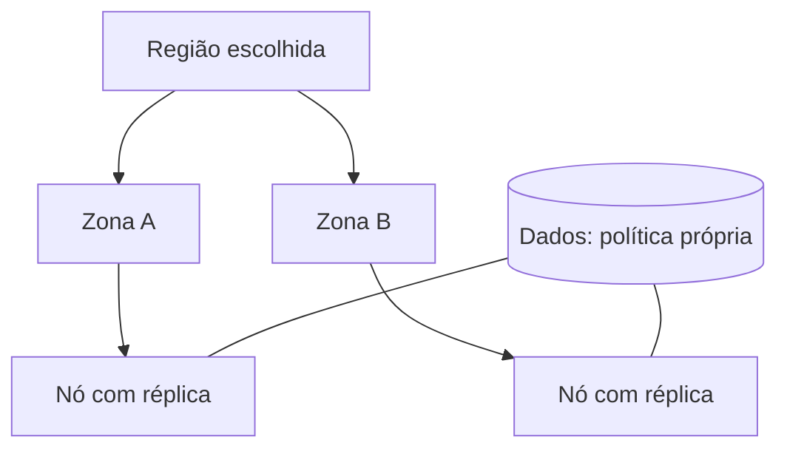
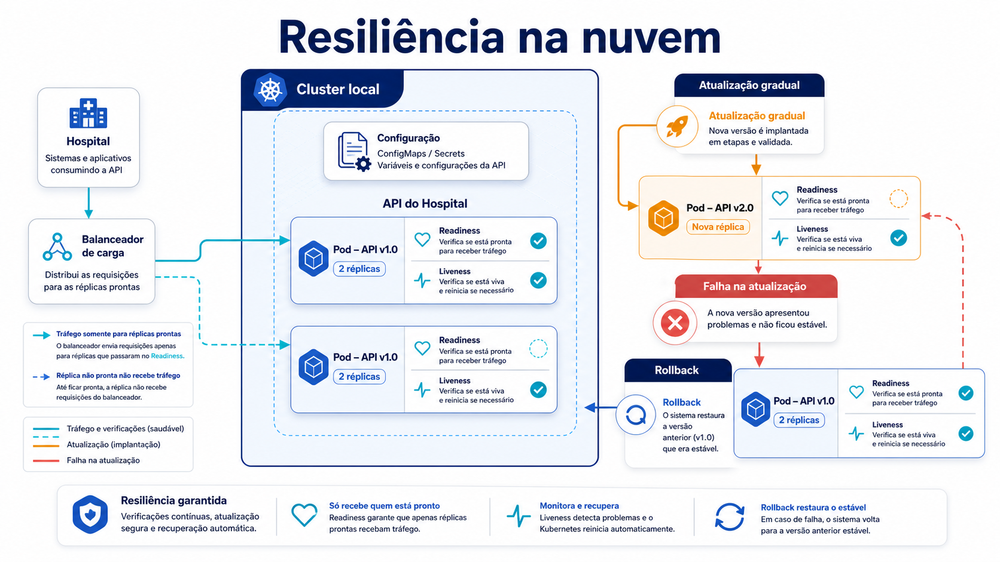

# Conceitos: serviço, responsabilidade e execução

## Nuvem como modelo operacional

Nuvem oferece recursos de computação que podem ser provisionados e medidos como serviço. O benefício arquitetural não é um logotipo: é diminuir o tempo e o custo de obter capacidade, desde que a equipe consiga descrevê-la, controlá-la e recuperá-la. Uma máquina virtual criada em minutos ainda exige imagem, acesso, atualização e monitoramento. Um banco gerenciado reduz tarefas de operação do motor, mas não decide retenção, modelo de dados ou quem pode consultar um resultado.

Em **on-premise**, a organização mantém a infraestrutura em instalações próprias ou sob contrato dedicado e assume, em maior grau, espaço, hardware, capacidade e operação. Isso pode ser a decisão adequada para uma restrição de dados ou latência, mas não elimina automação, observabilidade ou recuperação. Em **IaaS** (Infrastructure as a Service), a organização consome computação, rede e armazenamento virtualizados; normalmente administra sistema operacional, runtime, aplicação e dados. Em **PaaS** (Platform as a Service), o provedor também opera um runtime ou plataforma de entrega e a equipe concentra-se no código, configuração e dados. Em **SaaS** (Software as a Service), o produto pronto é consumido por configuração e integração. Uma ferramenta de agenda pode ser SaaS para o hospital, enquanto sua própria API roda on-premise, em IaaS ou PaaS. Os modelos podem coexistir na mesma solução.

| Camada | IaaS | PaaS | SaaS | Decisão que continua interna |
| --- | --- | --- | --- | --- |
| Hardware e rede física | provedor | provedor | provedor | critérios de uso e conectividade |
| Sistema operacional e runtime | equipe, em geral | provedor | provedor | versão suportada e exposição |
| Aplicação e configuração | equipe | equipe | configuração do cliente | contrato, testes e acesso |
| Dados e classificação | equipe | equipe | equipe usuária | finalidade, retenção e autorização |

Esta tabela é uma simplificação intencional: contratos variam. **Responsabilidade compartilhada** significa ler limites concretos. O provedor pode responder por uma zona física; a organização responde por credenciais, configuração pública acidental, dados enviados ao SaaS e requisitos de continuidade. Delegar uma tarefa não elimina a obrigação de verificar que ela é executada.

## Região, zona e fronteiras de falha

Uma **região** é uma área geográfica ou administrativa onde um provedor oferece recursos; uma **zona** é uma unidade de isolamento dentro dela. Os nomes e garantias dependem do provedor, portanto não se deve inferir que “duas zonas” resolvem qualquer indisponibilidade. Separar réplicas entre zonas pode reduzir impacto de uma falha local, mas banco, fila, DNS, identidade e operação de deploy continuam sendo dependências a analisar.

Para o hospital, região envolve latência, residência de dados, contratos e caminho de recuperação. Zona envolve domínio de falha. Uma réplica extra no mesmo nó protege contra queda de processo, não contra perda do nó. Um plano honesto declara o cenário: duas réplicas em nós distintos, com anti-affinity se necessário; dados replicados com recuperação testada; e procedimentos para indisponibilidade regional. A arquitetura não deveria esconder essas condições atrás de “multi-AZ”.

**Texto alternativo:** uma região contém duas zonas; cada zona recebe uma réplica, enquanto os dados mantêm uma política de recuperação própria.

*Figura 6 — Réplicas entre domínios de falha e dados com política independente.*

**Leitura textual da figura:** uma região contém zonas. Colocar réplicas em zonas diferentes reduz um domínio de falha para a camada de execução, mas o armazenamento tem política e testes próprios; o desenho não presume que ele já seja resiliente.

## Contêiner, imagem e orquestração

*Figura 7 — Estado desejado e recuperação de uma API em cluster.*

**Leitura textual da figura:** o cluster local mantém duas réplicas da API hospitalar. A verificação de readiness decide quando uma réplica pode receber tráfego; a de liveness permite reiniciar um processo travado. Durante uma atualização gradual, uma nova versão substitui réplicas progressivamente; se a evidência indicar falha, o rollback retorna à versão anterior. Configuração e imagem versionada dão contexto a esse estado desejado.

Uma **imagem** de contêiner empacota filesystem, dependências e metadados imutáveis identificados por tag ou digest. Um **contêiner** é uma execução dessa imagem, isolada em processos e recursos do host; ele não é uma máquina virtual completa e compartilha o kernel do host. Docker é uma ferramenta comum para construir e executar imagens. Portabilidade significa que a imagem reduz diferenças de empacotamento, não que elimina diferença de CPU, política de rede, permissões ou serviço externo.

**Orquestração** coordena muitas execuções: agenda Pods, mantém número desejado de réplicas, expõe rede, faz atualizações e tenta recuperar processos. Kubernetes declara o estado desejado; seus controladores trabalham para aproximar o estado atual. Um Deployment cria ReplicaSets e permite atualização gradual; um Service oferece um nome estável e seleciona Pods por rótulo. O orquestrador pode reiniciar um processo, mas não corrige uma regra de negócio nem descobre por conta própria uma imagem inadequada.

Readiness pergunta “esta instância deve receber tráfego agora?”. Liveness pergunta “o processo continua vivo o bastante para ser reiniciado se travar?”. Na API do laboratório, `/health/ready` e `/health/live` são separados para preservar essa semântica. Não use uma liveness que dependa de banco ou serviço remoto: uma falha compartilhada poderia reiniciar todos os Pods justamente quando a dependência precisa estabilizar.

## Vocabulário de revisão

Ao ver uma proposta, pergunte: qual camada é IaaS, PaaS ou SaaS? Quem atualiza o runtime? Em qual região estão dados e recuperação? Que falha uma zona diferente reduz? A imagem tem versão reprodutível? Qual rótulo liga Service a Pod? O que readiness protege e o que liveness deve evitar? Se as respostas não aparecem em configuração, contrato e evidência, a nuvem ainda é apenas uma intenção.
