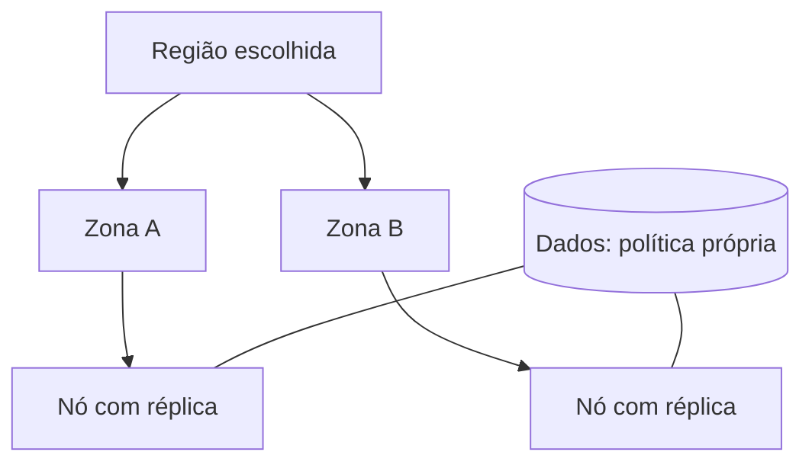
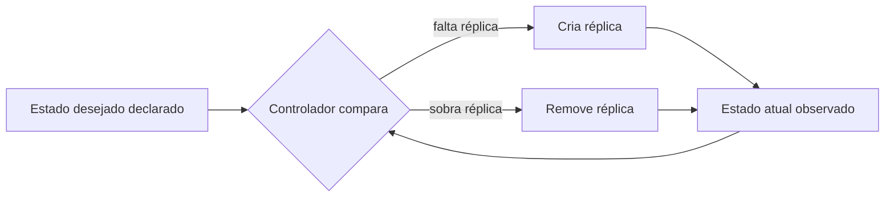

# Conceitos: serviço, responsabilidade e execução

## Nuvem como modelo operacional

Nuvem oferece recursos de computação que podem ser provisionados e medidos como serviço. O benefício arquitetural está em diminuir o tempo e o custo de obter capacidade, desde que a equipe consiga descrevê-la, controlá-la e recuperá-la. Uma máquina virtual criada em minutos ainda exige imagem, acesso, atualização e monitoramento. Um banco gerenciado reduz tarefas de operação do motor, mas não decide retenção, modelo de dados ou quem pode consultar um resultado.

A maneira mais direta de enxergar a diferença entre os modelos é empilhar as camadas de um sistema e perguntar, para cada uma, quem a opera.


*Figura 11 — Onde termina a responsabilidade do provedor em cada modelo de serviço. Fonte: curso.*

**Leitura textual da figura:** nove camadas aparecem empilhadas, de baixo para cima: rede, armazenamento, servidores, virtualização, sistemas operacionais, middleware, ambiente de execução de aplicações, dados e aplicação. Três colchetes marcam até onde vai a gestão do provedor em cada modelo. A infraestrutura gerida em nuvem cobre as quatro camadas de baixo, da rede à virtualização, que é o alcance de IaaS. A plataforma gerida em nuvem sobe até o ambiente de execução, incorporando sistemas operacionais e middleware, que é o alcance de PaaS. O software gerido em nuvem cobre a pilha inteira, incluindo dados e aplicação, que é o alcance de SaaS. Um quarto colchete, à direita, marca o auto-hospedado, ou on-premise, em que a organização responde por todas as nove camadas.

### Os quatro modelos, um a um

**On-premise (auto-hospedado).** A organização mantém a infraestrutura em instalações próprias ou sob contrato dedicado e assume, em maior grau, espaço, hardware, capacidade e operação.

- *O que a organização opera:* as nove camadas da figura, da rede à aplicação.
- *Exemplos gerais:* um servidor de arquivos num data center próprio, um ERP instalado em máquinas da empresa, um banco relacional mantido pela equipe de infraestrutura.
- *Quando faz sentido:* restrição de residência de dados, exigência de latência muito baixa até um equipamento local, ou investimento em hardware que ainda não se pagou.
- *O que não desaparece:* automação, observabilidade e recuperação continuam sendo trabalho da equipe.

**IaaS (Infrastructure as a Service).** O provedor opera os elementos básicos e entrega capacidade virtualizada sob demanda.

- *O que o provedor opera:* rede, armazenamento, servidores e virtualização.
- *O que a organização opera:* sistema operacional, middleware, ambiente de execução, aplicação e dados.
- *Exemplos gerais:* Amazon EC2, Google Compute Engine, máquinas virtuais do Azure.
- *Quando faz sentido:* a equipe precisa escolher a versão do sistema operacional, instalar agentes próprios ou controlar regras de rede.

**PaaS (Platform as a Service).** O provedor sobe mais um degrau e passa a operar também o ambiente onde a aplicação executa.

- *O que o provedor opera:* tudo de IaaS mais sistema operacional, middleware e ambiente de execução.
- *O que a organização opera:* aplicação e dados.
- *Exemplos gerais:* Google App Engine, AWS Elastic Beanstalk, Azure App Services.
- *Quando faz sentido:* o contrato de implantação da aplicação cabe no que a plataforma aceita, e a equipe quer deixar de cuidar de host.

**SaaS (Software as a Service).** O produto chega pronto e é consumido por configuração e integração.

- *O que o provedor opera:* a pilha inteira, incluindo a própria aplicação.
- *O que a organização opera:* configuração, integração e a classificação dos dados que envia.
- *Exemplos gerais:* Google Workspace, Microsoft 365, Salesforce.
- *Quando faz sentido:* a capacidade não é diferencial competitivo e um contrato bem lido resolve.

Nomear o produto não classifica a solução, porque o mesmo fornecedor costuma vender ofertas nas três faixas. Os modelos também coexistem: uma organização pode comprar uma agenda como SaaS, executar sua própria aplicação em PaaS e manter um banco legado em IaaS.

| Camada | IaaS | PaaS | SaaS | Decisão que continua interna |
| --- | --- | --- | --- | --- |
| Hardware e rede física | provedor | provedor | provedor | critérios de uso e conectividade |
| Sistema operacional e runtime | equipe, em geral | provedor | provedor | versão suportada e exposição |
| Aplicação e configuração | equipe | equipe | configuração do cliente | contrato, testes e acesso |
| Dados e classificação | equipe | equipe | equipe usuária | finalidade, retenção e autorização |

Esta tabela é uma simplificação intencional: contratos variam. **Responsabilidade compartilhada** significa ler limites concretos. O provedor pode responder por uma zona física. A organização responde por credenciais, configuração pública acidental, dados enviados ao SaaS e requisitos de continuidade. Delegar uma tarefa não elimina a obrigação de verificar que ela é executada.

A mesma pilha, lida pelos atributos que costumam decidir a escolha, mostra por que nenhum modelo domina os demais.

| Característica | IaaS | PaaS | SaaS | On-premise |
| --- | --- | --- | --- | --- |
| Gestão pelo usuário | sistema operacional, middleware e aplicações | aplicação e dados | apenas uso do software | a pilha inteira |
| Flexibilidade | alta | média | baixa | muito alta |
| Manutenção | média | baixa | nenhuma | alta |
| Custo inicial | médio | baixo | nenhum | alto |
| Controle | alto | médio | baixo | total |

A nuvem oferece escala e custo inicial menor com menos manutenção. O on-premise oferece controle e personalização maiores, ao preço de equipe especializada e investimento em data center próprio. Modelos híbridos combinam os dois, e a escolha depende das restrições concretas de dados, latência e capacidade da organização.

## Região, zona e fronteiras de falha

Uma **região** é uma área geográfica ou administrativa onde um provedor oferece recursos. Uma **zona** é uma unidade de isolamento dentro dela. Os nomes e garantias dependem do provedor, portanto não se deve inferir que “duas zonas” resolvem qualquer indisponibilidade. Separar réplicas entre zonas pode reduzir impacto de uma falha local, mas banco, fila, DNS, identidade e operação de deploy continuam sendo dependências a analisar.

Escolher uma região é decidir sobre latência, residência de dados, contratos e caminho de recuperação. Escolher uma zona é decidir sobre domínio de falha. Uma réplica extra no mesmo nó protege contra queda de processo, não contra perda do nó. Um plano honesto declara o cenário. Duas réplicas em nós distintos, com anti-affinity se necessário. Dados replicados com recuperação testada. Procedimentos escritos para indisponibilidade regional. A arquitetura não deveria esconder essas condições atrás de “multi-AZ”.

**Texto alternativo:** uma região contém duas zonas. Cada zona recebe uma réplica, enquanto os dados mantêm uma política de recuperação própria.

*Figura 6 — Réplicas entre domínios de falha e dados com política independente. Fonte: curso.*


```mermaid
flowchart TB
    R[Região escolhida] --> Z1[Zona A]
    R --> Z2[Zona B]
    Z1 --> N1[Nó com réplica]
    Z2 --> N2[Nó com réplica]
    DB[(Dados: política própria)] --- N1
    DB --- N2
```

**Leitura textual da figura:** uma região contém zonas. Colocar réplicas em zonas diferentes reduz um domínio de falha para a camada de execução, mas o armazenamento tem política e testes próprios. O desenho não presume que ele já seja resiliente.

## Contêiner, imagem e orquestração

Os modelos de serviço respondem quem opera cada camada. Falta responder como a camada de aplicação, que fica com a equipe em IaaS e em PaaS, é empacotada e executada. É aí que entram contêiner e orquestração, e os dois resolvem problemas diferentes.

O contêiner resolve o empacotamento. Ele fixa, num artefato só, a fronteira entre a aplicação e as camadas de baixo da Figura 11. A orquestração resolve a operação. Ela automatiza, sobre um conjunto de máquinas, o trabalho manual que sobra para quem contrata IaaS, e é também o mecanismo que coloca réplicas em zonas diferentes, como a Figura 6 mostrou.

### Imagem e contêiner

Uma **imagem** de contêiner empacota filesystem, dependências e metadados imutáveis identificados por tag ou digest. Um **contêiner** é uma execução dessa imagem, isolada em processos e recursos do host. Ele não é uma máquina virtual completa e compartilha o kernel do host. Portabilidade significa que a imagem reduz diferenças de empacotamento. Diferença de CPU, política de rede, permissões e serviço externo continuam por conta de quem implanta.

Contêinerização é uma forma leve de virtualização. A comparação com a máquina virtual explica de onde vem essa leveza.


*Figura 12 — O que cada contêiner deixa de carregar em relação a uma máquina virtual. Fonte: curso.*

**Leitura textual da figura:** à esquerda, a implantação baseada em máquinas virtuais mostra três VMs sobre uma camada de virtualização com hipervisor, que por sua vez está sobre a infraestrutura de servidores, armazenamento e rede. Cada VM carrega sua própria aplicação, suas dependências de execução e um sistema operacional completo. À direita, a implantação baseada em contêineres mostra três contêineres sobre um motor de contêineres, um único sistema operacional e a mesma infraestrutura. Cada contêiner carrega aplicação e dependências de execução, sem sistema operacional próprio. A diferença entre as duas pilhas está nas três cópias de sistema operacional que desaparecem à direita.

As duas pilhas da Figura 12 são um recorte das camadas da Figura 11. A virtualização com hipervisor é a camada que o provedor opera em IaaS. O motor de contêineres fica acima dela, entre o sistema operacional e a aplicação.

O hipervisor aloca recursos de hardware para cada instância e entrega isolamento forte, ao custo de memória e processamento. O motor de contêineres, como o Docker, executa processos isolados sobre um kernel compartilhado. Daí vêm as propriedades que levam a arquitetura a preferir contêineres em muitos cenários: consumo menor de recursos, inicialização em segundos, replicação barata e execução de várias aplicações na mesma máquina sem interferência. A portabilidade entra na mesma lista, com a ressalva já registrada acima.

Essas propriedades explicam onde a tecnologia pegou. No desenvolvimento, porque replicar um ambiente de teste vira baixar uma imagem. Na nuvem, porque microsserviços precisam de unidades de implantação independentes e substituíveis. Na computação de borda, porque o recurso disponível no dispositivo raramente comporta uma VM.

### Docker em três comandos

**Docker** é o motor de contêineres mais difundido. Três comandos bastam para ver a distinção entre imagem e contêiner funcionando. O exemplo usa o servidor web Nginx, que é a imagem pública mais comum em demonstrações.

```sh
docker pull nginx:1.27
docker run --name web -d -p 8080:80 nginx:1.27
docker ps
```

O primeiro comando baixa a imagem e a guarda na máquina. Ele não executa nada. O segundo cria um contêiner a partir dessa imagem, com o nome `web`, em segundo plano, e liga a porta 8080 da máquina à porta 80 de dentro do contêiner. O terceiro lista o que está em execução. Executar `docker run` de novo, com outro nome, cria um segundo contêiner a partir da mesma imagem, o que torna visível a relação de um para muitos entre as duas coisas.

### Da execução isolada à orquestração

O Docker sozinho executa contêineres numa máquina. Ele não decide em qual máquina de um conjunto o contêiner deve rodar, não recria o que morreu e não reparte tráfego entre réplicas. Esse é o trabalho do orquestrador.

**Orquestração** coordena muitas execuções: agenda unidades de execução, mantém o número desejado de réplicas, expõe rede, faz atualizações e tenta recuperar processos. **Kubernetes** é o orquestrador dominante. Ele declara o estado desejado, e seus controladores trabalham para aproximar o estado atual. Um Deployment cria ReplicaSets e permite atualização gradual. Um Service oferece um nome estável e seleciona Pods por rótulo. O orquestrador pode reiniciar um processo, mas não corrige uma regra de negócio nem descobre por conta própria uma imagem inadequada.

A divisão de trabalho é essa. Docker constrói, envia e executa contêineres individuais. Kubernetes gerencia escala e disponibilidade de muitos contêineres em um ambiente distribuído. Usar Docker sem orquestrador é comum em desenvolvimento. Usar Kubernetes sem entender a imagem que ele executa costuma terminar em incidente.

### Kubernetes em um manifesto

O equivalente ao `docker run` acima, em Kubernetes, é declarar o estado desejado num arquivo e entregá-lo ao cluster. O manifesto abaixo pede três réplicas do mesmo Nginx.

```yaml
apiVersion: apps/v1
kind: Deployment
metadata:
  name: web
spec:
  replicas: 3
  selector:
    matchLabels:
      app: web
  template:
    metadata:
      labels:
        app: web
    spec:
      containers:
        - name: web
          image: nginx:1.27
          ports:
            - containerPort: 80
```

```sh
kubectl apply -f web.yaml
kubectl get pods
kubectl scale deployment web --replicas=5
```

### O estado futuro desejado

A diferença de natureza está no verbo. `docker run` é uma ordem, executada uma vez. `kubectl apply` registra uma intenção, e o cluster passa a persegui-la. Apagar um Pod à mão faz o controlador criar outro, porque o estado declarado continua pedindo três. Mudar `--replicas` para cinco não cria dois contêineres, altera o número desejado e deixa o controlador chegar lá.

Essa intenção declarada tem nome: **estado futuro desejado**. Em vez de descrever a sequência de passos que leva o sistema de onde ele está para onde se quer que ele fique, descreve-se apenas o destino. Um agente compara continuamente o destino declarado com o estado observado e executa o que faltar para fechar a diferença. O nome desse laço é **reconciliação**, e ele muda o que significa operar: a operação deixa de ser executar procedimentos e passa a ser manter um arquivo correto.

Três consequências arquiteturais decorrem disso. O estado desejado vira artefato versionado, revisável em pull request como qualquer código. A diferença entre o que foi declarado e o que existe passa a ser mensurável, e ganha o nome de desvio, ou *drift*. E a recuperação de uma alteração manual deixa de depender de alguém lembrar do que fez, porque o agente a desfaz sozinho na próxima comparação.

**Texto alternativo:** o estado desejado alimenta um controlador, que compara com o estado atual e cria ou remove réplicas até os dois coincidirem.

*Figura 17 — O laço de reconciliação que sustenta a orquestração. Fonte: curso.*


```mermaid
flowchart LR
    D[Estado desejado declarado] --> C{Controlador compara}
    A[Estado atual observado] --> C
    C -->|falta réplica| M[Cria réplica]
    C -->|sobra réplica| R[Remove réplica]
    M --> A
    R --> A
```

**Leitura textual da figura:** o estado desejado, declarado em arquivo, e o estado atual, observado no cluster, chegam a um controlador que os compara. Quando falta réplica, o controlador cria uma. Quando sobra, remove uma. Os dois resultados voltam a alimentar o estado atual, fechando um laço que se repete continuamente. Nenhuma seta parte do controlador para o estado desejado, porque ele nunca altera a intenção declarada.

#### O mesmo padrão fora do Kubernetes

O Kubernetes aplica o padrão ao que executa dentro de um cluster. Ele não cria a rede, as sub-redes, o banco gerenciado nem as máquinas virtuais onde o cluster vive. Para isso existe a **infraestrutura como código**, que estende a mesma ideia ao restante da pilha. Três nomes aparecem com frequência, e a comunidade de DevOps costuma reparti-los pelo momento do ciclo de vida em que atuam.

**Terraform** é provisionador. O foco dele é o Day 0, criar a infraestrutura básica do zero: redes, sub-redes, regras de firewall, bancos gerenciados e máquinas virtuais. Ele é declarativo, e a ordem em que se escreve o código não importa, porque ele deduz as dependências entre os recursos. Ele também é *stateful*, e essa é a característica que mais o distingue: um arquivo de estado guarda o mapa do que foi criado, o que permite detectar o que sumiu do código e destruir a infraestrutura na ordem correta com um comando só.

**Ansible** é gerenciador de configuração. O foco dele é o Day 1 em diante, entrar em máquinas que já existem para instalar pacotes, atualizar o sistema operacional, ajustar arquivos de configuração e implantar aplicações. Ele não guarda arquivo de estado. A cada execução lê o inventário de máquinas e executa as tarefas na hora. Os playbooks são escritos em YAML e executados em ordem, de cima para baixo, e é daí que vem a caracterização de procedural.

**Argo CD** é controlador de entrega contínua para Kubernetes, no padrão GitOps. Nele, o repositório Git é a fonte da verdade do estado desejado da aplicação. O Argo compara continuamente o estado vivo do cluster com o que está no repositório, marca a aplicação como `OutOfSync` quando os dois divergem, mostra o desvio e sincroniza de volta, de forma automática ou mediante aprovação. É o mesmo laço de reconciliação da Figura 17, com o estado desejado morando fora do cluster.

| Característica | Terraform | Ansible | Argo CD |
| --- | --- | --- | --- |
| Foco principal | provisionar a infraestrutura | preparar sistema operacional e aplicações | sincronizar o cluster com o repositório |
| Momento do ciclo | Day 0 | Day 1 em diante | contínuo, após a implantação |
| Gerenciamento de estado | *stateful*, com arquivo de estado próprio | *stateless*, lê o inventário a cada execução | o estado desejado é o repositório Git |
| Abordagem | declarativa, a ordem do código não importa | tarefas em YAML executadas em sequência | declarativa, sobre manifestos Kubernetes |
| Ciclo de vida completo | destrói recursos na ordem correta com um comando | destruir infraestrutura complexa exige playbook escrito à mão | remove o que saiu do repositório, quando configurado para isso |

Duas ressalvas evitam que essa repartição vire dogma. A primeira é que a rotulagem de Ansible como procedural se refere à ordem de execução das tarefas, e não a uma ausência de intenção declarada: os módulos do Ansible são idempotentes e se escrevem pelo estado que se quer alcançar, como `state: present`. A segunda é que as três não competem entre si. O arranjo comum usa Terraform para criar o cluster e o banco, Ansible para preparar máquinas que ficaram fora do cluster, e Argo CD para manter as aplicações sincronizadas depois. Escolher uma delas raramente é a pergunta certa.

O que as une, e é o que interessa ao arquiteto, é a mesma inversão: alguém escreve o destino num arquivo versionado, e um agente assume a responsabilidade de chegar lá e de permanecer lá. O risco correspondente também é o mesmo. Um estado desejado errado é perseguido com a mesma eficiência de um estado desejado certo.

Fontes destas distinções: [Terraform vs Ansible, Spacelift](https://spacelift.io/blog/ansible-vs-terraform) e a [documentação do Argo CD](https://argo-cd.readthedocs.io/en/stable/).

### Prontidão e vitalidade

Duas verificações diferentes decidem o que o orquestrador faz com uma réplica. Readiness pergunta “esta instância deve receber tráfego agora?”. Liveness pergunta “o processo continua vivo o bastante para ser reiniciado se travar?”. Separar os dois endpoints, por convenção `/health/ready` e `/health/live`, preserva essa semântica.

A separação tem consequência prática. Uma liveness que dependa de banco ou serviço remoto transforma uma falha compartilhada em reinício coletivo, justamente quando a dependência precisa estabilizar. A dependência externa pertence à readiness, ou a uma resposta degradada, conforme o contrato do serviço.

## Vocabulário de revisão

Ao ver uma proposta, pergunte: qual camada é IaaS, PaaS ou SaaS? Quem atualiza o runtime? Em qual região estão dados e recuperação? Que falha uma zona diferente reduz? A imagem tem versão reprodutível? Onde está escrito o estado futuro desejado, e quem o revisa antes de valer? Qual rótulo liga Service a Pod? O que readiness protege e o que liveness deve evitar? Se as respostas não aparecem em configuração, contrato e evidência, a nuvem ainda é apenas uma intenção.
