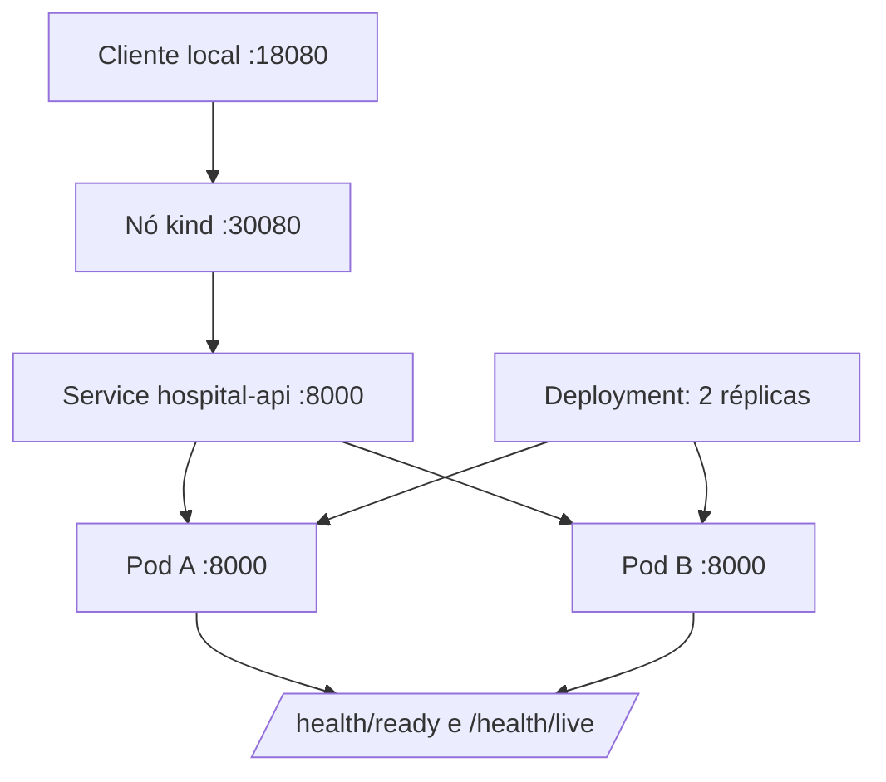

# Exemplo arquitetural: elegibilidade implantada como capacidade

## Decisão e fronteira

A plataforma hospitalar recebe uma solicitação de elegibilidade e devolve um protocolo. O percurso anterior da disciplina já separou API, serviço, governança e eventos. Aqui a mudança é operacional: a capacidade HTTP é empacotada na imagem `hospital-api:1.0.0` e declarada em Kubernetes como `Deployment` no namespace `hospital`. O namespace é uma fronteira organizacional local, não um mecanismo de segurança completo. Ele permite nomear, consultar e limpar os recursos da oficina sem atingir outros namespaces.

O Deployment pede duas réplicas e seleciona `app: hospital-api`. O mesmo rótulo aparece no template do Pod e no Service; esse contrato simples é vital. Se selector e labels divergirem, o Service existe, mas não tem endpoints. A porta interna é sempre `8000`, chamada `http`. O Service NodePort expõe a porta `30080` dentro do nó kind; a configuração do cluster a mapeia para `127.0.0.1:18080`, evitando exposição em todas as interfaces da máquina.

**Leitura textual da figura:** o cliente usa apenas `127.0.0.1:18080`. O mapeamento do nó leva ao Service, que seleciona dois Pods etiquetados. Cada Pod atende na porta 8000 e oferece endpoints de saúde; o Deployment mantém a quantidade desejada.

## O que os manifests dizem

`configmap.yaml` declara `APP_ENV=local-kind`, exemplo de configuração não secreta. `deployment.yaml` referencia esse ConfigMap, fixa imagem local e `imagePullPolicy: IfNotPresent`. A oficina constrói a imagem e a carrega explicitamente no kind, portanto o cluster não tenta buscar uma imagem privada ou imprevista. Em um registry compartilhado, o equivalente seria uma imagem publicada por pipeline e identificada por digest, com política de acesso e evidência de origem.

Requests e limits tornam a hipótese de capacidade visível: cada Pod pede `100m` e `128Mi`, podendo usar até `250m` e `256Mi`. Não são números universais. A equipe mede a API sob carga sintética e revisa valores junto com o limite de conexões e o comportamento de dependências. `hpa.yaml` usa `autoscaling/v2`, aponta para `hospital-api`, começa com duas réplicas e permite no máximo cinco. Sem Metrics Server, o objeto continua válido, mas a métrica pode aparecer como `<unknown>`; isso é evidência de dependência operacional ausente, não razão para fingir que houve autoscaling.

Readiness consulta `/health/ready` cedo e frequentemente. Enquanto falhar, o Pod pode existir, mas não vira endpoint do Service. Liveness consulta `/health/live` com atraso maior; sua função é detectar processo travado, não medir disponibilidade de banco. Ambos têm timeout e failure threshold explícitos. A separação permite evoluir readiness para testar a condição mínima de servir tráfego sem transformar uma indisponibilidade remota em reinício coletivo.

## Atualização controlada

A estratégia `RollingUpdate` usa `maxUnavailable: 0` e `maxSurge: 1`. O controlador cria no máximo uma instância adicional, espera que a nova passe readiness e só então reduz uma antiga. Com duas réplicas, isso mantém duas prontas durante a transição se o cluster tiver capacidade. Se a imagem estiver ausente, a nova réplica entra em `ImagePullBackOff`; a revisão não se completa e a versão existente permanece. O estudante observa esse estado antes de executar rollback, em vez de supor que uma mensagem de erro demonstra a causa.

O laboratório provoca a falha alterando apenas a imagem para `hospital-api:imagem-propositalmente-ausente`, registra `kubectl get pods` e `kubectl describe`, e executa `kubectl rollout undo deployment/hospital-api -n hospital`. O rollback restaura a revisão anterior e sua imagem. Para uma mudança real que inclua schema, este procedimento só é seguro se o schema for compatível ou se houver plano de migração independente. Assim, “tem rollback” vira uma propriedade condicionada, e não um slogan.

## Leitura por atributos

Disponibilidade local melhora porque duas réplicas e readiness evitam uma troca abrupta de tráfego. Modificabilidade melhora porque imagem, configuração e regras de atualização estão versionadas. Segurança não é demonstrada pelo namespace: produção exigiria identidade, NetworkPolicy, secrets, imagem verificada e regras de acesso. Eficiência depende de requests, limits e medição. Recuperabilidade depende de a versão anterior estar disponível e de dados externos terem backup/restore. O exemplo ensina a localizar cada atributo em uma decisão observável.
