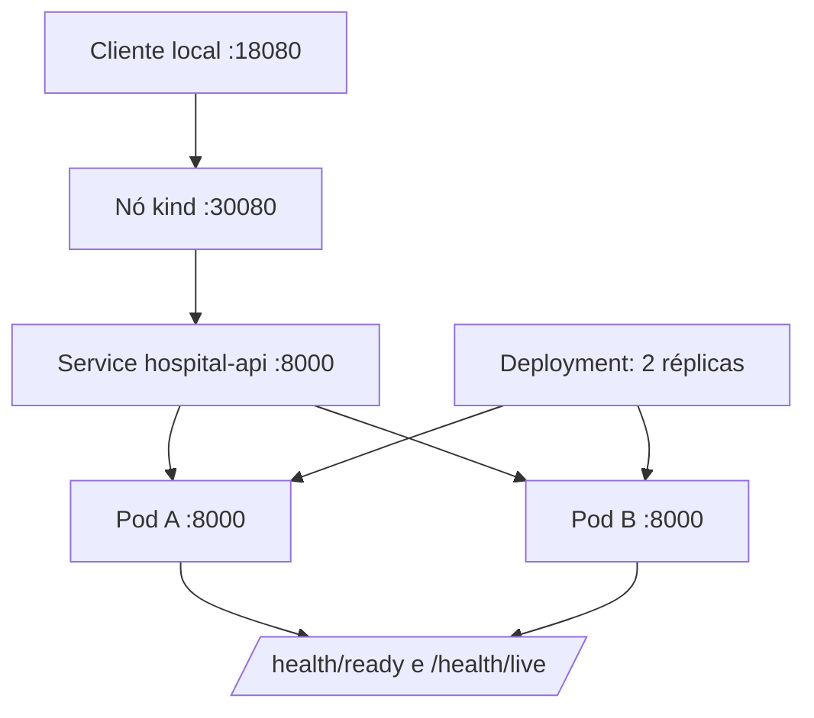

# Exemplo arquitetural: elegibilidade implantada como capacidade

## Uma arquitetura de referência em nuvem

Antes de olhar a fatia hospitalar, vale ter à vista um desenho completo, com as peças que uma plataforma em nuvem costuma reunir. A figura abaixo é o modelo de referência usado na disciplina.

*Figura 15 — Modelo de referência de uma plataforma em nuvem orientada a microsserviços. Fonte: curso.*

**Leitura textual da figura:** um cliente móvel e um cliente web chegam, de fora, a uma plataforma de computação em nuvem delimitada por uma borda tracejada. A primeira peça interna é o software de acessibilidade, rotulado como Ingress Controller, Firewall ou Proxy, que recebe os dois clientes. Dele saem dois caminhos, um para a API do Microgateway Mobile e outro para a API do Microgateway Web. Cada microgateway está dentro de uma caixa marcada como conjunto de escala. À esquerda, a API do Plano de Controle fica em seu próprio conjunto de escalabilidade e aponta para o microgateway Mobile. Abaixo dos microgateways, dois microsserviços de integração, cada um em seu conjunto de escala, ligam-se aos gateways e, mais abaixo, a um banco de dados em nuvem, a dois microsserviços especializados e a um LMS executado em máquina virtual. À direita, fora da borda da plataforma, três nuvens representam serviços de terceiros: videoconferência, cobrança e CRM, alcançados a partir de um dos microsserviços de integração.

A camada de entrada concentra segurança e roteamento do tráfego externo. Ela aparece com três nomes porque três tecnologias diferentes ocupam esse lugar conforme o contexto. Um **Ingress Controller** age como balanceador do tráfego que entra num cluster Kubernetes e centraliza regras de roteamento, TLS e autorização dos serviços expostos. Um **firewall** monitora e controla o tráfego de entrada e de saída por regras declaradas, barrando o que não foi autorizado. Um **proxy** intermedeia clientes e servidores, servindo para filtragem, cache e anonimato, e na forma de proxy reverso distribui requisições entre vários servidores de retaguarda.

Depois vêm os **microgateways**, um por canal. Um microgateway é uma versão reduzida do gateway de API tradicional, projetada para operar perto dos microsserviços. Ele cuida de autenticação, autorização, registro de log e controle de tráfego em granularidade fina, o que descentraliza a gestão de APIs em vez de concentrá-la numa peça única. Separar o canal mobile do canal web permite escalar e versionar cada um conforme sua própria demanda.

A **API do plano de controle** é dedicada ao gerenciamento do fluxo de chamadas, e não ao atendimento do usuário final. Ela carrega políticas de segurança, controle de taxa de requisição e regras de escala. Mantê-la separada evita que uma mudança de política exija implantar de novo um serviço de negócio.

Os **microsserviços de integração** conectam APIs internas e externas, e são eles que alcançam os serviços de terceiros à direita do desenho. Os demais microsserviços atendem funcionalidades específicas. Cada um é replicado de forma independente, que é o significado prático das caixas de conjunto de escala espalhadas pelo desenho: a unidade de escala é o serviço, e não a plataforma inteira.

O **banco de dados em nuvem** é gerenciado pelo provedor e também é replicado, o que distribui carga de leitura e escrita. O **LMS** executa numa máquina virtual dentro do mesmo conjunto de escala, exemplo de carga legada que convive com microsserviços sem ter sido reescrita. Já os serviços de terceiros, entre eles videoconferência, cobrança e CRM, são consumidos como SaaS, com a responsabilidade sobre dados e continuidade recaindo sobre quem integra.

O exemplo hospitalar a seguir é uma fatia desse modelo. Ele materializa o caminho que vai do cliente ao microsserviço, com Service e réplicas, e deixa de fora plano de controle, integrações externas e banco gerenciado, que continuam sendo decisões a tomar em produção.

## Decisão e fronteira

A plataforma hospitalar recebe uma solicitação de elegibilidade e devolve um protocolo. O percurso anterior da disciplina já separou API, serviço, governança e eventos. Aqui a mudança é operacional: a capacidade HTTP é empacotada na imagem `hospital-api:1.0.0` e declarada em Kubernetes como `Deployment` no namespace `hospital`. O namespace é uma fronteira organizacional local, não um mecanismo de segurança completo. Ele permite nomear, consultar e limpar os recursos da oficina sem atingir outros namespaces.

O Deployment pede duas réplicas e seleciona `app: hospital-api`. O mesmo rótulo aparece no template do Pod e no Service. Esse contrato simples é vital. Se selector e labels divergirem, o Service existe, mas não tem endpoints. A porta interna é sempre `8000`, chamada `http`. O Service NodePort expõe a porta `30080` dentro do nó kind. A configuração do cluster a mapeia para `127.0.0.1:18080`, evitando exposição em todas as interfaces da máquina.

**Texto alternativo:** o acesso restrito a `127.0.0.1:18080` chega ao Service, que seleciona dois Pods na porta 8000. O Deployment mantém as réplicas.

*Figura 9 — Encaminhamento local até as réplicas da API. Fonte: curso.*

```mermaid
flowchart TB
    C[Cliente local :18080] --> N[Nó kind :30080]
    N --> S[Service hospital-api :8000]
    S --> A[Pod A :8000]
    S --> B[Pod B :8000]
    A --> R[/health/ready e /health/live/]
    B --> R
    D[Deployment: 2 réplicas] --> A
    D --> B
```

**Leitura textual da figura:** o cliente usa apenas `127.0.0.1:18080`. O mapeamento do nó leva ao Service, que seleciona dois Pods etiquetados. Cada Pod atende na porta 8000 e oferece endpoints de saúde. O Deployment mantém a quantidade desejada.

## O que os manifests dizem

`configmap.yaml` declara `APP_ENV=local-kind`, exemplo de configuração não secreta. `deployment.yaml` referencia esse ConfigMap, fixa imagem local e `imagePullPolicy: IfNotPresent`. A oficina constrói a imagem e a carrega explicitamente no kind, portanto o cluster não tenta buscar uma imagem privada ou imprevista. Em um registry compartilhado, o equivalente seria uma imagem publicada por pipeline e identificada por digest, com política de acesso e evidência de origem.

Requests e limits tornam a hipótese de capacidade visível: cada Pod pede `100m` e `128Mi`, podendo usar até `250m` e `256Mi`. Não são números universais. A equipe mede a API sob carga sintética e revisa valores junto com o limite de conexões e o comportamento de dependências. `hpa.yaml` usa `autoscaling/v2`, aponta para `hospital-api`, começa com duas réplicas e permite no máximo cinco. Sem Metrics Server, o objeto continua válido, mas a métrica pode aparecer como `<unknown>`. Esse estado é evidência de dependência operacional ausente, e registrá-lo vale mais do que supor que houve autoscaling.

Readiness consulta `/health/ready` cedo e frequentemente. Enquanto falhar, o Pod pode existir, mas não vira endpoint do Service. Liveness consulta `/health/live` com atraso maior, com uma função específica: detectar processo travado. Medir disponibilidade de banco cabe a outra verificação. Ambos têm timeout e failure threshold explícitos. A separação permite evoluir readiness para testar a condição mínima de servir tráfego sem transformar uma indisponibilidade remota em reinício coletivo.

## Atualização controlada

A estratégia `RollingUpdate` usa `maxUnavailable: 0` e `maxSurge: 1`. O controlador cria no máximo uma instância adicional, espera que a nova passe readiness e só então reduz uma antiga. Com duas réplicas, isso mantém duas prontas durante a transição se o cluster tiver capacidade. Se a imagem estiver ausente, a nova réplica entra em `ImagePullBackOff`. A revisão não se completa, e a versão existente permanece. O estudante observa esse estado antes de executar rollback, em vez de supor que uma mensagem de erro demonstra a causa.

O laboratório provoca a falha alterando apenas a imagem para `hospital-api:imagem-propositalmente-ausente`, registra `kubectl get pods` e `kubectl describe`, e executa `kubectl rollout undo deployment/hospital-api -n hospital`. O rollback restaura a revisão anterior e sua imagem. Para uma mudança real que inclua schema, este procedimento só é seguro se o schema for compatível ou se houver plano de migração independente. Assim, “tem rollback” vira uma propriedade condicionada a um schema compatível.

## Leitura por atributos

Disponibilidade local melhora porque duas réplicas e readiness evitam uma troca abrupta de tráfego. Modificabilidade melhora porque imagem, configuração e regras de atualização estão versionadas. Segurança não é demonstrada pelo namespace: produção exigiria identidade, NetworkPolicy, secrets, imagem verificada e regras de acesso. Eficiência depende de requests, limits e medição. Recuperabilidade depende de a versão anterior estar disponível e de dados externos terem backup/restore. O exemplo ensina a localizar cada atributo em uma decisão observável.
