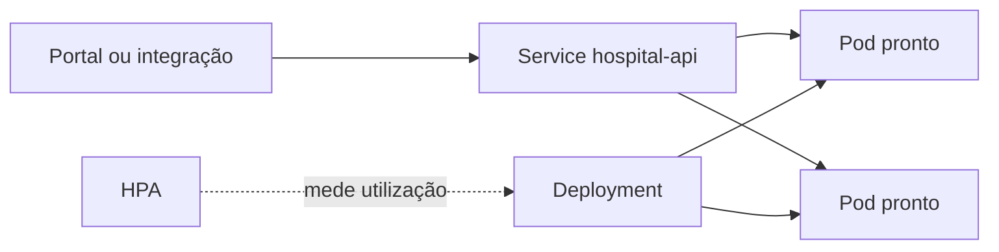

# Módulo 6 — Arquiteturas de nuvem

**Encontro:** 6 de 6

Computação em nuvem não é um desenho com ícones de fornecedor nem a decisão automática de “migrar tudo”. É uma maneira de obter capacidade computacional por serviço e de operar essa capacidade com fronteiras de responsabilidade, automação, medição e descarte. Para a plataforma hospitalar, a pergunta não é se um contêiner é moderno: é como manter a API de elegibilidade disponível durante uma atualização, absorver aumento de consultas sem desperdiçar recursos e saber voltar a um estado conhecido quando a implantação falha.

O resultado deste módulo é justificar escolhas de **IaaS**, **PaaS** e **SaaS** a partir de atributos de qualidade e conduzir uma implantação local em Kubernetes. Ao final, você terá uma API `hospital-api` com duas réplicas, probes de readiness e liveness, recursos declarados, atualização gradual e rollback observável. O laboratório usa Docker e kind localmente; não pede cadastro, informação de pagamento, dados clínicos ou um provedor remoto.

## Pergunta orientadora

Como transformar necessidade de elasticidade, resiliência e custo em decisões operacionais verificáveis, sem transferir responsabilidade para a palavra “nuvem”?

Uma resposta começa separando capacidade de produto. Um provedor pode tornar hardware, rede ou runtime disponíveis rapidamente, mas a organização ainda escolhe o que medir, quais dados podem sair de uma zona de confiança, quando uma instância está pronta e quanto custa manter uma capacidade ociosa. O Kubernetes não conhece prioridade clínica; ele só reconcilia o estado que recebeu. Portanto, manifesto, imagem, endpoint de saúde, orçamento e procedimento de recuperação são partes da arquitetura.

## Percurso de aprendizagem

1. Em [Conceitos](conceitos.md), distinguimos modelos de serviço, responsabilidade compartilhada, região, zona, contêiner e orquestração.
2. Em [Padrões e decisões](padroes-e-decisoes.md), avaliamos stateless e stateful, doze fatores, elasticidade, resiliência, custo e lock-in.
3. Em [Exemplo arquitetural](exemplo-arquitetural.md), lemos a implantação de elegibilidade e suas garantias reais.
4. Em [Estudo de caso](estudo-de-caso.md), comparamos alternativas para uma janela de agendamento hospitalar.
5. Na [Oficina de ferramentas](oficina-de-ferramentas.md), criamos um cluster kind, carregamos uma imagem local, observamos rollout e fazemos rollback seguro.
6. Em [Exercícios](exercicios.md), usamos os seis níveis da Taxonomia de Bloom para defender decisões e evidências.
7. Em [Síntese e referências](sintese-e-referencias.md), consolidamos equivalências em Java e .NET e fontes públicas.

**Texto alternativo:** clientes chegam a um Service, que distribui somente para dois Pods prontos; o Deployment os mantém e o HPA pode mudar a quantidade quando houver métrica.

*Figura 5 — Estado declarado da API de elegibilidade no laboratório local.*

**Leitura textual da figura:** clientes chegam ao Service, que só encaminha tráfego aos Pods prontos. O Deployment mantém réplicas e conduz atualizações; o HPA pode ajustar a quantidade conforme uma métrica configurada, desde que o cluster forneça essa métrica.

## Limite deliberado

Não há promessa de alta disponibilidade apenas porque existem duas réplicas: um cluster local tem um único nó e não representa falha de zona. Também não há segredo, prontuário ou identificador real no repositório. O HPA é declarado para estudar o contrato entre demanda e capacidade; um kind básico pode não ter Metrics Server e, nesse caso, mostrar métrica indisponível sem afetar o rollout. O exercício procura evidência e limites, não uma demonstração de marketing.
