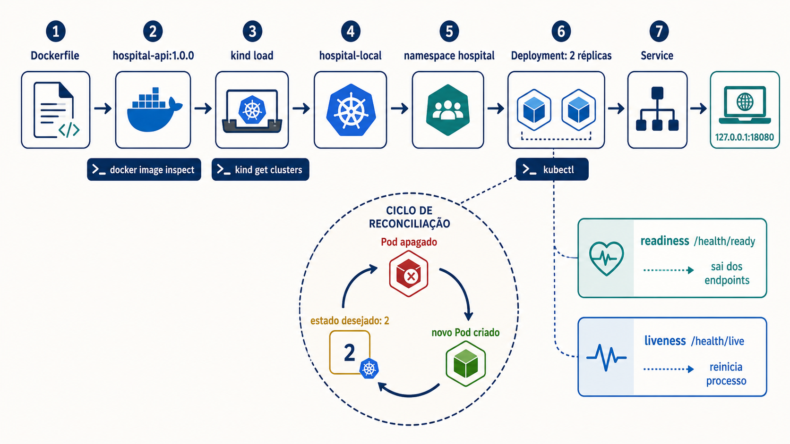
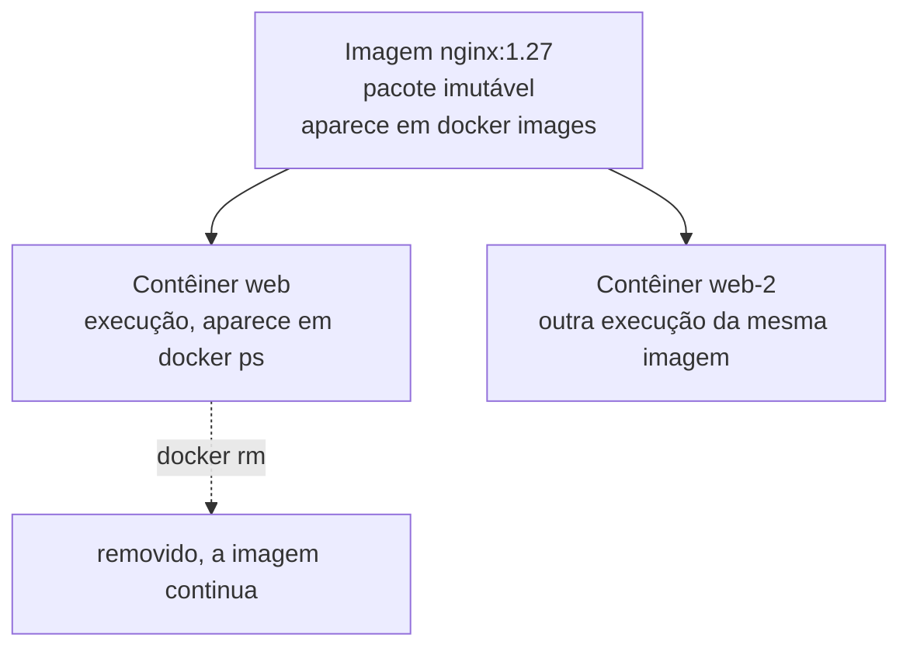
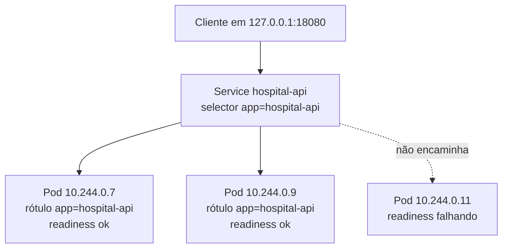
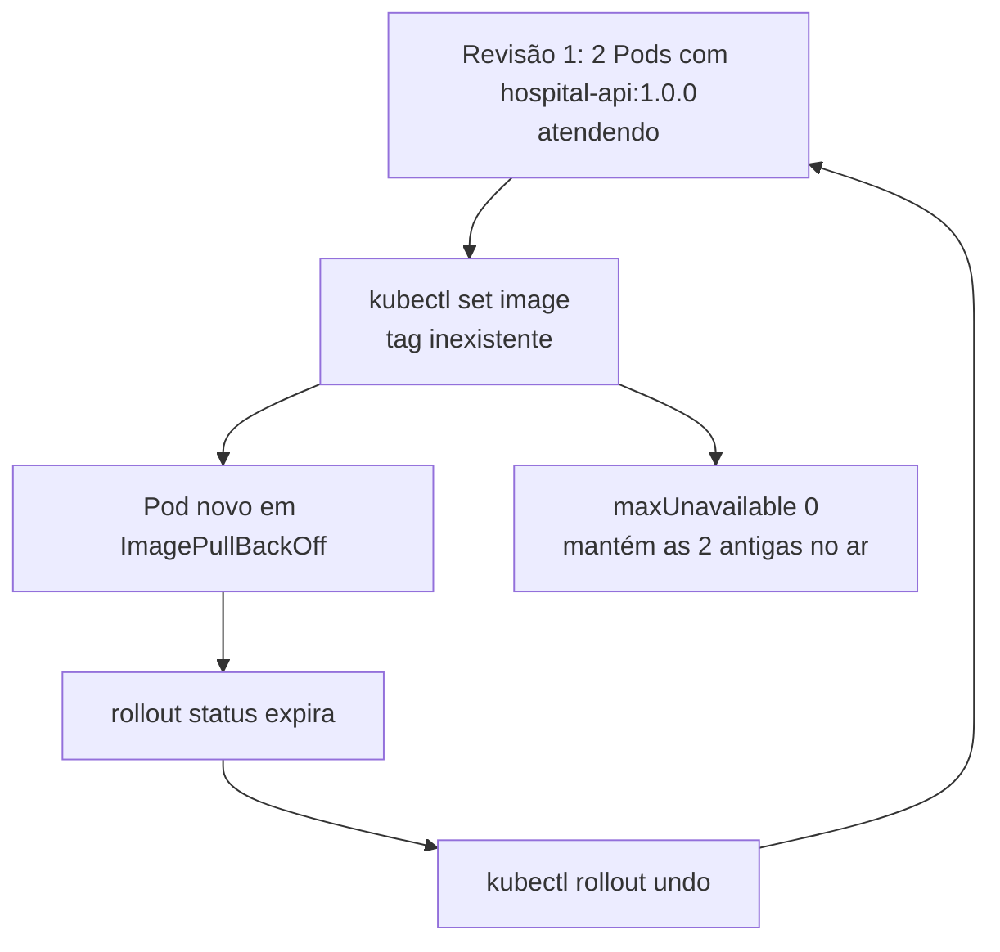

# Oficina de ferramentas: do primeiro contêiner ao rollback em Kubernetes

Esta oficina começa numa pasta vazia. Você vai escrever cada arquivo, construir a imagem da aplicação, criar um cluster Kubernetes descartável na sua própria máquina e ver o cluster recuperar o serviço sozinho depois de uma falha provocada. Nada é enviado para fora do computador. Não há cadastro, nuvem contratada nem custo.

A aplicação é uma API mínima de elegibilidade, escrita para caber em trinta linhas. Ela existe para ter algo concreto rodando dentro do contêiner, e o conteúdo dela importa pouco. O que importa é o percurso.

Todos os nomes e portas são fixos ao longo da página: pasta `oficina-nuvem`, imagem `hospital-api:1.0.0`, cluster `hospital-local`, namespace `hospital`, Deployment e Service `hospital-api`, porta do contêiner `8000` e acesso local em `http://127.0.0.1:18080`. Não aponte estes comandos para um cluster compartilhado.

## Uso seguro dos arquivos

Todos os arquivos desta oficina são seus, criados numa pasta nova. Não há material do curso a preservar, e para desfazer uma alteração basta copiar o arquivo de novo desta página.

O que exige cuidado é o que não é seu. O cluster criado aqui é descartável e local, e os comandos desta página nunca devem ser apontados para um contexto compartilhado. Antes de aplicar qualquer coisa, confirme que o contexto ativo é `kind-hospital-local`, o que os Pré-requisitos adiante mostram como verificar. Em máquina compartilhada, não remova imagens, contêineres ou clusters que você não criou.

## Ferramenta

Quatro peças entram aqui, e vale saber o que cada uma faz antes de instalar qualquer coisa.

| Ferramenta | O que é | Para que serve aqui |
| --- | --- | --- |
| **Docker** | Programa que constrói e executa contêineres na sua máquina. Um contêiner é um processo isolado que carrega junto tudo de que precisa para rodar. | Construir a imagem da aplicação e executá-la. |
| **Kubernetes** | Orquestrador de contêineres. Recebe a descrição de um estado desejado e trabalha continuamente para que a realidade corresponda a ela. | Manter duas cópias da aplicação no ar, substituir a que falhar e trocar de versão sem derrubar o serviço. |
| **kind** | Sigla de *Kubernetes in Docker*. Cria um cluster Kubernetes completo dentro de contêineres Docker. | Ter um cluster de verdade, descartável, sem nuvem e sem custo. |
| **kubectl** | Programa de linha de comando que conversa com o Kubernetes. | Entregar os arquivos de configuração ao cluster e observar o que ele fez com eles. |

Docker e Kubernetes resolvem problemas diferentes, e confundi-los atrapalha o resto da oficina. O Docker executa contêineres em **uma** máquina. Ele não decide em qual máquina de um conjunto o contêiner deve rodar, não recria o que morreu e não reparte tráfego entre cópias. Esse é o trabalho do Kubernetes.

Cinco palavras aparecem em quase todos os comandos adiante, e elas são o vocabulário mínimo.

Uma **imagem** é o pacote pronto da aplicação, imutável, identificado por um nome e uma versão, como `hospital-api:1.0.0`. Um **contêiner** é uma execução dessa imagem. A mesma imagem produz muitos contêineres, do jeito que uma classe produz muitos objetos.

Um **Pod** é a menor unidade que o Kubernetes executa. Ele envolve um ou mais contêineres que compartilham rede e armazenamento. Na prática desta oficina, um Pod contém um contêiner.

Um **Deployment** declara quantas cópias de um Pod devem existir e como substituí-las quando a versão muda. É nele que está a decisão de manter duas réplicas.

Um **Service** dá um endereço estável para um conjunto de Pods que nascem e morrem o tempo inteiro. Sem ele, quem chama a aplicação precisaria saber o endereço de cada Pod, que muda a cada substituição.

E um **manifesto** é o arquivo YAML que descreve o estado desejado de um desses objetos. Você escreve o manifesto, entrega ao cluster, e o cluster passa a persegui-lo.

A diferença que dá sentido à oficina inteira está aí. Você não vai mandar o Kubernetes criar dois Pods. Você vai **declarar que devem existir dois**, e ele passa a garantir isso. Apagar um Pod à mão faz o orquestrador criar outro, e é esse comportamento que se chama reconciliação.

## Leia antes de executar comandos

Esta seção descreve os arquivos que você vai escrever, na ordem em que eles aparecem. Ler antes evita digitar comandos sem saber o que eles produzem.

Primeiro vem a aplicação, um arquivo `app.py` com três endereços HTTP. Um deles responde a consulta de elegibilidade, e os outros dois existem só para o cluster perguntar se a aplicação está saudável. Junto dela vem `requirements.txt`, que declara as bibliotecas e as versões exatas, porque uma aplicação que não declara as próprias dependências funciona numa máquina e falha na seguinte.

O `Dockerfile` descreve como produzir a imagem imutável: parte de Python 3.12, instala as dependências declaradas, copia a aplicação, cria um usuário sem privilégios e expõe a porta 8000. A construção local materializa esse pacote. A tag `hospital-api:1.0.0` é a revisão usada pelo Deployment, sem relação com um endereço de registry de produção. Um contêiner só aparece quando essa imagem é executada.

O arquivo `infra/kind/cluster.yaml` instrui o **kind** a criar o cluster Kubernetes `hospital-local` em contêineres Docker, com um nó de controle e a porta 30080 limitada a `127.0.0.1:18080`. Esse mapeamento é o que permite abrir a aplicação no navegador da sua máquina. Ele cria um **cluster local descartável** para a oficina. Ele não deve ser usado em um cluster compartilhado, nem os comandos desta página devem ser apontados para qualquer contexto compartilhado.

Os manifestos expressam o estado inicial, antes de serem aplicados ao cluster: `namespace.yaml` cria a fronteira `hospital`. `configmap.yaml` fornece somente `APP_ENV=local-kind`. `deployment.yaml` pede duas réplicas da imagem, recursos e atualização gradual. `service.yaml` seleciona os Pods por `app: hospital-api`. `hpa.yaml` declara a faixa de duas a cinco réplicas, dependente de métricas disponíveis. Nada disso cria dados clínicos ou tolerância a falhas de zona.

As probes deixam a condição observável. `readiness` consulta `/health/ready` e mantém um Pod fora dos endpoints enquanto ele não pode receber tráfego. `liveness` consulta `/health/live` para permitir reinício de um processo travado. Ela não deve depender de banco ou de uma API remota. O estado inicial esperado é: nenhum recurso do namespace `hospital` aplicado, nenhuma imagem no nó kind e nenhum contexto `kind-hospital-local` até que o cluster seja criado e a imagem seja carregada.



*Figura 10 — Da imagem imutável ao estado declarado que o cluster mantém sozinho. Fonte: curso.*

**Leitura textual da figura:** a faixa superior numera sete etapas em sequência, do `Dockerfile` à imagem `hospital-api:1.0.0`, dela ao `kind load`, ao cluster `hospital-local`, ao namespace `hospital`, ao Deployment com duas réplicas, ao Service e finalmente ao acesso local em `127.0.0.1:18080`. Sob as etapas aparecem os comandos que produzem evidência de cada uma: `docker image inspect`, `kind get clusters` e `kubectl`. Ao centro, o ciclo de reconciliação parte do estado desejado de duas réplicas, passa pelo Pod apagado, pelo novo Pod criado e retorna ao estado desejado. À direita, readiness consulta `/health/ready` e retira o Pod dos endpoints, enquanto liveness consulta `/health/live` e reinicia o processo.

### A pasta que você vai montar

Ao fim da preparação, a pasta vazia terá esta forma. Nenhum desses arquivos vem pronto, e cada um é escrito nos passos adiante.

```text
oficina-nuvem/
├── app.py                        a aplicação, com três endereços HTTP
├── requirements.txt              as dependências, com versão fixada
├── Dockerfile                    a receita da imagem imutável
└── infra/
    ├── kind/cluster.yaml         define o cluster local descartável
    └── k8s/
        ├── namespace.yaml        a fronteira lógica "hospital"
        ├── configmap.yaml        configuração externa ao código
        ├── deployment.yaml       o manifesto central: réplicas, recursos e probes
        ├── service.yaml          o endereço estável na frente dos Pods
        └── hpa.yaml              a faixa de réplicas para escala automática
```

### O que você vai observar, e por que importa

| O que a oficina mostra | O conceito do módulo |
| --- | --- |
| A imagem é imutável e a revisão fica registrada | [Contêiner, imagem e orquestração](conceitos.md#conteiner-imagem-e-orquestracao) |
| Duas réplicas atendendo, nenhuma guardando estado próprio | [Stateless, stateful e os doze fatores](padroes-e-decisoes.md#stateless-stateful-e-os-doze-fatores) |
| A faixa de réplicas é declarada uma vez e ajustada pelo cluster | [Elasticidade e escalabilidade](padroes-e-decisoes.md#elasticidade-e-escalabilidade) |
| A atualização troca Pods sem derrubar o serviço | [Resiliência, rollout e rollback](padroes-e-decisoes.md#resiliencia-rollout-e-rollback) |
| O cluster desfaz sozinho uma alteração feita à mão | [O estado futuro desejado](conceitos.md#o-estado-futuro-desejado) |

## Pré-requisitos

**Objetivo**

Confirmar que a máquina tem as quatro ferramentas antes de criar qualquer recurso.

**Pré-requisito**

Docker iniciado, mais `kubectl` e `kind` instalados e acessíveis no `PATH`. A seção seguinte traz a instalação por sistema. Cerca de 4 GB de memória livre e 5 GB de disco, porque o cluster kind roda dentro de contêineres.

**Execute**

No macOS e no Linux, rode `docker version`, `kind version` e `kubectl version --client`. No PowerShell do Windows, os mesmos três comandos funcionam sem alteração.

**Observe**

O `docker version` precisa mostrar duas seções, Client e Server. Só o Client aparecendo significa que o Docker está instalado e o serviço não subiu. O comando `kubectl config current-context` pode apontar para outro cluster já existente na sua máquina, e é por isso que ele reaparece depois da criação do cluster.

**Compare**

Ter o cliente `kubectl` instalado não confirma que existe um cluster. Ter um cluster não confirma que a sua imagem está dentro dele. São três verificações separadas, e cada uma tem seu comando.

**Questões exploratórias**

- Que risco existe em executar um comando de aplicação no contexto errado?
- Por que o laboratório fixa o acesso em `127.0.0.1` em vez de abrir a porta para a rede?

## Instalação

As três seções abaixo instalam as mesmas três ferramentas. Depois de qualquer uma delas, crie a pasta de trabalho e entre nela, porque todos os comandos da oficina rodam a partir dali.

### Windows

Instale [Docker Desktop](https://docs.docker.com/desktop/setup/install/windows-install/), que já traz o Docker Engine. Depois instale [kubectl](https://kubernetes.io/docs/tasks/tools/) e [kind](https://kind.sigs.k8s.io/docs/user/quick-start/). Com o Chocolatey, os dois últimos saem em dois comandos, `choco install kubernetes-cli` e `choco install kind`. Abra o Docker Desktop e espere o ícone indicar que o serviço está em execução. Em seguida, no PowerShell:

```powershell
docker version
kind version
kubectl version --client
mkdir oficina-nuvem
cd oficina-nuvem
```

**Resultado esperado**

As três versões aparecem, e o Docker mostra a seção Server preenchida.

**Contingência**

Se o Docker não responder, abra o Docker Desktop e aguarde a inicialização, que pode levar um minuto. Se a porta 18080 já estiver ocupada, libere-a ou execute somente a validação estática descrita na limpeza. Não altere o manifesto durante a aula para contornar a porta.

### macOS

Instale [Docker Desktop](https://docs.docker.com/desktop/setup/install/mac-install/) ou, se preferir uma alternativa sem interface, o Colima. Depois instale as outras duas com o Homebrew, `brew install kubectl` e `brew install kind`. Em seguida, no Terminal:

```sh
docker version
kind version
kubectl version --client
mkdir oficina-nuvem
cd oficina-nuvem
```

**Resultado esperado**

O Docker responde e os três executáveis estão no `PATH`.

**Contingência**

Em Mac com pouca memória livre, feche outras cargas locais e tente de novo. Não remova imagens ou clusters de colegas em máquina compartilhada. Se o kind não conseguir criar o nó, faça a validação estática descrita na limpeza e registre a limitação na entrega.

### Linux

Instale o [Docker Engine](https://docs.docker.com/engine/install/) pela documentação da sua distribuição e siga a orientação oficial para usar o socket do Docker sem `sudo`. Depois instale [kubectl](https://kubernetes.io/docs/tasks/tools/) e [kind](https://kind.sigs.k8s.io/docs/user/quick-start/), ambos disponíveis como binário único que basta colocar no `PATH`. Em seguida:

```sh
docker version
kind version
kubectl version --client
mkdir oficina-nuvem
cd oficina-nuvem
```

**Resultado esperado**

O serviço do Docker responde sem recorrer a um cluster remoto.

**Contingência**

Se o socket recusar acesso, aplique a orientação oficial da distribuição em vez de prefixar tudo com `sudo`. Não use privilégio elevado para apontar o `kubectl` a outro contexto nem para remover recursos não relacionados à oficina.

## Preparação do laboratório

A preparação tem quatro passos. O primeiro usa só o Docker, para você ver um contêiner funcionando antes de qualquer coisa mais complicada. O segundo escreve a aplicação e a empacota numa imagem. O terceiro cria o cluster. O quarto escreve os manifestos.

### Passo 1 — o primeiro contêiner, sem Kubernetes nenhum

**Objetivo**

Ver a diferença entre imagem e contêiner acontecendo no terminal, antes de acrescentar orquestração.

**Pré-requisito**

Estar dentro da pasta `oficina-nuvem`, com o Docker respondendo.

**Execute**

O primeiro comando baixa uma imagem mínima e a executa uma vez. O segundo baixa um servidor web e o deixa rodando em segundo plano, com a porta 8080 da sua máquina ligada à porta 80 de dentro do contêiner.

```sh
docker run hello-world
docker run --name web -d -p 8080:80 nginx:1.27
docker ps
curl http://localhost:8080
docker rm -f web
```

**Observe**

O `docker ps` lista o que está em execução agora. O `curl` devolve a página inicial do Nginx, servida de dentro do contêiner. O último comando remove o contêiner, e a imagem `nginx:1.27` continua na máquina, pronta para gerar outro.

**Compare**

Rode `docker images` e depois `docker ps`. A primeira lista mostra pacotes guardados, a segunda mostra execuções vivas.



**Texto alternativo:** uma imagem ligada a dois contêineres criados a partir dela, e uma seta tracejada mostrando que remover um contêiner não remove a imagem.

*Figura 18 — Uma imagem, muitos contêineres. Fonte: curso.*

**Leitura textual da figura:** à esquerda, a imagem `nginx:1.27`, que é o pacote imutável listado por `docker images`. Dela saem duas setas para dois contêineres diferentes, `web` e `web-2`, cada um uma execução independente da mesma imagem, listados por `docker ps`. Uma seta tracejada sai do primeiro contêiner indicando a remoção por `docker rm`, e o destino registra que a imagem permanece na máquina. A relação é de um para muitos, do mesmo jeito que uma classe produz muitos objetos.

**Questões exploratórias**

- O que aconteceria se você executasse `docker run` duas vezes com nomes diferentes a partir da mesma imagem?
- Por que remover o contêiner não remove a imagem?

### Passo 2 — a aplicação e o `Dockerfile`

**Objetivo**

Escrever a aplicação, declarar suas dependências e transformá-la numa imagem identificada por versão.

**Pré-requisito**

O Passo 1 concluído, e o contêiner `web` já removido para liberar recursos.

**Execute**

Crie `app.py` com a aplicação. Os dois endereços de saúde são o que o cluster vai consultar mais adiante.

```python
import os

from fastapi import FastAPI

app = FastAPI()
AMBIENTE = os.environ.get("APP_ENV", "desconhecido")


@app.get("/health/live")
def live():
    return {"status": "live"}


@app.get("/health/ready")
def ready():
    return {"status": "ready"}


@app.get("/elegibilidades/{numero}")
def consultar(numero: str):
    return {"numero": numero, "elegivel": True, "ambiente": AMBIENTE}
```

Crie `requirements.txt` com as versões fixadas. Fixar a versão é o que faz a imagem construída hoje ser igual à construída no mês que vem.

```text
fastapi==0.141.1
uvicorn==0.52.4
```

Crie o `Dockerfile`. Cada linha é uma instrução, e a ordem importa, porque o Docker guarda o resultado de cada etapa e reaproveita o que não mudou.

```dockerfile
FROM python:3.12-slim

WORKDIR /app

COPY requirements.txt ./
RUN python -m pip install --no-cache-dir -r requirements.txt

COPY app.py ./

RUN useradd --create-home --uid 10001 app
USER app

EXPOSE 8000

CMD ["python", "-m", "uvicorn", "app:app", "--host", "0.0.0.0", "--port", "8000"]
```

As dependências são copiadas e instaladas antes da aplicação de propósito. Mudar uma linha de `app.py` não refaz a instalação das bibliotecas, porque a etapa anterior não mudou. Inverter a ordem faria cada alteração de código reinstalar tudo.

Agora construa a imagem e confira que ela existe.

```sh
docker build -t hospital-api:1.0.0 .
docker image inspect hospital-api:1.0.0
docker run --name api -d -p 8000:8000 hospital-api:1.0.0
curl http://localhost:8000/health/ready
docker rm -f api
```

**Observe**

O `-t hospital-api:1.0.0` dá nome e versão à imagem, e é assim que o Deployment vai encontrá-la depois. O `curl` responde `{"status":"ready"}`, o que prova que a aplicação funciona antes de existir qualquer cluster.

**Compare**

Compare este `docker run` com o do Passo 1. A única diferença é a imagem usada, e num caso ela veio da internet e no outro foi construída por você a partir do `Dockerfile`.

**Questões exploratórias**

- Por que o `Dockerfile` cria um usuário sem privilégios em vez de rodar como administrador?
- O que mudaria se `requirements.txt` não fixasse versões?

### Passo 3 — o cluster local com kind

**Objetivo**

Criar um cluster Kubernetes descartável e colocar a imagem construída dentro dele.

**Pré-requisito**

A imagem `hospital-api:1.0.0` construída, e nenhum cluster de mesmo nome já existente.

**Execute**

Crie `infra/kind/cluster.yaml`. O bloco de mapeamento é o que liga a porta 30080 de dentro do cluster à porta 18080 da sua máquina, restrita ao endereço local.

```yaml
kind: Cluster
apiVersion: kind.x-k8s.io/v1alpha4
nodes:
  - role: control-plane
    extraPortMappings:
      - containerPort: 30080
        hostPort: 18080
        listenAddress: "127.0.0.1"
        protocol: TCP
```

Depois crie o cluster e carregue a imagem nele.

```sh
kind get clusters
kind create cluster --name hospital-local --config infra/kind/cluster.yaml
kind load docker-image hospital-api:1.0.0 --name hospital-local
kubectl config current-context
kubectl get nodes
```

**Observe**

O `kind get clusters` antes da criação lista o que já existe, e o contexto ao fim precisa ser `kind-hospital-local`. O carregamento explícito da imagem é necessário porque o cluster roda dentro de contêineres e não enxerga o Docker da sua máquina.

**Compare**

O `docker build` produziu uma imagem. O `kind load` a tornou visível para o cluster. Nenhum dos dois criou aplicação alguma em execução no Kubernetes.

**Questões exploratórias**

- Por que um cluster de nó único não demonstra tolerância a falha de zona?
- Onde estaria a imagem, num ambiente real, em vez de na sua máquina?

### Passo 4 — os manifestos

**Objetivo**

Escrever o estado desejado da aplicação e conferir a sintaxe antes de entregá-lo ao cluster.

**Pré-requisito**

O cluster criado e o contexto correto confirmado no passo anterior.

**Execute**

Crie os cinco arquivos em `infra/k8s/`. O `namespace.yaml` cria a fronteira lógica onde tudo mais vai morar.

```yaml
apiVersion: v1
kind: Namespace
metadata:
  name: hospital
  labels:
    app: hospital-api
```

O `configmap.yaml` guarda configuração fora do código, que é o terceiro dos doze fatores em forma de arquivo.

```yaml
apiVersion: v1
kind: ConfigMap
metadata:
  name: hospital-api-config
  namespace: hospital
data:
  APP_ENV: local-kind
```

O `deployment.yaml` é o manifesto central, e cada bloco dele corresponde a um conceito do módulo. Ele aparece comentado logo depois.

```yaml
apiVersion: apps/v1
kind: Deployment
metadata:
  name: hospital-api
  namespace: hospital
spec:
  replicas: 2
  strategy:
    type: RollingUpdate
    rollingUpdate:
      maxUnavailable: 0
      maxSurge: 1
  selector:
    matchLabels:
      app: hospital-api
  template:
    metadata:
      labels:
        app: hospital-api
    spec:
      containers:
        - name: hospital-api
          image: hospital-api:1.0.0
          imagePullPolicy: IfNotPresent
          ports:
            - name: http
              containerPort: 8000
          envFrom:
            - configMapRef:
                name: hospital-api-config
          resources:
            requests:
              cpu: 100m
              memory: 128Mi
            limits:
              cpu: 250m
              memory: 256Mi
          readinessProbe:
            httpGet:
              path: /health/ready
              port: http
            initialDelaySeconds: 2
            periodSeconds: 3
          livenessProbe:
            httpGet:
              path: /health/live
              port: http
            initialDelaySeconds: 5
            periodSeconds: 5
```

O `service.yaml` dá o endereço estável e encontra os Pods por rótulo.

```yaml
apiVersion: v1
kind: Service
metadata:
  name: hospital-api
  namespace: hospital
spec:
  type: NodePort
  selector:
    app: hospital-api
  ports:
    - name: http
      port: 8000
      targetPort: http
      nodePort: 30080
```

O `hpa.yaml` declara a faixa de réplicas para escala automática.

```yaml
apiVersion: autoscaling/v2
kind: HorizontalPodAutoscaler
metadata:
  name: hospital-api
  namespace: hospital
spec:
  scaleTargetRef:
    apiVersion: apps/v1
    kind: Deployment
    name: hospital-api
  minReplicas: 2
  maxReplicas: 5
  metrics:
    - type: Resource
      resource:
        name: cpu
        target:
          type: Utilization
          averageUtilization: 70
```

Antes de aplicar, confira a sintaxe sem criar nada. O `--dry-run=client` faz o `kubectl` validar os arquivos na sua máquina e devolver o resultado sem tocar no cluster.

```sh
kubectl apply --dry-run=client -f infra/k8s/namespace.yaml
kubectl apply --dry-run=client -f infra/k8s/configmap.yaml -f infra/k8s/deployment.yaml -f infra/k8s/service.yaml -f infra/k8s/hpa.yaml
```

**Observe**

A validação confirma sintaxe aceita pelo cliente. Ela não executa Pods nem verifica se a imagem existe. O namespace é validado separado porque os outros quatro recursos declaram pertencer a ele.

**Compare**

Compare este `--dry-run=client` com a aplicação de verdade da próxima seção. O primeiro responde sobre o arquivo. A segunda responde sobre o cluster.

**Questões exploratórias**

- Por que `IfNotPresent` faz sentido para uma imagem carregada manualmente no kind?
- Que verificação uma esteira de integração contínua acrescentaria antes de aplicar?

### O `deployment.yaml` linha a linha

Três blocos desse manifesto concentram as decisões da oficina, e vale lê-los com calma.

O primeiro declara quantas cópias devem existir e como trocá-las de versão.

```yaml
spec:
  replicas: 2                    # o estado desejado: sempre duas
  strategy:
    type: RollingUpdate
    rollingUpdate:
      maxUnavailable: 0          # nunca fique com menos de 2 atendendo
      maxSurge: 1                # pode subir 1 a mais durante a troca
```

A combinação `maxUnavailable: 0` com `maxSurge: 1` é uma decisão de disponibilidade escrita como configuração. Ela diz: durante uma atualização, crie primeiro o Pod novo, espere que ele fique pronto, e só então remova o antigo. O cluster chega a ter três Pods por instantes, e nunca menos que dois atendendo. Trocar `maxUnavailable` para `1` tornaria a atualização mais rápida e aceitaria uma janela de capacidade reduzida.

O segundo declara o que cada réplica precisa de recursos.

```yaml
          resources:
            requests:            # o que o Pod precisa para ser agendado
              cpu: 100m
              memory: 128Mi
            limits:              # o teto que ele não pode ultrapassar
              cpu: 250m
              memory: 256Mi
```

A distinção entre pedido e teto costuma confundir, e as consequências são bem diferentes. O **pedido** é usado para decidir em qual nó o Pod cabe, já que o Kubernetes só o agenda onde houver 100 milicores livres. O **teto** é o que o Pod não pode ultrapassar em execução. Exceder o teto de memória faz o contêiner ser encerrado.

O terceiro declara duas verificações de saúde que parecem iguais e respondem perguntas opostas.

```yaml
          readinessProbe:              # "posso receber tráfego?"
            httpGet:
              path: /health/ready
            periodSeconds: 3

          livenessProbe:               # "ainda estou vivo?"
            httpGet:
              path: /health/live
            periodSeconds: 5
```

Reprovar na verificação de **prontidão** tira o Pod da lista de destinos do Service sem reiniciá-lo. Ele continua vivo e apenas deixa de receber requisições até se recuperar. Reprovar na de **vitalidade** faz o Kubernetes reiniciar o contêiner, por concluir que ele travou.

Confundir as duas produz um defeito clássico. Se a verificação de vitalidade consultasse o banco de dados, uma lentidão no banco reiniciaria todos os Pods em cadeia, transformando um problema de dependência numa queda geral. É por isso que `/health/live` responde sem consultar nada externo, enquanto `/health/ready` pode ser mais exigente.

O Service, por sua vez, resolve outro problema. Pods são efêmeros e trocam de endereço a cada substituição. O `selector` por rótulo é o que dá estabilidade ao conjunto.



**Texto alternativo:** um cliente chega ao Service, que encaminha para dois Pods cujo rótulo casa com o seletor e cuja prontidão está satisfeita, e uma seta tracejada indica um terceiro Pod que não recebe tráfego por estar reprovando a verificação de prontidão.

*Figura 19 — Como o Service escolhe para onde encaminhar. Fonte: curso.*

**Leitura textual da figura:** o cliente chama sempre o mesmo endereço local, e o Service resolve o resto. Ele não guarda endereços de Pod, guarda um seletor de rótulo, e qualquer Pod marcado como `app: hospital-api` entra no conjunto automaticamente. Dois Pods com endereços diferentes aparecem recebendo tráfego, porque cumprem o rótulo e passaram na verificação de prontidão. Um terceiro Pod, ligado por seta tracejada, tem o rótulo certo e está reprovando a prontidão, por isso fica fora do encaminhamento sem ser reiniciado. Os endereços mudam a cada substituição, e o cliente nunca precisa saber quantos Pods existem.

## Execução

**Objetivo**

Entregar o estado desejado ao cluster, comprovar que ele foi alcançado e ver a reconciliação acontecer.

**Pré-requisito**

O contexto precisa ser `kind-hospital-local` e a imagem `hospital-api:1.0.0` precisa ter sido carregada no Passo 3.

**Execute**

No macOS e no Linux. O namespace vai primeiro, sozinho, porque os quatro recursos seguintes declaram pertencer a ele e falhariam se ele ainda não existisse.

```sh
kubectl apply -f infra/k8s/namespace.yaml
kubectl apply -f infra/k8s/configmap.yaml -f infra/k8s/deployment.yaml -f infra/k8s/service.yaml -f infra/k8s/hpa.yaml
kubectl rollout status deployment/hospital-api -n hospital
kubectl get deployment,pods,service,hpa -n hospital -o wide
curl --fail --silent http://127.0.0.1:18080/health/ready
kubectl get endpointslice -n hospital -l kubernetes.io/service-name=hospital-api
```

No PowerShell, a mesma sequência, trocando apenas o programa que faz a chamada HTTP.

```powershell
kubectl apply -f infra/k8s/namespace.yaml
kubectl apply -f infra/k8s/configmap.yaml -f infra/k8s/deployment.yaml -f infra/k8s/service.yaml -f infra/k8s/hpa.yaml
kubectl rollout status deployment/hospital-api -n hospital
kubectl get deployment,pods,service,hpa -n hospital -o wide
curl.exe --fail --silent http://127.0.0.1:18080/health/ready
kubectl get endpointslice -n hospital -l kubernetes.io/service-name=hospital-api
```

Agora veja a reconciliação. Liste os Pods, apague **um** deles à mão e liste de novo. A expressão entre aspas apenas lê o nome do primeiro Pod da lista, para você não precisar copiá-lo.

```sh
kubectl get pods -n hospital
kubectl delete pod -n hospital "$(kubectl get pods -n hospital -l app=hospital-api -o jsonpath='{.items[0].metadata.name}')"
kubectl get pods -n hospital
```

No PowerShell, a leitura do nome muda de forma.

```powershell
kubectl get pods -n hospital
$alvo = kubectl get pods -n hospital -l app=hospital-api -o jsonpath='{.items[0].metadata.name}'
kubectl delete pod -n hospital $alvo
kubectl get pods -n hospital
```

**Observe**

O rollout informa duas réplicas disponíveis, e o endereço local devolve `{"status":"ready"}`. O `EndpointSlice` contém os endereços dos Pods prontos, que é a lista que o Service usa para distribuir tráfego. Depois de apagar um Pod, a listagem mostra um Pod novo com idade de poucos segundos, porque o estado desejado continua pedindo dois. O HPA pode não ter métrica atual no kind básico, e registrar esse fato vale mais do que inventar escalonamento.

**Compare**

Compare `kubectl get pods` com o `curl`. O primeiro descreve o estado que o cluster alcançou. O segundo prova que o caminho até a aplicação respondeu de verdade, atravessando o mapeamento de porta, o Service e o Pod.

**Questões exploratórias**

- Que sinal mostraria que o endereço continua atendendo com uma das réplicas fora do ar?
- Como o pedido de CPU declarado no manifesto participa do cálculo de utilização do HPA?

### Provocar a falha e voltar atrás

**Objetivo**

Observar uma atualização que não termina e restaurar a revisão saudável sem tocar em dados.

**Pré-requisito**

O rollout inicial concluído. A única alteração abaixo é uma tag de imagem propositalmente ausente, que não existe em lugar nenhum. Não use uma tag de ambiente real.

**Execute**

No macOS e no Linux. O `|| true` evita que o terminal encerre quando o status expira, que é justamente o comportamento esperado aqui.

```sh
kubectl set image deployment/hospital-api hospital-api=hospital-api:imagem-propositalmente-ausente -n hospital
kubectl rollout status deployment/hospital-api -n hospital --timeout=20s || true
kubectl get pods -n hospital
kubectl describe deployment/hospital-api -n hospital
kubectl rollout undo deployment/hospital-api -n hospital
kubectl rollout status deployment/hospital-api -n hospital
curl --fail --silent http://127.0.0.1:18080/health/live
```

No PowerShell, a falha do status aparece em `$LASTEXITCODE` e os comandos seguintes continuam por padrão.

```powershell
kubectl set image deployment/hospital-api hospital-api=hospital-api:imagem-propositalmente-ausente -n hospital
kubectl rollout status deployment/hospital-api -n hospital --timeout=20s
kubectl get pods -n hospital
kubectl describe deployment/hospital-api -n hospital
kubectl rollout undo deployment/hospital-api -n hospital
kubectl rollout status deployment/hospital-api -n hospital
curl.exe --fail --silent http://127.0.0.1:18080/health/live
```

**Observe**

Os Pods novos ficam em `ErrImagePull` ou `ImagePullBackOff`, porque a imagem pedida não existe, e o rollout esgota o tempo. As duas réplicas antigas continuam atendendo durante o incidente inteiro, o que é consequência direta do `maxUnavailable: 0`. Depois do `undo`, a tag volta a `hospital-api:1.0.0` e a verificação de vitalidade responde.

**Compare**

Compare a falha de imagem, em que o contêiner nem inicia, com uma falha de prontidão, em que ele inicia e não entra no Service. As duas bloqueiam a atualização, e a evidência e a correção são diferentes.



**Texto alternativo:** a revisão saudável com dois Pods recebe uma troca de imagem para uma tag inexistente, o Pod novo entra em erro de download, a configuração de indisponibilidade zero mantém os dois antigos atendendo, o status do rollout expira e o comando de desfazer retorna à revisão saudável.

*Figura 20 — Por que o serviço não caiu durante a atualização bloqueada. Fonte: curso.*

**Leitura textual da figura:** o percurso parte da revisão saudável, com dois Pods na versão 1.0.0 atendendo. A troca de imagem para uma tag inexistente produz dois efeitos ao mesmo tempo. De um lado, o Pod novo entra em erro de download da imagem e nunca fica pronto. De outro, a configuração de indisponibilidade zero impede o controlador de remover qualquer Pod antigo antes de o novo ficar pronto, e por isso os dois continuam atendendo. O status do rollout esgota o tempo, o comando de desfazer é executado e o desenho retorna à revisão inicial. O serviço não caiu em nenhum instante, e isso é consequência de uma linha de configuração.

**Questões exploratórias**

- Que parte de uma migração de banco de dados o `rollout undo` não desfaria?
- Que verificação na esteira de integração impediria a tag inexistente de chegar até aqui?

## Resultado esperado

Ao fim, o namespace `hospital` foi criado antes de ConfigMap, Deployment, Service e HPA. O Deployment `hospital-api` tem duas réplicas prontas, e o Service responde somente em `127.0.0.1:18080`. Um Pod apagado à mão foi recriado sozinho. Há uma revisão saudável, uma tentativa bloqueada por imagem ausente, eventos descritos e rollback confirmado. O resultado não afirma tolerância a falha de zona, escala automática comprovada sem métrica, nem prontidão para produção.

## Interpretação

O Deployment mostrou reconciliação e atualização gradual. O Service mostrou descoberta por rótulo. As probes mostraram a separação entre receber tráfego e manter o processo vivo. A tag ausente confirmou que o Kubernetes não conserta uma imagem inválida por conta própria, e o rollback funcionou como contenção porque a revisão anterior continuava compatível.

Vale fechar comparando o começo com o fim. No Passo 1, você deu uma ordem ao Docker e ele executou uma vez. A partir do Passo 4, você declarou um destino e o cluster passou a persegui-lo, inclusive contra a sua própria ação manual. Essa inversão é o que separa executar contêineres de orquestrar contêineres.

Para produção, falta o que a oficina deliberadamente não tem: autenticação, políticas de rede, gestão de segredos, registro de imagem com procedência verificável, cópia de segurança e exercícios de falha programados.

## Limpeza e contingência

Colete a evidência antes de apagar qualquer coisa. Depois, no macOS, no Linux ou no PowerShell, execute `kind delete cluster --name hospital-local`. O comando remove somente o cluster criado por esta oficina. A imagem `hospital-api:1.0.0` pode permanecer na sua máquina para a próxima aula, e `docker image rm hospital-api:1.0.0` a remove quando você não precisar mais dela.

Se o kind não puder rodar nesta máquina, ainda é possível entregar a oficina com validação estática. Valide primeiro `kubectl apply --dry-run=client -f infra/k8s/namespace.yaml` e depois os quatro manifestos restantes com os quatro `-f` explícitos mostrados no Passo 4, registre a saída e diga na entrega que a validação foi estática. Não tente usar um cluster remoto ou compartilhado como substituto.

## Evidência a entregar

Entregue texto ou capturas de tela, sem dados pessoais, contendo:

- versões de Docker, kind e kubectl.
- conteúdo dos arquivos que você escreveu, ao menos `Dockerfile` e `deployment.yaml`.
- saída da validação com `--dry-run=client`.
- contexto `kind-hospital-local` confirmado.
- imagem carregada no cluster.
- rollout inicial concluído.
- lista de Pods e do Service.
- resposta de `/health/ready` pelo endereço local.
- listagem de Pods antes e depois de apagar um à mão.
- trecho do `describe` com `ImagePullBackOff`.
- comando e status do rollback.
- resposta de `/health/live` após o rollback.
- confirmação da remoção do cluster.

Acrescente duas conclusões: uma garantia que o laboratório obteve e um limite que ele não prova.

## Rotas complementares, fora da entrega

As três sequências abaixo não fazem parte da evidência a entregar. Elas existem porque a prática do módulo usa um caminho só, kind mais kubectl, e convém conhecer o que existe antes e ao lado dele. Execute-as depois da entrega, se quiser, e nunca contra um cluster compartilhado.

### Imagens e contêineres sem orquestrador

Antes de qualquer cluster, o Docker sozinho já mostra a diferença entre imagem e contêiner. A imagem é o pacote imutável com sistema de arquivos, dependências, configuração e binários. O contêiner é uma execução dessa imagem, efêmera, que se inicia, para e remove em segundos.

Confirme a instalação e liste o que já existe na máquina.

```sh
docker --version
docker images
```

Baixe uma imagem que ainda não esteja local. O Docker verifica se ela existe na máquina, busca no Docker Hub quando não existe e a guarda para execuções futuras.

```sh
docker pull mysql:latest
```

Execute um contêiner a partir dela. O comando cria o contêiner `mysql-container`, define a senha do usuário administrador e mapeia a porta 3306 do contêiner para a máquina.

```sh
docker run --name mysql-container -e MYSQL_ROOT_PASSWORD=admin -d -p 3306:3306 mysql:latest
```

A saída é o identificador do contêiner criado. Confirme que ele está em execução e consulte o banco por dentro.

```sh
docker ps
docker exec -it mysql-container mysql -uroot -padmin -e "SHOW DATABASES;"
```

A segunda chamada deve listar `information_schema`, `mysql`, `performance_schema` e `sys`. Remover o contêiner ao final é `docker rm -f mysql-container`.

### Docker Swarm, a orquestração nativa

O Swarm transforma um host Docker em nó gerenciador e permite criar um cluster sem instalar nada além do próprio Docker. A figura do Swarm em [Padrões e decisões](padroes-e-decisoes.md) descreve a repartição entre gerenciadores e trabalhadores.

```sh
docker swarm init
docker info | grep Swarm
```

A saída do segundo comando deve conter `Swarm: active`. O primeiro comando devolve um token de adesão, usado no nó que vai entrar no cluster.

```sh
docker swarm join --token <TOKEN> <IP_DO_MANAGER>:2377
docker node ls
```

Com o cluster de pé, um serviço replicado distribui réplicas entre os nós disponíveis.

```sh
docker service create --name webserver -p 8080:80 --replicas 3 nginx
docker service ls
docker service ps webserver
curl http://localhost:8080
```

`docker service ls` mostra a proporção de réplicas ativas, no formato `3/3`. `docker service ps` mostra em qual nó cada réplica está, que é a evidência de distribuição. Para desfazer, execute `docker swarm leave --force` no nó que sai.

### Minikube, um Kubernetes local alternativo

O Minikube resolve o mesmo problema que o kind e usa uma máquina virtual ou um contêiner como nó. A sequência abaixo repete, com outros comandos, o que a oficina fez com kind.

```sh
minikube start
kubectl cluster-info
kubectl create deployment webserver --image=nginx
kubectl get deployments
kubectl get pods -o wide
```

Pods não são alcançáveis de fora por padrão, então um Service precisa expor o Deployment. Anote a porta atribuída na coluna `PORT(S)`.

```sh
kubectl expose deployment webserver --type=NodePort --port=80
kubectl get services
```

O Minikube atribui um endereço próprio ao nó, e a chamada abaixo monta o endereço completo a partir dele e da porta exposta.

```sh
minikube ip
curl http://$(minikube ip):$(kubectl get service webserver -o=jsonpath='{.spec.ports[0].nodePort}')
kubectl port-forward svc/webserver 8080:80 &
```

Escalar para três réplicas e observar os ReplicaSets fecha a comparação com a reconciliação vista na oficina.

```sh
kubectl scale deployment webserver --replicas=3
kubectl get pods -o wide
kubectl get rs
minikube delete
```

O último comando remove o cluster inteiro, com seus Deployments e Services.
