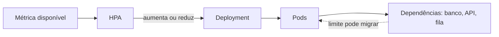

# Padrões e decisões: capacidade sem ilusões

## Stateless, stateful e os doze fatores

Uma aplicação **stateless** não mantém, no processo de uma réplica, o único estado necessário para atender a próxima requisição. Sessão, arquivo temporário relevante e fila local precisam ter destino explícito: token assinado, cache compartilhado, banco ou armazenamento de objeto. Isso permite substituir um Pod sem perder a conversa por acidente. Stateless não significa “sem dados”; significa que o estado durável está fora da instância descartável e tem owner, política de consistência e recuperação.

Uma aplicação **stateful** conserva identidade ou estado ligado à réplica: banco, nó de fila, volume ou processo com sequência. Ela pode rodar em Kubernetes, mas exige decisões adicionais sobre volume, ordem, quorum, backup, restore e atualização. Forçar banco relacional a parecer stateless só desloca o risco para um volume sem estratégia. Para a API de elegibilidade, o armazenamento em memória é deliberadamente didático: no laboratório a API é tratada como stateless e os dados não sobrevivem à troca de Pod; produção exigiria um store externo e teste de recuperação.

Os **doze fatores** são heurísticas para aplicações entregues como serviço: uma base de código, dependências declaradas, configuração no ambiente, backing services tratados como recursos anexados, build/release/run separados, processos sem estado, portas exportadas, concorrência por processos, inicialização e desligamento rápidos, paridade entre ambientes, logs como fluxo e tarefas administrativas descartáveis. Eles não substituem análise de domínio. A regra de configuração, por exemplo, não autoriza pôr segredo em ConfigMap; para isso há mecanismo próprio e controle de acesso.

## Elasticidade e escalabilidade

**Escalabilidade** é a capacidade de crescer mantendo comportamento aceitável; **elasticidade** é ajustar capacidade em resposta a demanda. Escalar horizontalmente aumenta réplicas; verticalmente muda recursos da mesma réplica. O HPA do laboratório declara mínimo de duas e máximo de cinco réplicas, com alvo de CPU. Isso é uma política, não uma prova: a métrica deve existir, o request de CPU deve ser definido e a equipe precisa observar latência, fila, erro e saturação para confirmar que CPU é um sinal útil.

Cada réplica tem request de `100m` de CPU e `128Mi` de memória: são insumos para agendamento. Os limits de `250m` e `256Mi` estabelecem teto; CPU pode sofrer throttling e memória excedida pode resultar em término. Escolher números por hábito é pior que não declarar hipótese. Comece com uma carga sintética, registre consumo e latência, ajuste e repita. A capacidade de banco, conexão e dependências também limita a escala; aumentar somente a API pode amplificar uma falha posterior.

**Texto alternativo:** uma métrica disponível alimenta o HPA, que altera réplicas no Deployment; essas réplicas ainda dependem de serviços que podem se tornar o próximo gargalo.

*Figura 8 — Escala da API limitada por suas dependências. Fonte: curso.*

**Leitura textual da figura:** uma métrica alimenta o HPA, que ajusta Pods pelo Deployment. Novas réplicas ainda dependem de banco, APIs e filas; se uma delas saturar, a elasticidade da camada web pode apenas deslocar o gargalo.

## Resiliência, rollout e rollback

Resiliência é continuar ou recuperar serviço dentro de um objetivo explícito diante de falhas. Réplicas reduzem impacto de queda de um Pod; readiness impede que uma instância ainda não pronta receba tráfego; rollout com `maxUnavailable: 0` preserva capacidade desejada durante atualização. Isso não garante ausência de erro: uma versão logicamente inválida pode responder saúde e ainda produzir decisão errada. Por isso, health check, teste de contrato, telemetria e revisão de mudança são complementares.

Um **rollback** retorna o Deployment à revisão anterior. Ele é útil se existe uma versão anterior saudável, mas não desfaz efeitos irreversíveis em banco, mensagens ou integrações. A migração de dados deve ter compatibilidade de ida e volta ou procedimento separado. Na oficina, a falha é segura: muda-se somente a imagem para uma tag propositalmente ausente; os novos Pods ficam indisponíveis e `kubectl rollout undo` restaura a imagem local conhecida. Não se altera dado hospitalar.

## Custo e lock-in

Custo inclui recursos ociosos, armazenamento, tráfego, observabilidade, suporte, licenças, operação e teste de continuidade. “Pague pelo uso” não significa custo baixo quando um recurso nunca reduz, logs crescem sem retenção ou uma saída de dados é frequente. Etiquetas de custo, orçamento, limite de ambiente e decisão de desligamento são arquitetura. Um SLO mais exigente pode justificar redundância; a justificativa deve mostrar valor e custo marginal.

**Lock-in** é a dificuldade de trocar ou negociar uma dependência, técnica ou organizacional. Serviços gerenciados podem ser escolhas excelentes quando reduzem risco operacional, mas ficam explícitos no ADR: API proprietária, formato de dados, identidade, observabilidade, egress e habilidades da equipe. Abstrair tudo prematuramente cria uma plataforma paralela. Prefira contratos de domínio, exportação testada, infraestrutura declarativa e uma condição mensurável de saída; aceite lock-in quando o benefício específico é conhecido e revisável.
