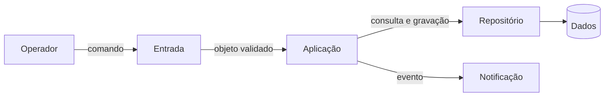
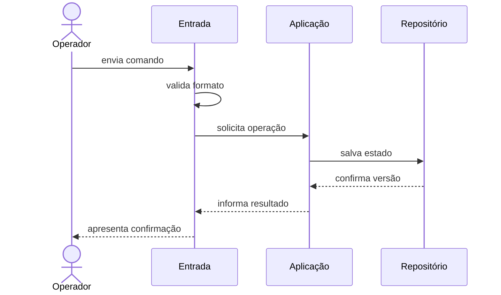

# Como ler uma arquitetura

Arquitetura de software reúne estruturas, decisões e racional para compreender e evoluir um sistema. Esta referência apresenta o vocabulário usado para ler uma descrição arquitetural antes de comparar estilos.

## Decisões arquiteturais

Uma decisão é arquitetural quando afeta interesses importantes, restringe escolhas posteriores ou custa caro reverter. A fronteira entre módulos costuma ser arquitetural; o nome de uma variável, não.

Arquitetura não é só um diagrama inicial: está no código, na implantação, nos dados e nas relações de trabalho. Também não é toda decisão técnica. Uma descrição arquitetural responde ao menos a quatro perguntas:

- quais elementos relevantes existem;
- quais responsabilidades e fronteiras cada elemento possui;
- por quais mecanismos os elementos colaboram;
- por que essa organização atende melhor às forças priorizadas do que as alternativas consideradas.

## Componentes, Conectores e Configuração

Um **Componente** é uma unidade com responsabilidade identificável: módulo, serviço, processo, banco ou fila. Um **Conector** representa uma interação, como chamada, HTTP, mensagem ou acesso a dados. A **Configuração** reúne componentes, conectores e restrições de dependência.

Observe um exemplo genérico de processamento de pedidos, ainda sem escolher tecnologia:

**Texto alternativo:** fluxo de processamento em que o Operador envia um comando à Entrada, que o encaminha à Aplicação; a Aplicação usa o Repositório e Notificação, e o Repositório mantém os Dados.

*Figura 1 — Componentes e conectores de um processamento de pedidos. Fonte: curso.*

**Leitura textual da figura:** o Operador envia um comando à Entrada. A Entrada encaminha o objeto validado à Aplicação, que consulta ou grava pelo Repositório, emite um evento para Notificação e mantém os Dados atrás desse conector. A figura separa os componentes e nomeia o tipo de interação entre eles.

O desenho ainda exige restrições: quem pode acessar `Dados`, onde está a regra e como erros atravessam fronteiras. Sem essa semântica, permite interpretações incompatíveis.

Uma visão arquitetural também precisa ser nomeada: módulos mostram dependências de código; execução, comunicação entre processos; implantação, ambientes computacionais. Misturá-las esconde decisões.

## Estrutura e comportamento se complementam

A estrutura mostra o que pode se relacionar; um cenário de comportamento mostra o que acontece durante uma interação. Uma sequência revela ordem, dados trocados, decisões e falhas que uma visão estática não evidencia.

**Texto alternativo:** sequência em que o Operador envia um comando, a Entrada valida e chama a Aplicação, que persiste pelo Repositório e devolve a confirmação pelo caminho inverso.

*Figura 2 — Sequência de uma operação com validação e persistência. Fonte: curso.*

**Leitura textual da figura:** o Operador envia um comando à Entrada, que valida o formato e solicita a operação à Aplicação. A Aplicação salva o estado no Repositório, recebe a confirmação de versão e devolve o resultado no caminho inverso até o Operador. A ordem explícita mostra onde uma indisponibilidade de persistência pode alterar o cenário.

Se a persistência falhar, a sequência deve declarar falha, espera ou repetição. Essa escolha afeta confiabilidade, latência e consistência; comportamento testa se a estrutura sustenta o cenário.

## Restrições, premissas e atributos de qualidade

Uma decisão escolhe uma alternativa e aceita consequências. Uma **restrição** limita opções, como executar localmente; uma **premissa** é condição a revisar, como esperar cinquenta operações por segundo. Confundi-las fragiliza a arquitetura.

Decisões úteis registram contexto, forças, alternativas, escolha, consequências e evidências. “Usar Python” não basta; um monólito modular pode justificar implantação simples e revisão quando houver escala independente demonstrada.

O código não explica alternativas rejeitadas; por isso o ADR o complementa. Structurizr Lite versiona modelos; pytest verifica comportamento; ArchUnit e NetArchTest verificam dependências. Ferramentas produzem evidência, não decidem pelo grupo.

Um **atributo de qualidade** descreve comportamento além da função principal. Modificabilidade, desempenho, disponibilidade, segurança, testabilidade e observabilidade são exemplos. “Ter desempenho” sem carga, ambiente e medida é ambíguo.

Use [fonte, estímulo, ambiente, artefato, resposta e medida](atributos-de-qualidade.md). Um cenário de modificabilidade pode limitar a alteração ao módulo de regras e a suíte a cinco minutos; throughput define lote, volume e itens por segundo.

Atributos entram em tensão. Mais isolamento pode acrescentar comunicação e operação. Uma otimização de throughput pode reduzir a clareza. Consistência imediata pode diminuir disponibilidade durante uma partição. Arquitetar é explicitar esses compromissos, não prometer maximizar tudo.
